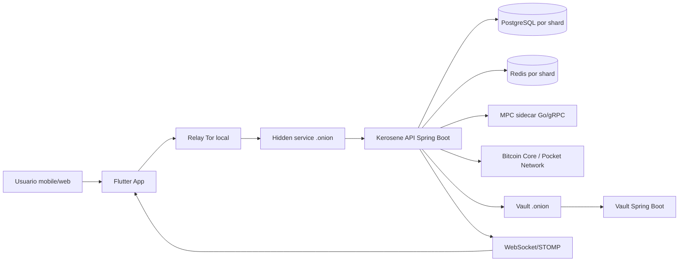
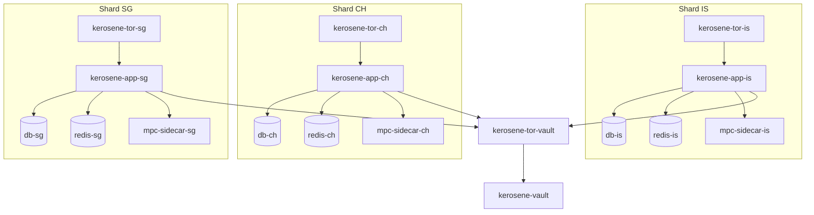
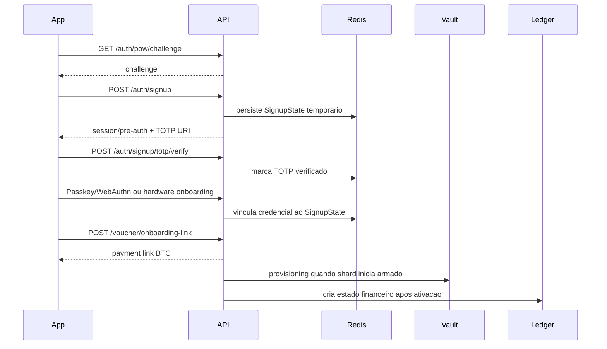
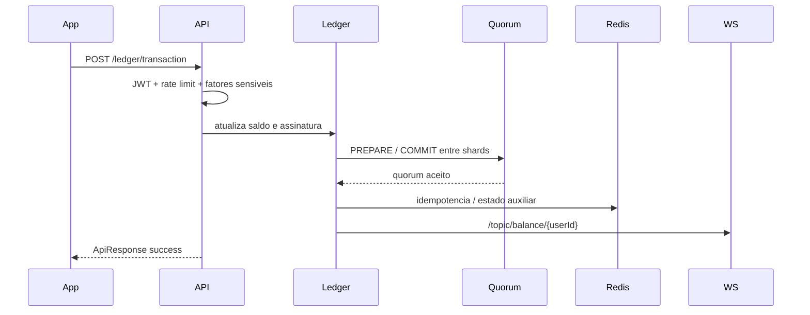

<p align="center">
  
</p>

<h1 align="center">Kerosene</h1>

<p align="center">
  <strong>Plataforma bancaria Bitcoin com app Flutter, backend Spring Boot, infraestrutura Tor, Vault de chaves e sidecar MPC.</strong>
</p>

<p align="center">
  <a href="#quickstart"></a>
  
  
  
  
  
  
</p>

---

## O Que E

Kerosene e um monorepo de uma plataforma bancaria Bitcoin em estado **pre-alpha**. O objetivo e entregar uma experiencia de banco digital com custodia operacional soberana, roteamento onion-first, onboarding forte, carteiras, ledger interno, transferencias, payment links, saques Bitcoin, observabilidade operacional e uma area web administrativa.

O repositorio combina quatro blocos principais:

| Bloco | Caminho | Papel |
| --- | --- | --- |
| Backend bancario | `backend/kerosene` | API Spring Boot com autenticacao, carteiras, ledger, transacoes, vouchers, auditoria, WebSocket e hardening HTTP. |
| App e web | `frontend` | Flutter/Dart para mobile, desktop, web, landing page, painel administrativo e experiencia bancaria do usuario. |
| Vault soberano | `backend/vault` | Servico Java separado para armamento por quorum, atestacao e provisionamento de chave AES para shards. |
| MPC sidecar | `backend/mpc-sidecar` | Servico Go/gRPC para contratos de keygen/signature e armazenamento volatil de shard. |
| Infraestrutura local | `backend/kerosene-infrastructure` | Compose local com shards IS/CH/SG, PostgreSQL, Redis, Tor, Vault, sidecars MPC, Bitcoin Core e Prometheus. |

> Nota de maturidade: Kerosene nao deve ser usado com fundos reais sem revisao de seguranca, auditoria independente, licencas aplicaveis, plano de custodia formal, monitoramento operacional e correcao dos limites listados em [Estado Atual](#estado-atual-e-limites).

---

## Indice

- [Visao De Produto](#visao-de-produto)
- [Mapa De Capacidades](#mapa-de-capacidades)
- [Arquitetura](#arquitetura)
- [Quickstart](#quickstart)
- [Como Usar As Features](#como-usar-as-features)
- [API Principal](#api-principal)
- [Configuracao](#configuracao)
- [Operacao Local](#operacao-local)
- [Seguranca](#seguranca)
- [Dados E Ledger](#dados-e-ledger)
- [Frontend](#frontend)
- [Vault E MPC](#vault-e-mpc)
- [Testes E Qualidade](#testes-e-qualidade)
- [Estrutura Do Repositorio](#estrutura-do-repositorio)
- [Estado Atual E Limites](#estado-atual-e-limites)
- [Documentacao Tecnica](#documentacao-tecnica)

---

## Visao De Produto

Kerosene foi desenhado como uma plataforma bancaria Bitcoin com foco em privacidade de rede, experiencia de conta moderna e controles tecnicos fortes. A proposta central e simples: permitir que um usuario entre, crie uma carteira, receba, envie, acompanhe saldo em tempo real e opere via mobile/web sem expor a API diretamente na internet publica.

O produto combina:

| Pilar | O que significa na pratica |
| --- | --- |
| Banking UX | Login, onboarding, carteiras, saldo, historico, depositos, saques, payment links, notificacoes e tela administrativa. |
| Bitcoin-first | Endereco de deposito, fee estimate, broadcast, payment links BTC, saques e integracoes de rede/onramp. |
| Onion-first | App mobile inicia Tor, abre relay local e encaminha trafego para shards `.onion`. Web admin tambem entende origem `.onion`. |
| Soberania operacional | Vault isolado, quorum de diretores, shards regionais e heartbeat de atestacao. |
| Defesa em profundidade | JWT, TOTP, passkeys/WebAuthn, hardware auth, rate limit, payload limit, headers de seguranca e auditoria Merkle. |
| Monorepo auditavel | Codigo de app, backend, Vault, MPC, Docker, scripts e docs no mesmo repositorio. |

---

## Mapa De Capacidades

### Usuario Final

| Feature | Estado no repositorio | Onde olhar |
| --- | --- | --- |
| Onboarding com PoW, signup e TOTP | Implementado no backend e integrado ao app | `source.auth`, `frontend/lib/features/auth` |
| Passkeys/WebAuthn e chave de hardware | Implementado com fluxos modernos e legados | `PasskeyController`, `WebAuthnController`, `HardwareAuthController` |
| Login com JWT e renovacao transparente | Implementado | `JwtAuthenticationFilter`, `TokenInterceptor` |
| Carteiras de usuario | Implementado | `WalletController`, `WalletService`, telas de wallet |
| Ledger interno e saldo em tempo real | Implementado | `LedgerController`, `LedgerService`, WebSocket/STOMP |
| Transferencias internas | Implementado com rate limit financeiro | `POST /ledger/transaction` |
| Payment requests internos | Implementado | `/ledger/payment-request` |
| Deposito Bitcoin | Implementado por endereco configurado | `/transactions/deposit-address` |
| Fee estimate e transacao unsigned | Implementado | `/transactions/estimate-fee`, `/transactions/create-unsigned` |
| Broadcast e status de transacao | Implementado | `/transactions/broadcast`, `/transactions/status` |
| Saque Bitcoin | Implementado no controller | `/transactions/withdraw` |
| Payment links BTC | Implementado | `/transactions/create-payment-link` |
| Voucher e onboarding pago | Implementado | `/voucher/**` |
| Notificacoes | Implementado para envio via backend e fila WebSocket | `/notifications/send`, `/user/{id}/queue/notifications` |
| QR, NFC, deposito, envio e historico no app | Telas e fluxos presentes no Flutter | `frontend/lib/features/wallet`, `home`, `transactions` |

### Operador / Administrador

| Feature | Estado | Onde olhar |
| --- | --- | --- |
| Landing page publica | Presente no Flutter web | `/`, `/bitcoin-banking` |
| Painel administrativo web | UI presente | `/admin`, `frontend/lib/features/web_admin` |
| Status publico de soberania | Implementado no backend | `/sovereignty/status`, `/sovereignty/ping` |
| Telemetria e reattestation | Implementado com token admin interno | `/sovereignty/telemetry`, `/sovereignty/reattest` |
| Proof of reserves / auditoria Merkle | Implementado | `/audit/latest-root`, `/audit/history`, `/audit/trigger` |
| Vault por quorum | Implementado | `backend/vault` |
| Stack local multi-shard | Implementado em Docker Compose | `backend/kerosene-infrastructure/docker-compose.local.yml` |

### Infraestrutura

| Capacidade | Estado | Observacao |
| --- | --- | --- |
| Shards IS/CH/SG | Compose local definido | Cada shard tem app, DB, Redis, Tor e sidecar MPC. |
| Tor hidden services | Definido e bootstrapado | Tor expoe `HiddenServicePort 80` para app e Vault. |
| PostgreSQL por shard | Definido | Imagem PostgreSQL 17 Alpine. |
| Redis por shard | Definido | Redis 7 com senha e appendonly. |
| Bitcoin Core local | Definido no compose atual | Healthcheck e scripts em `backend/kerosene/bitcoin-scripts`. |
| Prometheus | Definido no compose atual | Scrape configurado para apps, sujeito aos endpoints actuator disponiveis. |
| Runtime distroless | Definido para app e Vault | Dockerfiles em `backend/kerosene-infrastructure/images`. |
| Vanguards/Tor hardening | Arquivos presentes | `backend/kerosene/tor/vanguards`. |

---

## Arquitetura

### Visao Geral



### Topologia Local Multi-Shard



### Fluxo De Onboarding Bancario



### Fluxo Financeiro Interno



---

## Quickstart

### Pre-Requisitos

| Ferramenta | Uso |
| --- | --- |
| Docker + Docker Compose | Stack local com Vault, shards, DB, Redis, Tor, MPC e Bitcoin Core. |
| Java 21 | Backend principal e Vault. |
| Flutter/Dart | App mobile/web e painel administrativo. |
| Go 1.24 | Desenvolvimento do sidecar MPC. |
| Maven | Build direto do Vault. |
| OpenSSL | Geracao de segredos locais e certificados. |

### 1. Preparar `.env`

```bash
cp backend/kerosene/.env.example backend/kerosene/.env
```

Edite `backend/kerosene/.env` e troque todos os `CHANGE_ME_*`. Sugestoes para ambiente local:

```bash
openssl rand -base64 32   # AES_SECRET
openssl rand -base64 64   # JWT_SECRET
openssl rand -base64 64   # PASSWORD_PEPPER
openssl rand -base64 64   # HMAC_SECRET_KEY
```

Variaveis minimas usadas pelo bootstrap local:

```text
POSTGRES_USER
POSTGRES_PASSWORD
REDIS_PASSWORD
AES_SECRET
JWT_SECRET
PASSWORD_PEPPER
FOUNDER_TOTP_SECRET
API_KEY
```

Variaveis adicionais relevantes:

```text
HMAC_SECRET_KEY
WEBAUTHN_RP_ID
WEBAUTHN_RP_NAME
WEBAUTHN_ORIGINS
EXPECTED_TOR_HASH
REGION
MPC_SIDECAR_HOST
VAULT_ENABLED
VAULT_ONION_FILE
VAULT_PROXY_PATH
```

### 2. Subir o cluster local completo

```bash
bash scripts/start-local.sh
```

O script:

- valida `backend/kerosene/.env`;
- prepara certificados e arquivos `torrc`;
- sobe o compose local;
- arma o Vault com quorum local de desenvolvimento;
- aguarda provisionamento de chave nos shards;
- imprime os enderecos onion disponiveis quando consegue le-los.

### 3. Subir uma versao mais leve

Para iterar mais rapido em uma unica regiao:

```bash
bash scripts/start-local.sh --lite --region is
```

Regioes aceitas:

```text
is
ch
sg
```

### 4. Ver logs e parar

```bash
bash scripts/logs-local.sh
bash scripts/stop-local.sh
```

Para remover volumes locais de PostgreSQL, Redis, Tor e MPC:

```bash
bash scripts/stop-local.sh --volumes
```

### 5. Rodar modulos isolados

Backend principal:

```bash
cd backend/kerosene
./gradlew bootRun
```

Testes do backend:

```bash
cd backend/kerosene
./gradlew test
```

Vault:

```bash
cd backend/vault
mvn test
mvn spring-boot:run
```

MPC sidecar:

```bash
cd backend/mpc-sidecar
go test ./...
go run .
```

Frontend Flutter:

```bash
cd frontend
flutter pub get
flutter run
```

Build Android:

```bash
cd frontend
flutter build apk --release
```

---

## Como Usar As Features

Esta secao descreve os fluxos como o produto foi modelado no repositorio. Os nomes de tela podem evoluir, mas os caminhos e componentes abaixo refletem a estrutura atual.

### 1. Criar Conta

Fluxo recomendado:

1. Abrir o app.
2. Entrar em `/signup`.
3. Solicitar challenge de PoW em `GET /auth/pow/challenge`.
4. Enviar username, passphrase, voucher/challenge/nonce em `POST /auth/signup`.
5. Configurar TOTP usando a URI retornada.
6. Confirmar TOTP em `POST /auth/signup/totp/verify`.
7. Registrar passkey/WebAuthn ou hardware key durante onboarding.
8. Se exigido pelo produto, gerar link de pagamento de onboarding em `POST /voucher/onboarding-link`.

Telas e codigo:

```text
frontend/lib/features/auth/presentation/screens/signup/signup_flow_screen.dart
frontend/lib/features/auth/presentation/screens/signup/steps/
backend/kerosene/src/main/java/source/auth/controller/UsuarioController.java
backend/kerosene/src/main/java/source/auth/controller/WebAuthnController.java
backend/kerosene/src/main/java/source/auth/controller/HardwareAuthController.java
```

### 2. Fazer Login

Fluxo padrao:

1. Abrir `/login`.
2. Enviar credenciais para `POST /auth/login`.
3. Confirmar TOTP em `POST /auth/login/totp/verify`.
4. Guardar JWT retornado.
5. Enviar `Authorization: Bearer <jwt>` nas chamadas autenticadas.

Fluxos adicionais:

- WebAuthn: `/auth/passkey/login/start` e `/auth/passkey/login/finish`.
- Passkey simplificada: `/auth/passkey/challenge`, `/auth/passkey/verify`.
- Hardware auth: `/auth/hardware/challenge`, `/auth/hardware/verify`.

O backend pode renovar sessoes proximas da expiracao enviando o header:

```text
X-New-Token: <jwt-novo>
```

### 3. Criar Carteira

API:

```http
POST /wallet/create
Authorization: Bearer <jwt>
Content-Type: application/json

{
  "name": "Main wallet",
  "passphrase": "secret"
}
```

App:

```text
/create_wallet
/card
frontend/lib/features/wallet/presentation/screens/create_wallet_screen.dart
frontend/lib/features/bitcoin_accounts/presentation/bitcoin_accounts_screen.dart
```

### 4. Consultar Saldo E Historico

Endpoints:

```text
GET /ledger/all
GET /ledger/find?walletName=Main
GET /ledger/balance?walletName=Main
GET /ledger/history?page=0&size=50
```

Eventos em tempo real:

```text
/topic/balance/{userId}
```

App:

```text
/home
/history
frontend/lib/features/home/presentation/screens/home_screen.dart
frontend/lib/core/services/balance_websocket_service.dart
```

### 5. Enviar Dinheiro Internamente

Endpoint:

```http
POST /ledger/transaction
Authorization: Bearer <jwt>
Content-Type: application/json

{
  "sender": "Main",
  "receiver": "receiverWalletOrUser",
  "amount": 0.0001,
  "context": "payment",
  "idempotencyKey": "b35a4a48-8f9a-4e2f-8b6d-4f89e49a8c10",
  "requestTimestamp": 1775500000000,
  "totpCode": "123456",
  "confirmationPassphrase": "secret"
}
```

Protecoes relevantes:

- limite financeiro de 10 operacoes/min por usuario no controller de ledger;
- assinatura de integridade de saldo;
- proposta de quorum PREPARE/COMMIT antes do commit final;
- evento WebSocket de saldo apos sucesso.

### 6. Receber Bitcoin

Endpoint principal:

```text
GET /transactions/deposit-address
```

Fluxos de app:

```text
/receive
/deposits
frontend/lib/features/wallet/presentation/screens/receive_hub_screen.dart
frontend/lib/features/transactions/presentation/screens/deposits_screen.dart
```

O endereco default de `application.properties` e apenas configuracao de desenvolvimento. Em operacao real, sobrescreva `bitcoin.deposit-address`.

### 7. Sacar Bitcoin

Endpoint:

```http
POST /transactions/withdraw
Authorization: Bearer <jwt>
Content-Type: application/json

{
  "fromWalletName": "Main",
  "toAddress": "bc1...",
  "amount": 0.0001,
  "description": "withdraw",
  "totpCode": "123456",
  "confirmationPassphrase": "secret"
}
```

Fluxos de app:

```text
/send-money
frontend/lib/features/wallet/presentation/screens/send_money_screen.dart
frontend/lib/features/transactions/presentation/screens/withdraw_screen.dart
```

### 8. Criar Payment Link BTC

Endpoint:

```http
POST /transactions/create-payment-link
Authorization: Bearer <jwt>
Content-Type: application/json

{
  "amountBtc": 0.00022,
  "description": "Invoice #1001"
}
```

Consultar e completar:

```text
GET  /transactions/payment-link/{linkId}
POST /transactions/payment-link/{linkId}/confirm
POST /transactions/payment-link/{linkId}/complete
GET  /transactions/payment-links
```

App:

```text
/payment-links/lifecycle
frontend/lib/features/transactions/presentation/screens/payment_link_lifecycle_screen.dart
frontend/lib/features/wallet/presentation/screens/receive_payment_link_screen.dart
```

### 9. Vouchers E Ativacao

Endpoints publicos:

```text
POST /voucher/request
POST /voucher/confirm?pendingVoucherId={id}&txid={txid}
POST /voucher/onboarding-link?sessionId={id}
POST /voucher/onboarding-mock-confirm?sessionId={id}
```

Regra importante: o link de onboarding exige `SignupState` no Redis e passkey/hardware ja registrado no estado da sessao.

### 10. Administrar E Monitorar

Web:

```text
/admin
/status
```

Endpoints:

```text
GET  /sovereignty/status
GET  /sovereignty/ping
GET  /sovereignty/telemetry
POST /sovereignty/reattest
GET  /audit/latest-root
GET  /audit/history
POST /audit/trigger
```

Arquivos:

```text
frontend/lib/features/web_admin/presentation/
backend/kerosene/src/main/java/source/security/SovereigntyStatusController.java
backend/kerosene/src/main/java/source/ledger/audit/MerkleAuditController.java
```

---

## API Principal

Base local padrao:

```text
http://localhost:8080
```

Via Tor, os sidecars expoem `HiddenServicePort 80` apontando para cada app interno.

Resposta padrao:

```json
{
  "success": true,
  "message": "Mensagem operacional",
  "data": {},
  "errorCode": null,
  "timestamp": "2026-05-28T00:00:00"
}
```

Headers importantes:

| Header | Uso |
| --- | --- |
| `Authorization: Bearer <jwt>` | Autenticacao REST. |
| `X-New-Token` | Renovacao de JWT enviada pelo backend. |
| `X-Admin-Token` | Operacoes internas de soberania. |
| `X-Owner-TOTP` | Auditoria sensivel em `/v1/audit/siphon`. |
| `X-Hardware-Signature` | Auditoria sensivel em `/v1/audit/siphon`. |
| `Digest: SHA-256=<base64>` | Opcional; se enviado, o backend compara com o body. |

Regras globais:

- Requests com body precisam usar `Content-Type: application/json` ou `application/x-protobuf`.
- Payload HTTP com body acima de 2 KB e rejeitado.
- JWT em REST deve ir no header `Authorization`; token por query string foi removido do REST.
- Rate limit geral: 100 req/min por IP.
- Rate limit em `/auth/*`: 20 req/min por IP.
- Rate limit financeiro no ledger: 10 operacoes/min por usuario.

### Matriz De Endpoints Implementados

| Grupo | Endpoint |
| --- | --- |
| Auth | `GET /auth/pow/challenge` |
| Auth | `POST /auth/signup` |
| Auth | `POST /auth/signup/totp/verify` |
| Auth | `POST /auth/login` |
| Auth | `POST /auth/login/totp/verify` |
| Passkey simplificada | `GET /auth/passkey/challenge` |
| Passkey simplificada | `POST /auth/passkey/register` |
| Passkey simplificada | `POST /auth/passkey/verify` |
| Passkey simplificada | `POST /auth/passkey/onboarding/start` |
| Passkey simplificada | `POST /auth/passkey/onboarding/finish` |
| WebAuthn/FIDO2 | `POST /auth/passkey/register/start` |
| WebAuthn/FIDO2 | `POST /auth/passkey/register/finish` |
| WebAuthn/FIDO2 | `POST /auth/passkey/login/start` |
| WebAuthn/FIDO2 | `POST /auth/passkey/login/finish` |
| WebAuthn/FIDO2 | `POST /auth/passkey/register/onboarding/start` |
| WebAuthn/FIDO2 | `POST /auth/passkey/register/onboarding/finish` |
| Hardware auth | `GET /auth/hardware/challenge` |
| Hardware auth | `POST /auth/hardware/register` |
| Hardware auth | `POST /auth/hardware/verify` |
| Hardware auth | `POST /auth/hardware/register/onboarding/start` |
| Hardware auth | `POST /auth/hardware/register/onboarding/finish` |
| Wallet | `POST /wallet/create` |
| Wallet | `GET /wallet/all` |
| Wallet | `GET /wallet/find` |
| Wallet | `PUT /wallet/update` |
| Wallet | `DELETE /wallet/delete` |
| Ledger | `POST /ledger/transaction` |
| Ledger | `GET /ledger/history` |
| Ledger | `GET /ledger/all` |
| Ledger | `GET /ledger/find` |
| Ledger | `GET /ledger/balance` |
| Payment request interno | `POST /ledger/payment-request` |
| Payment request interno | `GET /ledger/payment-request/{linkId}` |
| Payment request interno | `POST /ledger/payment-request/{linkId}/pay` |
| Bitcoin | `GET /transactions/deposit-address` |
| Bitcoin | `GET /transactions/estimate-fee` |
| Bitcoin | `POST /transactions/create-unsigned` |
| Bitcoin | `GET /transactions/status` |
| Bitcoin | `POST /transactions/broadcast` |
| Bitcoin | `POST /transactions/withdraw` |
| Payment links BTC | `POST /transactions/create-payment-link` |
| Payment links BTC | `GET /transactions/payment-link/{linkId}` |
| Payment links BTC | `POST /transactions/payment-link/{linkId}/confirm` |
| Payment links BTC | `POST /transactions/payment-link/{linkId}/complete` |
| Payment links BTC | `GET /transactions/payment-links` |
| Voucher | `POST /voucher/request` |
| Voucher | `POST /voucher/confirm` |
| Voucher | `POST /voucher/onboarding-link` |
| Voucher | `POST /voucher/onboarding-mock-confirm` |
| Economy | `GET /api/economy/status` |
| Onramp | `GET /api/onramp/urls` |
| Notifications | `POST /notifications/send` |
| Soberania | `GET /sovereignty/status` |
| Soberania | `POST /sovereignty/reattest` |
| Soberania | `GET /sovereignty/telemetry` |
| Soberania | `GET /sovereignty/ping` |
| Auditoria | `GET /v1/audit/stats` |
| Auditoria | `POST /v1/audit/siphon` |
| Merkle audit | `GET /audit/latest-root` |
| Merkle audit | `GET /audit/history` |
| Merkle audit | `POST /audit/trigger` |

Referencia detalhada: [docs/API_REFERENCE.md](docs/API_REFERENCE.md).

### WebSocket/STOMP

Endpoints:

| Endpoint | SockJS | Uso |
| --- | --- | --- |
| `/ws/balance` | Sim | Saldo em tempo real. |
| `/ws/raw-balance` | Nao | Fallback WebSocket puro. |
| `/ws/payment-request` | Sim | Eventos de payment request. |
| `/ws/raw-payment-request` | Nao | Fallback WebSocket puro. |

Topicos:

| Topico | Payload |
| --- | --- |
| `/topic/balance/{userId}` | `BalanceUpdateEvent` |
| `/topic/payment-request/{linkId}` | `InternalPaymentRequestDTO` |
| `/user/{userId}/queue/notifications` | Notificacao de usuario |

Autenticacao do `CONNECT` STOMP:

```text
Authorization: Bearer <jwt>
```

O handshake WebSocket tambem entende `?token=<jwt>` para upgrade/STOMP. Essa excecao nao vale para REST.

---

## Configuracao

### Arquivos Principais

| Arquivo | Uso |
| --- | --- |
| `backend/kerosene/.env.example` | Template de segredos e credenciais locais. |
| `backend/kerosene/src/main/resources/application.properties` | Defaults locais do backend. |
| `backend/kerosene/src/main/resources/application-docker.properties` | Overrides do profile Docker. |
| `backend/vault/src/main/resources/application.properties` | Configuracao do Vault. |
| `frontend/lib/core/config/app_config.dart` | Nodes `.onion`, endpoints e flags do app. |
| `backend/kerosene-infrastructure/docker-compose.local.yml` | Stack local canonica. |

### Variaveis Criticas

| Variavel | Responsabilidade |
| --- | --- |
| `AES_SECRET` | Chave AES base64 para ambiente local/dev e armamento do Vault local. |
| `JWT_SECRET` | Assinatura dos tokens JWT. |
| `PASSWORD_PEPPER` | Pepper estavel para hashing de credenciais. |
| `HMAC_SECRET_KEY` | Integridade de componentes de tesouraria. |
| `FOUNDER_TOTP_SECRET` | Fluxos administrativos/auditoria. |
| `API_KEY` | Gateway Bitcoin/Pocket Network. |
| `REDIS_PASSWORD` | Redis local/shard. |
| `POSTGRES_USER` / `POSTGRES_PASSWORD` | PostgreSQL local/shard. |
| `WEBAUTHN_RP_ID` | Relying Party ID para WebAuthn. Deve bater com host/onion visto pelo usuario. |
| `WEBAUTHN_ORIGINS` | Origins aceitas para WebAuthn. |

### Configuracoes Bitcoin

Defaults em `application.properties`:

```text
bitcoin.deposit-address
bitcoin.min-confirmations
bitcoin.payment-link-expiration-minutes
bitcoin.mock-mode
bitcoin.network
bitcoin.derivation.salt
```

Antes de qualquer ambiente real:

- troque o endereco default de deposito;
- defina rede e confirmacoes esperadas;
- valide se o gateway Bitcoin/on-chain esta apontando para infraestrutura confiavel;
- remova qualquer mock/fallback de saldo operacional.

---

## Operacao Local

### Scripts

| Comando | Funcao |
| --- | --- |
| `bash scripts/init-local.sh` | Executa bootstrap local da infraestrutura. |
| `bash scripts/start-local.sh` | Sobe cluster local, builda imagens e arma Vault. |
| `bash scripts/start-local.sh --lite --region is` | Sobe modo leve com uma regiao. |
| `bash scripts/start-local.sh --no-arm` | Sobe sem armar Vault automaticamente. |
| `bash scripts/start-local.sh --no-build` | Reutiliza builds existentes. |
| `bash scripts/start-local.sh --frontend-server` | Tambem tenta servir Flutter web em localhost. |
| `bash scripts/logs-local.sh` | Segue logs do compose. |
| `bash scripts/stop-local.sh` | Derruba containers sem apagar volumes. |
| `bash scripts/stop-local.sh --volumes` | Derruba containers e remove volumes locais. |
| `bash scripts/arm-vault.sh` | Submete quorum local `director-1` e `director-2`. |

### Compose Equivalente

```bash
docker compose \
  --project-name kerosene-infrastructure \
  --env-file backend/kerosene/.env \
  -f backend/kerosene-infrastructure/docker-compose.local.yml \
  config
```

```bash
docker compose \
  --project-name kerosene-infrastructure \
  --env-file backend/kerosene/.env \
  -f backend/kerosene-infrastructure/docker-compose.local.yml \
  up -d --build
```

Cuidados:

- `docker compose config` materializa variaveis do `.env`; nao publique a saida se houver segredos reais.
- `init-local.sh` reescreve arquivos `torrc-*` para o ambiente local.
- Redis pode alertar se `vm.overcommit_memory` nao estiver em `1`; o script tenta orientar/corrigir quando possivel.

### Servicos Do Compose Local

| Servico | Papel |
| --- | --- |
| `kerosene-vault` | Vault Spring Boot isolado. |
| `kerosene-tor-vault` | Hidden service do Vault. |
| `db-is`, `db-ch`, `db-sg` | PostgreSQL por shard. |
| `redis-is`, `redis-ch`, `redis-sg` | Redis por shard. |
| `mpc-sidecar-is`, `mpc-sidecar-ch`, `mpc-sidecar-sg` | Sidecars MPC Go/gRPC. |
| `kerosene-app-is`, `kerosene-app-ch`, `kerosene-app-sg` | APIs Spring Boot por regiao. |
| `kerosene-tor-is`, `kerosene-tor-ch`, `kerosene-tor-sg` | Hidden services dos shards. |
| `bitcoin-core` | Node Bitcoin local do compose atual. |
| `prometheus` | Scrape local definido para a stack. |

### Redes E Volumes

Redes:

```text
net_vault
net_db_is
net_db_ch
net_db_sg
net_mpc
net_tor
tor_egress
```

Volumes:

```text
pg_data_is, pg_data_ch, pg_data_sg
redis_data_is, redis_data_ch, redis_data_sg
mpc_shards_is, mpc_shards_ch, mpc_shards_sg
tor_socks_is, tor_socks_ch, tor_socks_sg
tor_keys_vault, tor_keys_is, tor_keys_ch, tor_keys_sg
shard_identity_is, shard_identity_ch, shard_identity_sg
prometheus_data
```

---

## Seguranca

Kerosene usa defesa em profundidade. Abaixo estao os controles presentes no codigo, nao promessas de certificacao.

### Camada De Rede

- Trafego do app mobile/desktop pode ser roteado por Tor.
- O app inicia Tor via `TorService` e cria um relay local `127.0.0.1:<porta> -> .onion:80`.
- Cada shard tem hidden service proprio.
- O Vault tambem e acessado por hidden service interno.
- Redes Docker internas isolam DB, Redis, Vault e MPC.

### Camada HTTP/API

- API stateless com JWT.
- CSRF desabilitado por arquitetura stateless.
- CSP `default-src 'self'`.
- `frameOptions().deny()`.
- HSTS com `max-age=31536000`.
- `X-Content-Type-Options: nosniff`.
- Remocao de headers forjaveis como `X-Forwarded-For`, `Via` e `User-Agent` dentro do filtro paranoico.
- Content-Type estrito para requests com body.
- Limite de payload de 2 KB.
- Padding de resposta em `X-Pad-Noise`.
- Tempo minimo em rotas sensiveis de auth/voucher/ledger para reduzir vazamento por timing.

### Camada De Autenticacao

- Signup e login em duas fases com TOTP.
- JWT com renovacao via `X-New-Token`.
- Passkey simplificada com assinatura de challenge.
- WebAuthn/FIDO2 com endpoints `register/start`, `register/finish`, `login/start`, `login/finish`.
- Hardware auth por challenge e public key.
- Fluxos de onboarding mantem estado temporario no Redis.

### Camada Financeira

- Rate limit financeiro por usuario no ledger.
- `idempotencyKey` no DTO de transacao.
- Assinatura de integridade de saldo vinculada a usuario, wallet, nonce e balance.
- Atualizacao com lock pessimista por wallet.
- Proposta de quorum PREPARE/COMMIT via `QuorumSyncService`.
- Auditoria Merkle dos saldos internos.

### Camada De Segredos

- Vault separado do backend principal.
- Armamento por quorum de diretores.
- Provisionamento de chave com token de uso unico.
- Heartbeat com assinatura e tolerancia de clock.
- Fallback para `AES_SECRET` em desenvolvimento quando Vault nao esta habilitado.

---

## Dados E Ledger

Schemas iniciais:

```text
auth
financial
```

Tabelas e dominios relevantes:

| Area | Entidades |
| --- | --- |
| Auth | `users_credentials`, `passkey_credentials`, `hardware_credentials`, `vouchers`, devices |
| Wallet | `wallets` |
| Ledger | `ledger`, `ledger_entries`, `ledger_transaction_history`, `ledger_transactions` |
| Auditoria | checkpoints Merkle |
| Treasury | configuracoes, receita, integridade HMAC |

O ledger atual implementa:

- criacao de ledger por wallet;
- saldo com nonce e assinatura;
- historico paginado;
- transferencia interna;
- payment requests;
- publicacao de evento de saldo;
- auditoria Merkle deterministica sobre `walletId|balance`;
- scheduler de checkpoint Merkle configuravel por `audit.merkle.interval-ms`.

---

## Frontend

### App Mobile/Desktop

Stack:

```text
Flutter
Dart
Riverpod
Dio
STOMP/WebSocket
flutter_secure_storage
local_auth
mobile_scanner
nfc_manager
Tor relay
```

Rotas mobile principais:

| Rota | Tela |
| --- | --- |
| `/welcome` | Entrada do app. |
| `/login` | Login. |
| `/signup` | Signup/onboarding. |
| `/home` | Home bancaria. |
| `/home_loading` | Bootstrap autenticado. |
| `/settings` | Configuracoes. |
| `/history` | Historico/depositos. |
| `/card` | Contas/cartoes Bitcoin. |
| `/bitcoin-accounts/advanced` | Contas Bitcoin avancadas. |
| `/receive` | Hub de recebimento. |
| `/payments` | Fluxo unificado de pagamentos. |
| `/payment-links/lifecycle` | Ciclo de payment links. |
| `/notification-devices` | Dispositivos de notificacao. |
| `/create_wallet` | Criacao de carteira. |
| `/send-money` | Envio. |
| `/deposits` | Depositos. |

### Web / Landing / Admin

Rotas web presentes em `web_bootstrap.dart`:

| Rota | Uso |
| --- | --- |
| `/` | Landing page. |
| `/bitcoin-banking` | Landing orientada ao produto. |
| `/admin` | Painel administrativo protegido. |
| `/download` | Landing focada em download. |
| `/status` | Status publico. |

Resolucao da API no web admin:

1. `WEB_API_URL` em build-time;
2. `WEB_ONION_GATEWAY` em build-time;
3. origem `.onion` se o browser ja estiver em onion;
4. fallback para `Uri.base.origin`.

Build web exemplo:

```bash
cd frontend
flutter build web --release --csp --no-web-resources-cdn \
  --dart-define="WEB_API_URL=http://localhost:8080" \
  --dart-define="PASSKEY_RP_ID=localhost" \
  --dart-define="PASSKEY_ORIGIN=http://localhost:3000"
```

---

## Vault E MPC

### Vault

Servico:

```text
backend/vault
```

Porta interna:

```text
8090
```

Endpoints:

| Metodo | Endpoint | Uso |
| --- | --- | --- |
| `POST` | `/v1/vault/arm` | Submete quorum de diretor e master key. |
| `POST` | `/v1/vault/attest` | Valida atestacao e emite token de provisionamento. |
| `GET` | `/v1/vault/provision` | Entrega AES key com token one-time. |
| `POST` | `/v1/vault/heartbeat` | Recebe heartbeat assinado de shard. |

Regras importantes:

- diretores aceitos: `director-1`, `director-2`, `director-3`;
- quorum necessario: 2 aprovacoes;
- `master_key` precisa ser consistente entre aprovacoes;
- `/provision` consome token uma unica vez;
- heartbeat rejeita skew maior que 30 segundos.

### MPC Sidecar

Servico:

```text
backend/mpc-sidecar
```

Porta:

```text
50051
```

Contrato gRPC:

```proto
service MpcService {
  rpc Keygen (KeygenRequest) returns (KeygenResponse);
  rpc Sign (SignRequest) returns (SignResponse);
}
```

Estado atual:

- o servidor Go registra `MpcService` e reflection;
- o sidecar grava shard mock/simplificado em armazenamento volatil;
- `Sign` retorna assinatura placeholder baseada em `R_VALUE`/`S_VALUE`;
- o client Java abre canal gRPC, mas os metodos `keygen` e `sign` ainda retornam placeholders sem usar stubs gerados.

---

## Testes E Qualidade

Comandos recomendados:

```bash
cd backend/kerosene
./gradlew test
./gradlew dependencyCheckAnalyze
```

```bash
cd backend/vault
mvn test
```

```bash
cd backend/mpc-sidecar
go test ./...
```

```bash
cd frontend
flutter test
dart run tool/check_hardcoded_copy.dart
```

Checks de documentacao:

```bash
git diff --check -- README.md docs
```

Observacoes:

- o backend usa OWASP Dependency Check e falha o build para CVSS maior ou igual a `7.0`;
- o app tem testes Flutter em `frontend/test`;
- existem testes Java para voucher, ledger, wallet, auditoria, payment links e filtros de seguranca.

---

## Estrutura Do Repositorio

```text
.
├── README.md
├── docs/
│   ├── README.md
│   ├── ARCHITECTURE.md
│   ├── INFRASTRUCTURE.md
│   ├── API_REFERENCE.md
│   └── APK.md
├── scripts/
│   ├── init-local.sh
│   ├── start-local.sh
│   ├── logs-local.sh
│   ├── stop-local.sh
│   ├── arm-vault.sh
│   └── backend-common.sh
├── backend/
│   ├── kerosene/
│   │   ├── src/main/java/source/
│   │   ├── src/main/resources/
│   │   ├── docker-entrypoint-initdb.d/
│   │   ├── tor/
│   │   ├── bitcoin-scripts/
│   │   ├── lnd-scripts/
│   │   ├── vault-scripts/
│   │   ├── observability/
│   │   ├── web-admin-build/
│   │   ├── build.gradle.kts
│   │   └── .env.example
│   ├── vault/
│   │   ├── src/main/java/vault/
│   │   ├── src/main/resources/
│   │   ├── pom.xml
│   │   └── Dockerfile
│   ├── mpc-sidecar/
│   │   ├── proto/mpc.proto
│   │   ├── service/
│   │   ├── main.go
│   │   ├── go.mod
│   │   └── Dockerfile
│   └── kerosene-infrastructure/
│       ├── docker-compose.local.yml
│       ├── images/
│       └── scripts/
└── frontend/
    ├── lib/
    │   ├── app/
    │   ├── bootstrap/
    │   ├── core/
    │   ├── design_system/
    │   ├── features/
    │   └── l10n/
    ├── assets/
    ├── android/
    ├── ios/
    ├── macos/
    ├── windows/
    ├── web/
    ├── native/
    ├── test/
    └── pubspec.yaml
```

---

## Estado Atual E Limites

Este README descreve o estado observado do repositorio em 2026-05-28. Pontos que exigem atencao antes de qualquer publicacao seria:

| Area | Limite atual |
| --- | --- |
| Maturidade | Projeto pre-alpha. Requer hardening, testes e auditoria antes de fundos reais. |
| Licenca | Nao ha arquivo `LICENSE` no repositorio. Defina a licenca antes de abrir o projeto publicamente. |
| CORS | `allowedOriginPatterns("*")` esta habilitado para desenvolvimento/teste. |
| Bitcoin deposit address | `application.properties` contem endereco default; producao deve sobrescrever. |
| MPC | Sidecar e client Java ainda possuem comportamento placeholder. |
| Proof of reserves | Auditoria Merkle existe, mas precisa de processo operacional e publicacao de provas. |
| On-chain balance | Algumas rotas de auditoria possuem mock/fallback no codigo documentado. |
| Auth/passkeys | Existem fluxos simplificados e FIDO2/WebAuthn lado a lado; mantenha app, controllers e security matchers sincronizados a cada mudanca. |
| Frontend endpoints | `AppConfig` contem endpoints de produto em evolucao que podem nao ter controller backend equivalente ainda. |
| APK | APKs nao devem ser versionados. Gere em CI ou publique via GitHub Releases. Veja `docs/APK.md` para metadados historicos. |
| Compliance | Uma plataforma bancaria/custodial exige revisao legal, KYC/AML conforme jurisdicao, politicas de risco e controles operacionais. |

---

## Documentacao Tecnica

| Documento | Conteudo |
| --- | --- |
| [docs/README.md](docs/README.md) | Indice tecnico da documentacao versionavel. |
| [docs/ARCHITECTURE.md](docs/ARCHITECTURE.md) | Arquitetura real, fluxos e limites por componente. |
| [docs/INFRASTRUCTURE.md](docs/INFRASTRUCTURE.md) | Docker, Tor, DB, Redis, Vault, redes, volumes e scripts. |
| [docs/API_REFERENCE.md](docs/API_REFERENCE.md) | Referencia REST/WebSocket/Vault derivada dos controllers. |
| [docs/APK.md](docs/APK.md) | Processo de publicacao de APK e metadados de artefato. |

---

## Publicacao No GitHub

Checklist sugerido antes de tornar o repositorio publico:

- adicionar `LICENSE`;
- revisar `.gitignore` para impedir `.env`, certificados, chaves Tor, keystores e builds;
- publicar APKs apenas como assets de GitHub Releases;
- remover segredos reais do historico Git, se existirem;
- revisar CORS, WebAuthn RP/origins e endereco Bitcoin de deposito;
- rodar testes backend, frontend, Vault e sidecar;
- revisar findings de dependency check;
- documentar ameacas, modelo de custodia e plano de incident response;
- criar GitHub Actions para lint, testes, build e release;
- abrir issues para cada limite listado em [Estado Atual](#estado-atual-e-limites).

---

## Aviso

Kerosene e software em desenvolvimento. Nada neste repositorio deve ser interpretado como recomendacao financeira, garantia de seguranca, servico bancario licenciado ou autorizacao para operar custodia sem cumprir leis aplicaveis. Use testnet, mocks ou ambientes isolados ate que o sistema seja formalmente auditado.
