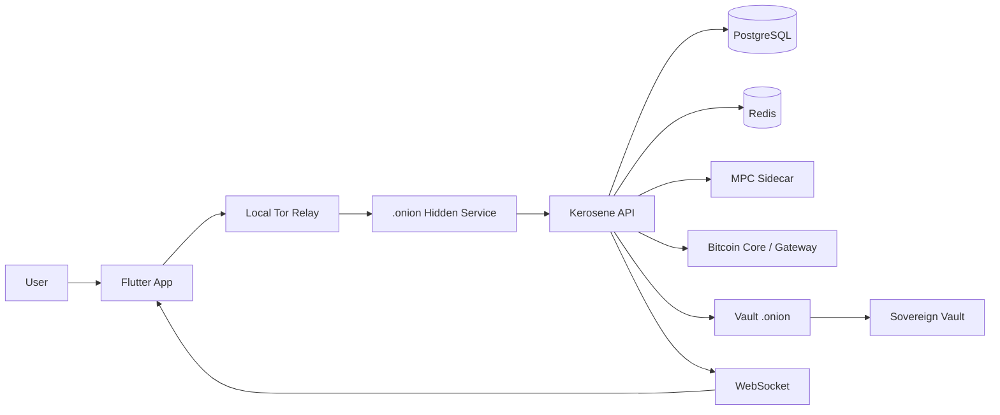

<p align="center">
  
</p>

<h1 align="center">Kerosene</h1>

<p align="center">
  <strong>Bitcoin banking infrastructure for privacy-first digital finance.</strong>
</p>

<p align="center">
  
  
  
  
</p>

---

## Executive Summary

Kerosene is a **pre-alpha Bitcoin banking platform** built for teams exploring the future of sovereign financial infrastructure.

It combines a modern banking experience with a privacy-first network model, internal ledger controls, Bitcoin transaction flows, Tor hidden services, a quorum-based Vault, and an MPC sidecar architecture.

The product thesis is simple:

> A digital bank should be fast for users, hard to surveil, auditable by operators, and resilient by design.

Kerosene is not production-ready and must not be used with real funds before security review, legal review, independent audit, licensing, and operational hardening.

---

## Why Kerosene

Financial infrastructure is moving toward programmable money, stronger custody models, and privacy-preserving access. Kerosene explores that direction through a full-stack reference implementation.

| Strategic Pillar | Product Outcome |
| --- | --- |
| **Bitcoin-first** | Deposits, withdrawals, fee estimation, payment links, and transaction lifecycle APIs. |
| **Onion-first** | Mobile and web traffic can route through Tor hidden services instead of exposing the API directly to the public internet. |
| **Sovereign operations** | Vault provisioning, quorum arming, regional shards, attestation, and controlled key delivery. |
| **Banking-grade UX** | Signup, login, wallets, balance, history, transfers, notifications, QR/NFC flows, and admin surfaces. |
| **Auditability** | Ledger integrity signatures, Merkle checkpoints, proof-of-reserve foundations, and operational telemetry. |

---

## Product Surface

Kerosene ships as a monorepo with four core layers:

| Layer | Stack | Purpose |
| --- | --- | --- |
| **Client experience** | Flutter / Dart | Mobile, desktop, web, landing page, wallet UX, admin UI. |
| **Banking backend** | Java 21 / Spring Boot | Auth, wallets, ledger, transactions, vouchers, audit, WebSocket, security controls. |
| **Sovereign Vault** | Java / Spring Boot | Quorum-based arming, attestation, and key provisioning. |
| **MPC sidecar** | Go / gRPC | Keygen/signature contract and volatile shard handling. |
| **Local infrastructure** | Docker Compose | PostgreSQL, Redis, Tor, Vault, shards, sidecars, Bitcoin Core, Prometheus. |

---

## Core Capabilities

### User Experience

- Account creation with proof-of-work challenge, signup state, TOTP, passkeys/WebAuthn, and hardware-auth flows.
- Wallet creation, balance view, transaction history, deposits, withdrawals, internal transfers, and payment links.
- Real-time balance and payment updates over WebSocket/STOMP.
- Flutter mobile, desktop, web, landing, and admin interfaces.

### Financial Infrastructure

- Internal ledger with signed balances, idempotent transaction requests, and pessimistic wallet locking.
- Internal transfer flow with quorum-style prepare/commit coordination.
- Bitcoin deposit address, fee estimation, unsigned transaction creation, broadcast, status, withdrawal, and payment link endpoints.
- Merkle audit checkpoints for deterministic balance snapshots.

### Security Architecture

- JWT-based stateless API authentication.
- TOTP, passkeys/WebAuthn, and hardware-key support.
- Strict content type handling, payload limits, rate limits, hardened headers, and sensitive-route timing controls.
- Tor hidden services for shards and Vault access.
- Vault arming by director quorum and one-time key provisioning.

---

## Architecture



Kerosene is designed around separated trust zones:

- **Application layer:** user-facing banking APIs and real-time events.
- **Data layer:** PostgreSQL and Redis isolated per shard.
- **Custody layer:** Vault and MPC sidecars separated from the main backend.
- **Network layer:** Tor hidden services for privacy-preserving access.
- **Audit layer:** Merkle checkpoints and operational telemetry.

---

## Quickstart

### Requirements

- Docker and Docker Compose
- Java 21
- Flutter / Dart
- Go 1.24
- Maven
- OpenSSL

### 1. Configure the environment

```bash
cp backend/kerosene/.env.example backend/kerosene/.env
```

Generate local secrets:

```bash
openssl rand -base64 32   # AES_SECRET
openssl rand -base64 64   # JWT_SECRET
openssl rand -base64 64   # PASSWORD_PEPPER
openssl rand -base64 64   # HMAC_SECRET_KEY
```

Update all `CHANGE_ME_*` values before starting the stack.

### 2. Start the local cluster

```bash
bash scripts/start-local.sh
```

This starts the local multi-shard environment with Vault, Tor, PostgreSQL, Redis, MPC sidecars, Bitcoin Core, and Prometheus.

### 3. Start a lighter local environment

```bash
bash scripts/start-local.sh --lite --region is
```

Supported regions:

```text
is
ch
sg
```

### 4. Logs and shutdown

```bash
bash scripts/logs-local.sh
bash scripts/stop-local.sh
```

Remove local volumes:

```bash
bash scripts/stop-local.sh --volumes
```

---

## Key APIs

### Authentication

```text
GET  /auth/pow/challenge
POST /auth/signup
POST /auth/signup/totp/verify
POST /auth/login
POST /auth/login/totp/verify
```

### Wallet and Ledger

```text
POST /wallet/create
GET  /wallet/all
GET  /ledger/balance
GET  /ledger/history
POST /ledger/transaction
POST /ledger/payment-request
```

### Bitcoin

```text
GET  /transactions/deposit-address
GET  /transactions/estimate-fee
POST /transactions/create-unsigned
POST /transactions/broadcast
POST /transactions/withdraw
POST /transactions/create-payment-link
```

### Operations and Audit

```text
GET  /sovereignty/status
POST /sovereignty/reattest
GET  /sovereignty/telemetry
GET  /audit/latest-root
GET  /audit/history
POST /audit/trigger
```

Full API details live in:

```text
docs/backend/api/README.md
docs/backend/API_REFERENCE.md
```

---

## Repository Map

```text
.
├── backend/
│   ├── kerosene/                  # Main banking backend
│   ├── vault/                     # Quorum-based Vault service
│   ├── mpc-sidecar/               # Go/gRPC signing sidecar
│   └── kerosene-infrastructure/   # Docker, Tor, DB, Redis, Prometheus
├── frontend/                      # Flutter app, web, landing, admin UI
├── docs/                          # Backend, frontend, API and audit documentation
└── scripts/                       # Local bootstrap, logs, Vault arming, shutdown
```

---

## Current Maturity

Kerosene is **pre-alpha**.

Before any public release or use with real value, the project requires:

- independent security audit;
- custody and threat-model review;
- production-grade key management;
- legal, licensing, KYC/AML, and jurisdictional review;
- removal of development defaults and mock/fallback behavior;
- hardened CORS, WebAuthn origins, deposit address configuration, and CI/CD;
- formal incident response, monitoring, and proof-of-reserves process.

Known limits include:

| Area | Current Limit |
| --- | --- |
| License | No `LICENSE` file detected in the documented state. |
| CORS | Development-friendly wildcard origin behavior exists. |
| Bitcoin deposits | Default local deposit address must be replaced for production. |
| MPC | Sidecar is pre-alpha and does not replace audited threshold custody. |
| Proof of reserves | Merkle foundations exist, but operational publication is not complete. |
| Compliance | Banking/custodial deployment requires legal authorization and controls. |

---

## Positioning

Kerosene is best understood as a **research-grade Bitcoin banking stack** for builders evaluating:

- private financial access;
- sovereign custody operations;
- Bitcoin-native payment infrastructure;
- programmable internal ledgers;
- Tor-first application delivery;
- auditable digital banking systems.

It is not a licensed bank, custody provider, investment product, or security guarantee.

---

## Documentation

| Document | Purpose |
| --- | --- |
| `docs/backend/REPOSITORY_ORGANIZATION.md` | Monorepo layout and structural change rules. |
| `docs/backend/INFRASTRUCTURE.md` | Docker, Tor, DB, Redis, Vault, network, and volume details. |
| `docs/backend/BUSINESS_LOGIC.md` | Backend financial domains and core business rules. |
| `docs/backend/api/README.md` | Split backend API reference by domain, generated from controllers, DTOs, and security rules. |
| `docs/backend/API_REFERENCE.md` | Consolidated backend API reference kept for full-text review and audit comparison. |
| `docs/frontend/APP.md` | Flutter app surfaces, routes, runtime bootstrap, and API integration notes. |
| `docs/frontend/FRONTEND_DESIGN_SYSTEM.md` | Frontend design tokens, UI conventions, and component guidance. |

---

## Disclaimer

Kerosene is experimental software. Nothing in this repository is financial advice, a banking service, a custody guarantee, or authorization to operate regulated financial infrastructure.

Use isolated environments, testnet, mocks, and formal review processes until the system is independently audited and legally cleared.
