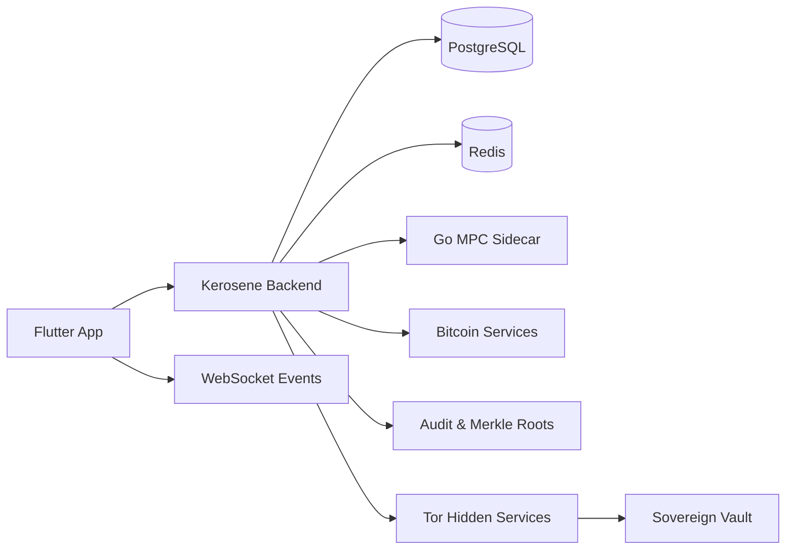

<h1 align="center">Kerosene</h1>

<p align="center">
  <strong>Bitcoin-native banking infrastructure for private, auditable digital finance.</strong>
</p>


---

## Overview

Kerosene is a pre-alpha Bitcoin banking stack for teams exploring privacy-first financial products, auditable ledgers, sovereign operations and modern wallet experiences.

It combines a Flutter client, a Java/Spring Boot backend, a Go MPC sidecar, local multi-region infrastructure, Tor hidden services, PostgreSQL, Redis and Bitcoin-oriented transaction flows.

The project is designed as a research-grade foundation, not as a production banking service.

> Fast for users. Private by default. Auditable for operators. Resilient by design.

---

## What Kerosene Includes

| Area | Capability |
| --- | --- |
| **Identity and access** | Signup, login, JWT sessions, TOTP, passkeys/WebAuthn, PIN flows, device trust and admin access controls. |
| **Wallets** | KFE wallets, custody-method limits, balances, receive addresses, watch-only/cold wallet support, UTXOs and PSBT creation. |
| **Transactions** | Quotes, internal transfers, transaction lifecycle lookup, receiving capabilities and economy status APIs. |
| **Security operations** | Rate limits, hardened security filters, release attestation, admin audit events, quorum and sovereignty checks. |
| **Client experience** | Flutter mobile/web app, onboarding, home balance carousel, wallet UX, notifications and design system. |
| **Infrastructure** | Docker-based local cluster with PostgreSQL, Redis, Tor, Vault, regional shards, MPC sidecars and monitoring surfaces. |

---

## Architecture



Repository layout:

```text
.
├── backend/
│   ├── kerosene/                  # Main Spring Boot backend
│   ├── mpc-sidecar/               # Go/gRPC sidecar for MPC-related flows
├── infra/                         # Docker, Kubernetes, runtime and infrastructure scripts
├── frontend/                      # Flutter app, web surfaces and design system
├── docs/                          # Backend, frontend and API documentation
└── scripts/                       # Local start, logs, migration, Vault and shutdown helpers
```

---

## Technology Stack

| Layer | Stack |
| --- | --- |
| App | Flutter, Dart, Riverpod, Dio, WebSocket/STOMP, secure storage, passkey/local auth integrations |
| Backend | Java 21, Spring Boot 3.5, Spring Security, JPA, Flyway, WebSocket, Actuator, Micrometer |
| Data | PostgreSQL, Redis |
| Bitcoin and custody | Bitcoin-oriented wallet flows, PSBT, UTXO inspection, MPC sidecar, Vault/quorum primitives |
| Sidecar | Go 1.24, gRPC |
| Local infrastructure | Docker Compose, Tor, Prometheus-compatible metrics |

---

## Quickstart

### Requirements

- Docker and Docker Compose
- Java 21
- Flutter / Dart
- Go 1.24+
- OpenSSL

### Configure the local environment

```bash
cp backend/kerosene/.env.example backend/kerosene/.env
```

Generate local development values and replace every `CHANGE_ME_*` entry in the environment file:

```bash
openssl rand -base64 32   # AES_SECRET
openssl rand -base64 64   # JWT_SECRET
openssl rand -base64 64   # PASSWORD_PEPPER
openssl rand -base64 64   # HMAC_SECRET_KEY
```

### Start the local stack

```bash
bash infra/scripts/local/control.sh start
```

Useful variants:

```bash
bash infra/scripts/local/control.sh start --no-build
bash infra/scripts/local/control.sh recreate server-wvo
bash infra/scripts/local/control.sh status --dashboard
```

Logs and shutdown:

```bash
bash infra/scripts/local/control.sh logs
bash infra/scripts/local/control.sh stop
bash infra/scripts/local/control.sh stop --volumes
```

The root scripts in `scripts/` remain compatibility wrappers, but the canonical operational entry point is `infra/scripts/local/control.sh`.

---

## Development Commands

Backend:

```bash
cd backend/kerosene
JAVA_HOME=/usr/lib/jvm/java-21-openjdk ./gradlew test
JAVA_HOME=/usr/lib/jvm/java-21-openjdk ./gradlew bootRun
```

Frontend:

```bash
cd frontend
flutter pub get
flutter test
flutter run
```

MPC sidecar:

```bash
cd backend/mpc-sidecar
go test ./...
```

---

## API Surface

The active API documentation lives in split, service-oriented files under:

```text
docs/backend/api/
```

Primary active API families:

```text
/auth/**                    # Authentication, sessions, TOTP, passkeys, device trust and recovery
/kfe/**                     # Wallets, dashboard, payment requests, receiving, quotes, transactions, UTXOs and PSBT
/api/public/kfe/payment-requests/** # Public payment-request lookup for QR/link flows
/api/economy/**             # Economy status and BTC price surfaces
/api/admin/kfe/audit/**     # Admin audit and Merkle-root operations
/api/admin/kfe/reserves/**  # Reserve overview and PSBT workflow operations
/mining/**                  # Mining-related endpoints
/notifications/**           # Notification registration, listing and revocation
/health/**                  # Public health probes
/sovereignty/**             # Sovereignty status, attestation and telemetry
/quorum/**                  # Shard-to-shard quorum coordination
```

Some older route families are intentionally documented as stale, removed or denied by default. Use the API docs as the source of truth before integrating a client.

Start here:

| Document | Purpose |
| --- | --- |
| `docs/backend/api/README.md` | API index by service, including active, stale and denied route families. |
| `docs/backend/api/KFE.md` | Wallets, balances, receiving, quotes, transactions, UTXOs and PSBT. |
| `docs/backend/api/AUTH.md` | Authentication, sessions, TOTP, passkeys, device trust and recovery. |
| `docs/backend/api/SOVEREIGNTY.md` | Sovereignty and quorum endpoints. |
| `docs/backend/API_REFERENCE.md` | Consolidated backend API reference for audit comparison. |

---

## Documentation Map

| Document | Description |
| --- | --- |
| `docs/backend/PROJECT_CONSOLIDATED_SUMMARY.md` | Backend project summary and architectural notes. |
| `docs/backend/REPOSITORY_ORGANIZATION.md` | Repository structure and organization rules. |
| `docs/backend/INFRASTRUCTURE.md` | Local infrastructure, Docker, Tor, database, Redis and runtime details. |
| `docs/backend/BUSINESS_LOGIC.md` | Business domains and backend rules. |
| `docs/backend/api/README.md` | Service-by-service API documentation. |
| `docs/frontend/APP.md` | Flutter app surfaces, runtime bootstrap and integration notes. |
| `docs/frontend/FRONTEND_DESIGN_SYSTEM.md` | Visual language, design tokens and component guidance. |

---

## Maturity and Safety

Kerosene is **pre-alpha experimental software**.

Do not use it with real funds or production users without independent security review, custody and key-management review, legal review, hardened production configuration, monitoring and incident response.

Known project status:

| Topic | Status |
| --- | --- |
| Production readiness | Not ready. Research and development only. |
| Real funds | Not supported. Use isolated local environments and test networks. |
| License | No root `LICENSE` file is currently present. Add one before public reuse. |
| Legacy APIs | Some historical route families are documented as stale or denied by default. |
| External integrations | Validate each integration against the current service docs before use. |

---

## Contributing

This repository is evolving quickly. Before opening a change:

1. Keep backend contracts aligned with `docs/backend/api/`.
2. Prefer active KFE endpoints over legacy route families.
3. Add or update tests for wallet, transaction, auth and security-sensitive behavior.
4. Keep frontend copy and state flows consistent with backend rules.
5. Never commit local environment files or real credentials.

---

## Disclaimer

Kerosene is not a bank, broker, licensed custodian, investment product, legal service or financial recommendation.

It is an experimental engineering project for learning, prototyping and internal evaluation of Bitcoin-native financial infrastructure.
