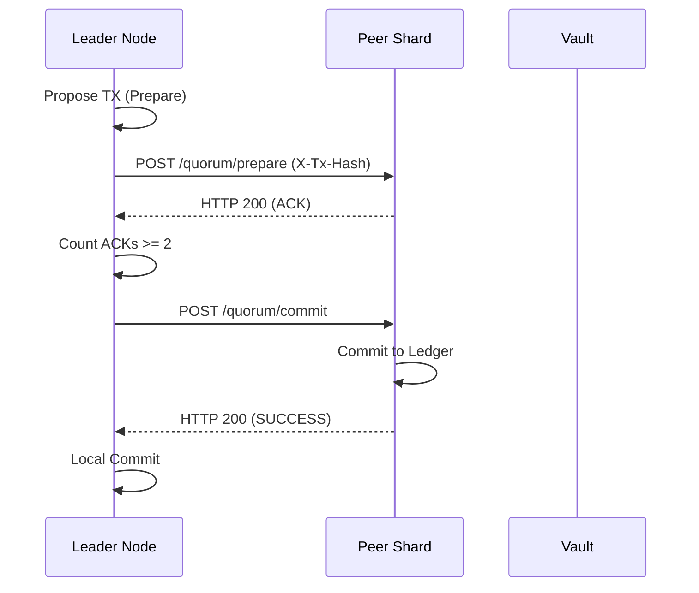

# Hydra System Architecture v5.0

Technical deep-dive into the security, consensus, and integrity layers of the Kerosene Hydra backend.

---

## 1. Quorum Consensus & Fail-Stop Protocol

Hydra implements a **CP (Consistency-Priority)** consensus model based on a custom **Raft-like 2-Phase Commit (2PC)** protocol across three geographically isolated nodes.

### Shard Configuration
- **Nodes**: Iceland (IS), Singapore (SG), Switzerland (CH).
- **Quorum**: Absolute majority required ($N/2 + 1 = 2$).
- **Connectivity**: mTLS over Tor Onion Services (Zero-Trust).

### 2-Phase Commit (2PC) Workflow

### Fail-Stop Mitigation (Split-Brain)
- **30s Window**: If a node loses quorum for more than 30 seconds, it enters **FAIL-STOP** mode.
- **Ritual Suicide**: In Fail-Stop, the node triggers `SuicideService`, clearing sensitive RAM and halting the JVM to prevent processing stale or conflicting data during a network partition.
- **Phase 2 Criticality**: If Phase 1 succeeds but Phase 2 fails, the node instantly terminates, as data consistency is considered compromised.

---

## 2. Hardware Sovereignty: TPM & Vault

Identity is tied to the physical silicon via **Trusted Platform Module (TPM) 2.0**.

### Remote Attestation Flow
1. **Nonce Generation**: The node requests a session from the Vault.
2. **PCR Quote**: The node invokes `tpm2_quote` to sign a selection of Platform Configuration Registers (PCRs 0, 1, 2, 3, 7) using a hardware-bound Attestation Key (AK).
3. **Verification**: The Vault validates the quote against the recorded "Golden Baseline". Any deviation (e.g., modified BIOS, unauthorized kernel modules) causes rejection.
4. **Provisioning**: Only after successful attestation does the Vault release the Master AES-256 key via a secure session.

### Memory Protection Guard
- **mlock()**: The JVM is configured to use native `mlockall` to prevent sensitive key material from being paged to disk (Swap).
- **Reflective Zeroing**: On emergency shutdown (Stall/Suicide), the `VaultKeyProvider` uses Java reflection to reach into `SecretKeySpec` internal byte buffers and overwrite them with zeros (`0x00`) before the process exits.
- **TME Support**: Integration with Intel/AMD Total Memory Encryption to ensure data is encrypted even in RAM.

---

## 3. Ledger Integrity & Merkle Audit

Every financial movement is anchored in a continuous Merkle Tree.

- **Merkle Roots**: Computed periodically and persisted.
- **Solvency Check**: The system continuously monitors `liability_to_users` vs `actual_onchain_balance`.
- **Insolvency Alarm**: If liabilities exceed on-chain reserves, the node triggers a global Write-Lock to prevent fractional reserve operation or exploit-based inflation.

---

## 4. MPC Sidecar (Multi-Party Computation)

For on-chain Bitcoin withdrawals, Hydra coordinates with a gRPC-linked **MPC Sidecar**.

- **Key Shards**: The private key is never recombined. The sidecar holds one shard, and the Vault/HSM holds another.
- **Distributed Signing**: Signatures are generated using threshold ECDSA (TSS), ensuring that no single physical server ever "sees" the full Bitcoin private key.

---

## 5. Anti-Abuse Layers

### Honeypot Defense
The `UserDTO` contains an innocuous-looking field `__hp`. Legitimate clients never populate this. If received, the request is flagged as a bot/scanner and silently blackholed or rate-limited to 0.1 req/s.

### PoW (Proof of Work)
Registration is gated by a CPU-bound challenge. `GET /auth/pow/challenge` returns a nonce that must be solved by the client (finding a hash prefix) before the `POST /auth/signup` is accepted.
