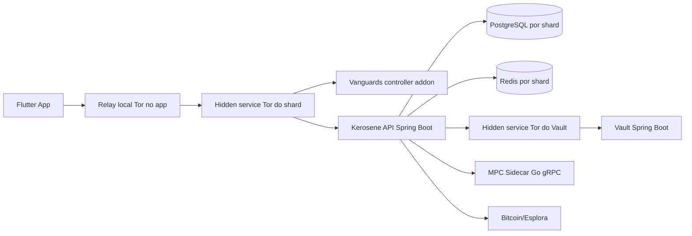
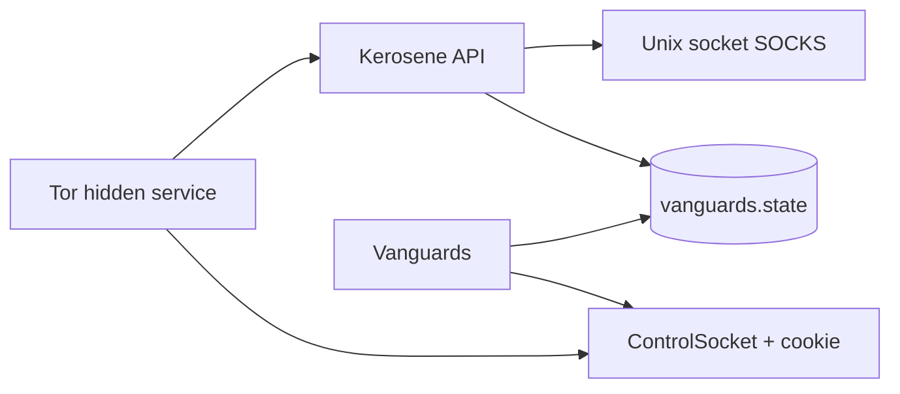
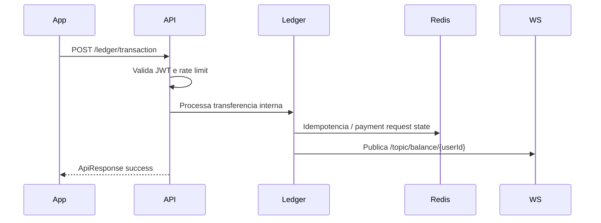

# Arquitetura Real do Kerosene

Documento tecnico baseado no codigo presente no repositorio em 2026-04-14.

## Visao Geral



O sistema e um monorepo dividido em quatro blocos principais:

| Bloco | Caminho | Papel |
| --- | --- | --- |
| API principal | `backend/kerosene` | Negocio da plataforma: autenticacao, carteiras, ledger, transacoes Bitcoin, vouchers, auditoria e WebSocket. |
| Vault | `backend/vault` | Armamento de chave mestra, atestacao TPM simulada/validada e provisionamento de AES key para shards. |
| MPC sidecar | `backend/mpc-sidecar` | Servico Go/gRPC para contratos `Keygen` e `Sign` usando `tss-lib`. |
| App | `frontend` | Flutter app com Riverpod, Dio, Tor, passkeys, NFC, QR, wallet UI e background service. |

## Camada Onion Hardening

Os shards IS, CH e SG agora executam `Tor + Vanguards` como plano de roteamento Onion.

Objetivo:

- manter `Layer 2` e `Layer 3` vanguards fixos/rotacionados segundo os algoritmos do addon oficial;
- reduzir superficie para `Guard Discovery` e correlacao de guards de onion service;
- separar o daemon de defesa do daemon Tor, preservando restart independente e limites de privilegio.

Topologia por shard:



Implementacao real no repositorio:

- `backend/kerosene/tor/torrc-is`
- `backend/kerosene/tor/torrc-ch`
- `backend/kerosene/tor/torrc-sg`
- `backend/kerosene/tor/vanguards/Dockerfile`
- `backend/kerosene/tor/vanguards/vanguards.conf`
- `backend/kerosene/tor/vanguards/entrypoint.sh`

Fluxo operacional:

1. O container Tor sobe o hidden service e expoe `ControlSocket`.
2. O sidecar `vanguards` autentica via cookie no `ControlSocket`.
3. O addon passa a atualizar `Layer2`/`Layer3`, `bandguards` e `rendguard`.
4. O backend principal nao fala com o controller Tor; ele apenas consome o socket SOCKS e observa o arquivo de estado para health.

## Backend Principal

Servico: `backend/kerosene`

Build:

- Java 21.
- Spring Boot `3.3.2`.
- Gradle Kotlin DSL.
- PostgreSQL driver `42.7.7`.
- Redis via `spring-boot-starter-data-redis`.
- JWT via `jjwt 0.13.0`.
- BitcoinJ `0.15.10`.
- gRPC Java para integracao com sidecar MPC.
- OWASP Dependency Check configurado para falhar build com CVSS maior ou igual a `7.0`.

Pacotes funcionais:

| Pacote | Responsabilidade |
| --- | --- |
| `source.auth` | Login, signup, TOTP, PoW, JWT, passkeys, usuarios e dispositivos. |
| `source.wallet` | Criacao, listagem, update e delecao de carteiras. |
| `source.ledger` | Balancos internos, historico, transacoes internas, payment requests e auditoria Merkle. |
| `source.transactions` | Endereco de deposito, fee estimate, unsigned tx, broadcast, withdraw, payment links, economy e onramp. |
| `source.mining` | Marketplace interno de rigs, aluguel de hashpower, cancelamento pro-rata e liquidacao de rendimento projetado. |
| `source.voucher` | Voucher Bitcoin e pagamento de onboarding. |
| `source.notification` | Notificacao via WebSocket user queue. |
| `source.security` | VaultKeyProvider, status de soberania, atestacao, heartbeat, egress guard e servicos de falha segura. |
| `source.config` | WebSocket/STOMP, filtros de logging e MDC. |

## Fluxo de Autenticacao

1. O cliente chama `GET /auth/pow/challenge`.
2. O cliente envia credenciais para `POST /auth/signup` ou `POST /auth/login`.
3. No signup, `POST /auth/signup/totp/verify` retorna um `sessionId` temporario para o onboarding em Redis.
4. No login, `POST /auth/login/totp/verify` retorna JWT.
5. No pior caso de recuperacao, `POST /auth/recovery/emergency/start` usa PoW + multiplos recovery codes e abre uma sessao curta sem JWT.
6. `POST /auth/recovery/emergency/finish` valida o NOVO TOTP e a NOVA passkey e so entao rotaciona passphrase, TOTP, passkey e recovery codes para o mesmo username.
7. Requisicoes autenticadas usam `Authorization: Bearer <jwt>`.
8. O backend renova tokens proximos da expiracao pelo header `X-New-Token`.

Passkeys:

- Controller real: `source.auth.controller.PasskeyController`.
- Endpoints implementados: `/auth/passkey/challenge`, `/auth/passkey/register`, `/auth/passkey/verify`, `/auth/passkey/onboarding/start`, `/auth/passkey/onboarding/finish`.
- O fluxo assina desafios e verifica assinatura com chave publica enviada ou armazenada.
- Observacao real: `challenge`, `verify` e os endpoints de onboarding precisam estar liberados na `SecurityFilterChain`; apenas `/auth/passkey/register` continua protegido por JWT.

Recuperacao extrema:

- Controller real: `source.auth.controller.EmergencyRecoveryController`.
- Endpoints implementados: `/auth/recovery/emergency/start` e `/auth/recovery/emergency/finish`.
- O `start` nao muda credenciais ainda; ele valida PoW, multipos recovery codes e cria uma sessao curta em Redis.
- O `finish` consome a sessao com `GETDEL` e troca as credenciais antigas por novas de forma transacional.
- O fluxo sempre exige:
  - nova passphrase BIP39
  - novo TOTP confirmado
  - nova passkey com prova criptografica
  - no minimo 3 recovery codes distintos
- Os recovery codes antigos deixam de valer imediatamente apos o sucesso.

## Fluxo Financeiro Interno



Ledger:

- `LedgerController` resolve o usuario autenticado pelo `SecurityContextHolder`.
- `TransactionDTO` suporta `sender`, `receiver`, `amount`, `context`, `idempotencyKey`, `requestTimestamp`, `passkeyAssertionJson`, `confirmationPassphrase` e `totpCode`.
- Autorizacao de transacao e baseada no perfil da conta:
  - `STANDARD` e `PASSKEY`: passkey obrigatoria sob challenge do servidor; TOTP nao e solicitado.
  - `SHAMIR`: shares SLIP-39/passphrase reconstruida + TOTP.
  - `MULTISIG_2FA`: passphrase + TOTP; threshold `3` adiciona passkey.
- Falhas de TOTP/passkey em transacao nao invalidam JWT e nao devem deslogar o usuario.
- Operacoes financeiras em `/ledger/transaction` e `/ledger/payment-request/{linkId}/pay` tem rate limit por usuario de 10 operacoes por minuto.
- O historico e paginado por `page` e `size`, com `size` limitado a 100.

## Bitcoin, Depositos e Saques

O controller real `TransactionController` oferece:

- `GET /transactions/deposit-address`.
- `GET /transactions/estimate-fee?amount=...`.
- `POST /transactions/create-unsigned`.
- `GET /transactions/status?txid=...`.
- `POST /transactions/broadcast`.
- `POST /transactions/create-payment-link`.
- `GET /transactions/payment-link/{linkId}` para fluxos autenticados.
- `POST /transactions/payment-link/{linkId}/confirm` para fluxos autenticados.
- `POST /transactions/payment-link/{linkId}/complete`.
- `GET /transactions/payment-links`.
- `POST /transactions/withdraw`.

O controller real `NetworkPaymentsController` oferece:

- `POST /transactions/network/onchain/address`.
- `GET /transactions/network/wallet-profile?walletName=...`.
- `POST /transactions/network/onchain/send`.
- `POST /transactions/network/lightning/invoice`.
- `POST /transactions/network/lightning/pay`.
- `GET /transactions/network/transfers`.
- `GET /transactions/network/transfers/{transferId}`.

Detalhes reais:

- Pagamentos externos on-chain e Lightning cobram `0.9%` de taxa de plataforma alem do fee de rede.
- Saidas externas usam `WalletAuthorizationService` e seguem a mesma matriz de fatores do ledger: conta padrao usa passkey sem TOTP; TOTP aparece apenas para modos superiores a `STANDARD`.
- O adapter de custodia e configuravel por `custody.*` e usa `BCX` como nome default do provider.
- `GET /transactions/deposit-address` e os fluxos de onramp/payment link emitem um endereco custodial dedicado por wallet/usuario.
- Em ambiente sem provider live, esses enderecos on-chain sao derivados de uma branch da carteira principal da Kerosene (`bitcoin.platform.master-xpub` com fallback para `bitcoin.hot-wallet.xpub`) e cada emissao avanca o indice da wallet monitorada.
- Lightning usa payload mock deterministico em desenvolvimento.

O controller real `MiningController` oferece:

- `GET /mining/rigs`.
- `POST /mining/allocations`.
- `GET /mining/allocations`.
- `GET /mining/allocations/{allocationId}`.
- `POST /mining/allocations/{allocationId}/cancel`.

Modelo real da mineracao:

- Inspirado no fluxo de hashpower rental da MRR: catalogo de rigs por algoritmo, unidade de hash, preco por unidade-dia e janela minima/maxima de locacao.
- A alocacao pode ser calculada por `requestedHashrate` ou por `budgetBtc`.
- Cancelamentos calculam refund proporcional do tempo restante e settlement do rendimento projetado do tempo consumido.

Fluxo real de onboarding sem JWT:

- `POST /voucher/onboarding-link?sessionId=...` cria o payment link publico de onboarding.
- `GET /voucher/onboarding-link/{linkId}` consulta o status do link sem autenticacao.
- `POST /voucher/onboarding-link/{linkId}/confirm` confirma o pagamento sem autenticacao.
- Os endpoints genericos `/transactions/payment-link/*` permanecem para fluxos autenticados.

Limites reais:

- `bitcoin.deposit-address` ainda existe como fallback estatico para onboarding publico/voucher; nao e mais a fonte principal do endpoint autenticado `/transactions/deposit-address`.
- `LedgerAuditController#getActualOnchainBalance` retorna `50.00000000` como mock/fallback no codigo atual.
- `MpcSidecarClient` em Java abre canal gRPC, mas `keygen` e `sign` ainda retornam placeholders. O sidecar Go tem contrato gRPC real.

## Vault

Servico: `backend/vault`

- Porta: `8090`.
- Build: Maven, Spring Boot `3.3.4`, Java 21.
- Endpoints: `/v1/vault/arm`, `/v1/vault/attest`, `/v1/vault/provision`, `/v1/vault/heartbeat`.
- `VaultController` exige quorum de diretores para armar a chave mestra: `director-1`, `director-2`, `director-3`, com `REQUIRED_APPROVALS = 2`.
- A chave e mantida em memoria por `VaultMemoryLocker`.
- Tokens de provisionamento ficam em `ConcurrentHashMap`, em RAM.

## MPC Sidecar

Servico: `backend/mpc-sidecar`

- Go module: `mpc-sidecar`.
- Go version: `1.24`.
- Porta: `50051`.
- Protobuf: `backend/mpc-sidecar/proto/mpc.proto`.
- RPCs:
  - `Keygen(KeygenRequest) returns (KeygenResponse)`.
  - `Sign(SignRequest) returns (SignResponse)`.

Estado atual:

- O sidecar registra `MpcService` e reflection no servidor gRPC.
- `InitSecureEnclave` e o servico usam simulacoes/arquivos em tmpfs para shards.
- A API Java ainda nao chama stubs gerados reais; o client atual e placeholder.

## Frontend Flutter

Servico: `frontend`

Caracteristicas reais:

- `MaterialApp` com rotas nomeadas.
- Riverpod como DI/state management.
- `AppConfig` define tres nodes `.onion`: IS, CH e SG.
- `main.dart` inicializa Tor via `TorService`, cria relay TCP local para o onion ativo e atualiza `AppConfig.apiUrl`.
- `ApiClient` usa Dio, retry, cookie manager persistente, tratamento de erro e opcional SOCKS5 para `.onion`.
- `TokenInterceptor` injeta JWT, trata `X-New-Token` e seta `Host` com o host `.onion`.
- WebSocket de saldo usa endpoint STOMP no backend.

Rotas principais no app:

```text
/welcome
/login
/signup
/home
/home_loading
/create_wallet
/send-money
/deposits
```

## WebSocket

Configuracao real: `source.config.WebSocketConfig`.

Endpoints:

- `/ws/balance` com SockJS.
- `/ws/raw-balance` sem SockJS.
- `/ws/payment-request` com SockJS.
- `/ws/raw-payment-request` sem SockJS.

Broker:

- Prefixo de broker: `/topic`.
- Prefixo de aplicacao: `/app`.
- Heartbeat: `10000,10000`.

Topicos publicados:

- `/topic/balance/{userId}` com `BalanceUpdateEvent`.
- `/topic/payment-request/{linkId}` com `InternalPaymentRequestDTO`.
- `/user/{userId}/queue/notifications` via `NotificationService`.

Autenticacao:

- O JWT deve ser enviado no frame STOMP `CONNECT` como header `Authorization: Bearer <token>` ou no query param `token` do handshake.
- O HTTP JWT filter nao aceita JWT por query param para REST, mas o handshake WebSocket extrai `token` e autentica no nivel STOMP.

## Persistencia

Schemas SQL iniciais:

- `auth`.
- `financial`.

Tabelas relevantes:

- `auth.users_credentials`.
- `auth.passkey_credentials`.
- `auth.vouchers`.
- `financial.wallets`.
- `financial.ledger`.
- `financial.ledger_transaction_history`.
- `financial.ledger_entries`.
- `financial.ledger_transactions`.

Migracao adicional:

- `backend/kerosene/src/main/resources/db/migration.sql` adiciona `totp_secret`, indices de performance, `deposit_address` e ajustes de passkey.

## Seguranca

Mecanismos presentes:

- `JwtAuthenticationFilter`: aceita somente `Authorization: Bearer <token>` em REST.
- `RateLimitFilter`: 20 req/min para `/auth/*` e 100 req/min para demais paths por IP.
- `ParanoidSecurityFilter`: exige `application/json` ou `application/x-protobuf` para requests com body, limita payload a 2 KB, remove headers forjaveis e injeta padding.
- JWT renewal por `X-New-Token`.
- TOTP em signup/login, endpoints sensiveis de auditoria e transacoes somente quando a politica elevada exigir (`SHAMIR`/`MULTISIG_2FA`). Contas `STANDARD` e `PASSKEY` usam passkey nas transacoes e nao pedem TOTP.
- `VaultKeyProvider` usa Vault quando `vault.enabled=true` e cai para `AES_SECRET` em desenvolvimento.
- `NetworkEgressFilter` documenta enforcement por iptables/seccomp, sem instalar SecurityManager.

Limites e pontos de atencao:

- CORS esta com `allowedOriginPatterns("*")` no estado atual.
- `WalletResponseDTO` expoe `passphraseHash`; isso deve ser revisado antes de producao.
- Alguns endpoints comentados como publicos em controllers nao estao liberados na `SecurityFilterChain`.
- O sidecar MPC ainda nao esta integrado com stubs reais no client Java.
