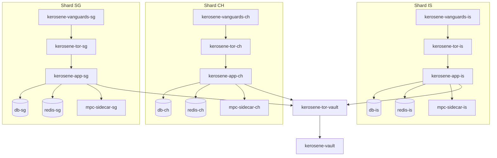

# Infraestrutura Real do Kerosene

Documento baseado nos arquivos Docker, compose, propriedades Spring e scripts existentes em 2026-04-07.

## Arquivos Relevantes

| Arquivo | Papel |
| --- | --- |
| `backend/kerosene-infrastructure/docker-compose.local.yml` | Compose local para simular Vault e shards IS/CH/SG no mesmo host. |
| `backend/kerosene/docker-compose.yml` | Compose de topologia distribuida antiga/producao, com mTLS e sidecars MPC definidos. |
| `backend/kerosene-infrastructure/images/app/Dockerfile` | Build do backend principal em Java 21 com runtime Distroless. |
| `backend/kerosene-infrastructure/images/vault/Dockerfile` | Build do Vault Maven/Java 21 com runtime Distroless. |
| `backend/kerosene/tor/Dockerfile` | Imagem Tor baseada em Debian Bookworm Slim. |
| `backend/kerosene/tor/vanguards/Dockerfile` | Imagem sidecar do addon oficial Tor Vanguards para os shards. |
| `backend/mpc-sidecar/Dockerfile` | Build Go/gRPC do sidecar MPC. |
| `backend/kerosene-infrastructure/scripts/init-local.sh` | Bootstrap local: valida `.env`, tenta gerar certificados e reescreve `torrc`. |
| `scripts/start-local.sh` | Wrapper local canonico para inicializar o backend via compose. |
| `scripts/arm-vault.sh` | Arma o Vault local usando `AES_SECRET` do `.env` e quorom de dois diretores de desenvolvimento. |
| `backend/kerosene/deploy/init-iptables.sh` | Regras host-level de egress guard por iptables. |

## Compose Local Recomendado

O compose local atual usa o layout real `backend/*`:

```bash
bash scripts/init-local.sh
bash scripts/start-local.sh
bash scripts/logs-local.sh
bash scripts/stop-local.sh
```

Comando compose equivalente:

```bash
docker compose --project-name kerosene-infrastructure --env-file backend/kerosene/.env -f backend/kerosene-infrastructure/docker-compose.local.yml config
docker compose --project-name kerosene-infrastructure --env-file backend/kerosene/.env -f backend/kerosene-infrastructure/docker-compose.local.yml up -d --build
```

Servicos definidos:

| Servico | Funcao |
| --- | --- |
| `kerosene-vault` | Vault local sem port binding de host. |
| `kerosene-tor-vault` | Hidden service Tor do Vault. |
| `db-is`, `db-ch`, `db-sg` | PostgreSQL 17 Alpine por shard, `REQUIRE_MTLS=false` no local. |
| `redis-is`, `redis-ch`, `redis-sg` | Redis 7 Alpine por shard com `--requirepass`. |
| `mpc-sidecar-is`, `mpc-sidecar-ch`, `mpc-sidecar-sg` | Sidecars Go/gRPC usados por `MPC_SIDECAR_HOST`. |
| `kerosene-app-is`, `kerosene-app-ch`, `kerosene-app-sg` | API principal por regiao. |
| `kerosene-tor-is`, `kerosene-tor-ch`, `kerosene-tor-sg` | Hidden services Tor dos shards. |
| `kerosene-vanguards-is`, `kerosene-vanguards-ch`, `kerosene-vanguards-sg` | Addon Vanguards preso ao `ControlSocket` do Tor por shard. |

Redes definidas:

| Rede | Tipo | Observacao |
| --- | --- | --- |
| `net_vault` | bridge internal | Sem egress direto; Vault isolado. |
| `net_db_is`, `net_db_ch`, `net_db_sg` | bridge internal | Banco e Redis por shard. |
| `net_mpc` | bridge internal | Declarada para sidecar MPC. |
| `net_tor` | bridge internal | Comunicacao app/Tor. |
| `tor_egress` | bridge | Apenas daemons Tor devem ter saida. |

Volumes definidos:

```text
pg_data_is, pg_data_ch, pg_data_sg
redis_data_is, redis_data_ch, redis_data_sg
mpc_shards_is, mpc_shards_ch, mpc_shards_sg
tor_socks_is, tor_socks_ch, tor_socks_sg
tor_data_is, tor_data_ch, tor_data_sg
tor_control_is, tor_control_ch, tor_control_sg
vanguards_state_is, vanguards_state_ch, vanguards_state_sg
tor_keys_vault, tor_keys_is, tor_keys_ch, tor_keys_sg
shard_identity_is, shard_identity_ch, shard_identity_sg
```

Observacao operacional: o compose local define os sidecars `mpc-sidecar-is`, `mpc-sidecar-ch` e `mpc-sidecar-sg` no `net_mpc`. O compose `backend/kerosene/docker-compose.yml` permanece como topologia distribuida antiga/producao e ainda deve ser revisado antes de producao para garantir build contexts consistentes com o layout `backend/*`.

## Topologia de Runtime



## Backend App Image

Dockerfile: `backend/kerosene-infrastructure/images/app/Dockerfile`

Caracteristicas:

- Stage builder com `eclipse-temurin:21-jdk`.
- Build Gradle `./gradlew bootJar --no-daemon -x test`.
- Runtime `gcr.io/distroless/java21-debian12:nonroot`.
- Usuario `65532:65532`.
- `EXPOSE 8080` apenas interno.
- Entrypoint Java com `UseContainerSupport`, `MaxRAMPercentage=75.0` e `java.security.egd`.

Hardening no compose:

- `cap_drop: [ALL]`.
- `cap_add: [IPC_LOCK]`.
- `security_opt: no-new-privileges:true`.
- `tmpfs` para `/tmp` e `/opt/kerosene`.

## Vault Image

Dockerfile: `backend/kerosene-infrastructure/images/vault/Dockerfile`

Caracteristicas:

- Stage builder com `maven:3.9.6-eclipse-temurin-21-jammy`.
- `mvn clean package -DskipTests`.
- Runtime `gcr.io/distroless/java21-debian12:nonroot`.
- Sem port binding de host no compose local.
- `server.port=8090` em `backend/vault/src/main/resources/application.properties`.

## Tor Sidecars

Arquivos:

- `backend/kerosene/tor/Dockerfile`.
- `backend/kerosene/tor/entrypoint.sh`.
- `backend/kerosene/tor/torrc-is`.
- `backend/kerosene/tor/torrc-ch`.
- `backend/kerosene/tor/torrc-sg`.
- `backend/kerosene/tor/torrc-vault`.
- `backend/kerosene/tor/vanguards/Dockerfile`.
- `backend/kerosene/tor/vanguards/entrypoint.sh`.
- `backend/kerosene/tor/vanguards/vanguards.conf`.

Configuracao real dos shards:

```text
SocksPort unix:/var/run/tor/socks/tor.sock WorldWritable
ControlSocket /var/run/tor/control/control
CookieAuthentication 1
CookieAuthFile /var/run/tor/control/control_auth_cookie
HiddenServicePort 80 kerosene-app-<region>-local:8080
```

Configuracao real do Vault:

```text
SocksPort 0
HiddenServicePort 80 kerosene-vault-local:8090
```

O entrypoint:

- Verifica o hash do binario Tor se `EXPECTED_TOR_HASH` estiver definida.
- Cria usuario `kerosene` com UID/GID `65532`.
- Ajusta permissoes de `/var/run/tor/socks`, `/var/run/tor/control` e `/var/lib/tor/kerosene_service`.
- Inicia `tor -f /etc/tor/torrc`.

## Tor Vanguards

Os shards IS, CH e SG executam um sidecar `vanguards` separado do processo Tor.

Decisao de desenho:

- o addon nao compartilha rede com nenhum outro servico; ele roda com `network_mode: none`;
- o acoplamento com Tor acontece apenas por volume do `ControlSocket` e cookie;
- o estado operacional fica em volume dedicado `vanguards_state_<region>`;
- o backend principal monta esse estado como somente leitura para publicar health via Actuator.

Volumes por shard:

| Volume | Escritor | Leitor | Papel |
| --- | --- | --- | --- |
| `tor_data_<region>` | Tor | Vanguards | `DataDirectory` com consenso e caches necessarios para o addon. |
| `tor_control_<region>` | Tor | Vanguards | `ControlSocket` e `control_auth_cookie`. |
| `vanguards_state_<region>` | Vanguards | App | `vanguards.state` usado para health e auditoria operacional. |

Healthchecks reais:

- Tor: `test -f /tmp/tor-ready`
- Vanguards: `test -f /tmp/vanguards-ready`

Subida:

1. `kerosene-tor-<region>` sobe e conclui bootstrap.
2. `kerosene-vanguards-<region>` autentica no `ControlSocket`.
3. O addon escreve `vanguards.state` e permanece supervisionando guard layers, bandguards e rendguard.

Observacao: o Vault continua com hidden service Tor isolado, mas sem sidecar `vanguards` nesta implementacao. O requisito aplicado aqui foi exatamente nos 3 shards regionais.

## Banco de Dados

Configuracao local de app:

- `application.properties`: `jdbc:postgresql://localhost:5432/kerosene`.
- `application-docker.properties`: `jdbc:postgresql://db:5432/kerosene`, mas o compose sobrescreve com `SPRING_DATASOURCE_URL` por shard.
- `ddl-auto=update`.
- `spring.sql.init.mode=always` no profile docker usando `classpath:db/migration.sql`.

Schemas:

- `auth`.
- `financial`.

Inicializacao:

- `backend/kerosene/docker-entrypoint-initdb.d/init.sql`.
- `backend/kerosene/docker-entrypoint-initdb.d/99-init-ssl.sh`.
- `backend/kerosene/src/main/resources/db/migration.sql`.

No compose local, `REQUIRE_MTLS=false`, entao o `pg_hba.conf` permite `scram-sha-256`. No compose distribuido antigo, os bancos usam SSL e certificados em `backend/kerosene/certs`.

## Redis

Configuracao:

- Local default: `127.0.0.1:6379`.
- Docker: host por shard via `SPRING_DATA_REDIS_HOST`.
- Senha por `REDIS_PASSWORD`.
- Comando real: `redis-server --requirepass ${REDIS_PASSWORD} --appendonly yes`.

Uso no codigo:

- Rate limit.
- Signup state.
- Payment links.
- Internal payment requests.
- Economy status.

## Variaveis de Ambiente

Nunca commitar valores reais. Lista de nomes usados:

```text
POSTGRES_USER
POSTGRES_PASSWORD
REDIS_PASSWORD
AES_SECRET
JWT_SECRET
PASSWORD_PEPPER
FOUNDER_TOTP_SECRET
HMAC_SECRET_KEY
WEBAUTHN_RP_ID
WEBAUTHN_RP_NAME
WEBAUTHN_ORIGINS
BITCOIN_ESPLORA_BASE_URL
BITCOIN_PLATFORM_MASTER_XPUB
BITCOIN_HOT_WALLET_ADDRESS
BITCOIN_HOT_WALLET_XPUB
BITCOIN_HOT_WALLET_XPUB_SCAN_RANGE
EXPECTED_TOR_HASH
REGION
MPC_SIDECAR_HOST
VAULT_ENABLED
VAULT_ONION_FILE
VAULT_PROXY_PATH
CUSTODY_PROVIDER_NAME
CUSTODY_BASE_URL
CUSTODY_API_KEY
CUSTODY_MOCK_MODE
CUSTODY_ONCHAIN_ADDRESS_PATH
CUSTODY_LIGHTNING_INVOICE_PATH
CUSTODY_ONCHAIN_SEND_PATH
CUSTODY_LIGHTNING_PAY_PATH
TOR_HEALTH_VANGUARDS_STATE_FILE
```

Variaveis com defaults no codigo:

- `bitcoin.deposit-address`.
- `bitcoin.min-confirmations`.
- `bitcoin.payment-link-expiration-minutes`.
- `bitcoin.mock-mode`.
- `bitcoin.esplora.base-url`.
- `bitcoin.platform.master-xpub`.
- `bitcoin.hot-wallet.address`.
- `bitcoin.hot-wallet.xpub`.
- `bitcoin.hot-wallet.xpub-scan-range`.
- `audit.merkle.interval-ms`.
- `blockchain.monitor.interval.min`.
- `blockchain.monitor.interval.max`.
- `onramp.moonpay.url`.
- `onramp.banxa.url`.
- `onramp.bipa.url`.
- `bitcoin.network`.
- `bitcoin.derivation.salt`.
- `transactions.external.fee-rate`.
- `transactions.local-address-provider-name`.
- `lightning.default-max-routing-fee-sats`.
- `custody.provider-name`.
- `custody.onchain-address-path`.
- `custody.lightning-invoice-path`.
- `custody.onchain-send-path`.
- `custody.lightning-pay-path`.

Configuracao nova de custodia/pagamentos externos:

- `transactions.external.fee-rate`: taxa percentual aplicada em saidas externas; default real `0.009` (0.9%).
- `lightning.default-max-routing-fee-sats`: reserva default de fee Lightning; default real `60` sats.
- `custody.*`: define o adapter HTTP para provider externo de carteira/custodia. O nome default configurado no backend e `BCX`.
- Se `custody.base-url` ou `custody.api-key` nao estiverem configurados, o backend entra em fallback:
  - enderecos on-chain usam derivacao local a partir de uma branch por wallet da carteira principal da Kerosene (`bitcoin.platform.master-xpub` com fallback para `bitcoin.hot-wallet.xpub`).
  - Lightning usa invoices/pagamentos mock deterministas para desenvolvimento.

## Validacao Antes de Deploy

Checklist minimo:

```bash
bash scripts/init-local.sh
bash scripts/start-local.sh --no-arm
bash scripts/stop-local.sh
cd backend/kerosene
./gradlew test
./gradlew dependencyCheckAnalyze
```

Cuidados:

- `docker compose config` imprime variaveis resolvidas; nao publique a saida se estiver usando `.env` real.
- Confirme se os sidecars MPC estao definidos no compose usado em producao.
- Confirme se os build contexts apontam para `backend/vault` e `backend/mpc-sidecar` no layout atual.
- Confirme se `bitcoin.platform.master-xpub` ou `bitcoin.hot-wallet.xpub` estao configurados para a emissao dos enderecos custodiais on-chain.
- Confirme se `WEBAUTHN_RP_ID` e `WEBAUTHN_ORIGINS` batem com o dominio/onion acessado pelo app.
