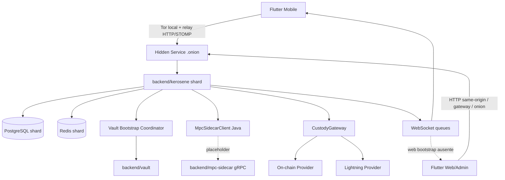
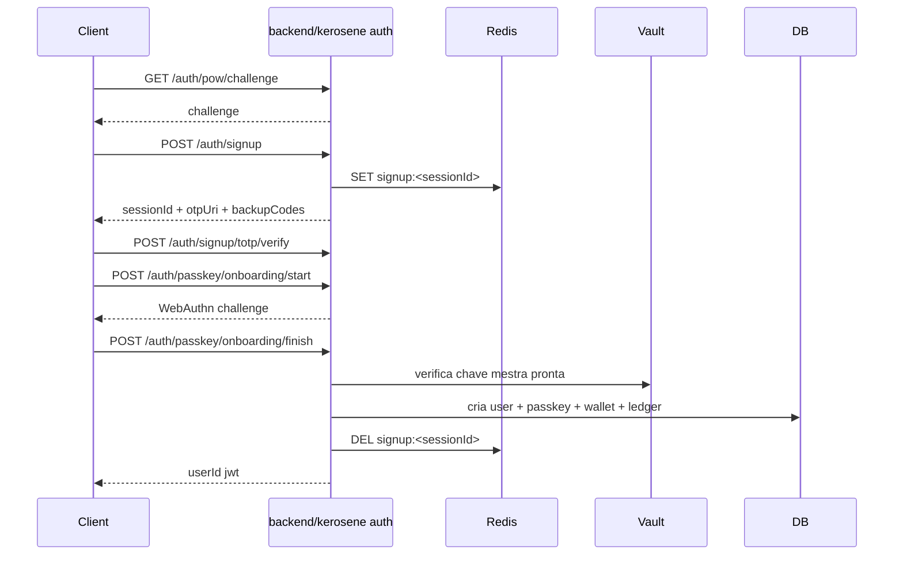
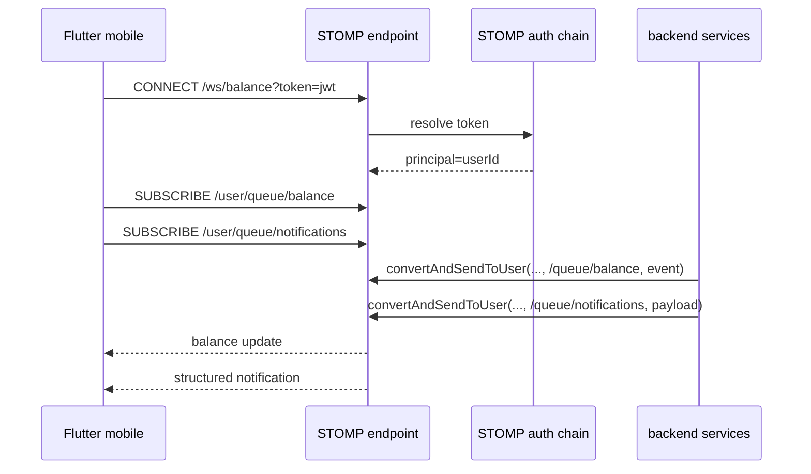

# Kerosene Master Reference

Inspeção consolidada em `2026-04-29`, derivada de documentação existente, leitura estática do repositório e validação pontual de build.

Categorias de estado usadas neste documento:

| Categoria | Significado operacional |
| --- | --- |
| `IMPLEMENTADO` | Existe no código principal, possui rota/serviço/fluxo real e não depende de mock para a função principal. |
| `IMPLEMENTADO COM LIMITAÇÕES` | Existe e funciona, mas tem restrições relevantes, dependências opcionais, fallback, hardcode, lacunas de UX, segurança ou observabilidade. |
| `PARCIAL` | Existe apenas uma parte do fluxo, ou o backend existe sem cliente, ou o cliente existe sem backend, ou faltam passos para o fluxo ficar utilizável ponta a ponta. |
| `MOCKADO` | O comportamento é simulado deliberadamente. |
| `PLACEHOLDER` | O ponto de extensão existe, mas a implementação final ainda não foi conectada. |
| `LEGADO` | Continua no repositório por compatibilidade, histórico ou transição, mas não representa o caminho principal recomendado. |
| `NÃO INTEGRADO` | Componentes existem separadamente, porém a integração principal ainda não foi realizada. |
| `DIVERGENTE ENTRE DOC E RUNTIME` | A documentação, o frontend, a segurança ou o código em runtime se contradizem. |
| `PENDENTE DE REVISÃO PARA PRODUÇÃO` | Pode existir e até funcionar, mas ainda há risco material para uso de produção. |

## 1. Propósito deste documento

Este arquivo é a referência global canônica do projeto Kerosene no estado atual do repositório. Ele substitui a necessidade de navegar entre múltiplos arquivos de documentação para entender produto, arquitetura, backend, Vault, sidecar MPC, infraestrutura, frontend Flutter, painel web/admin, fluxos de autenticação, pagamentos, notificações e gaps de integração.

Este documento consolida e reconcilia principalmente:

| Fonte | Papel nesta consolidação | Peso de confiança |
| --- | --- | --- |
| `docs/README.md` | visão geral do sistema e comandos operacionais | médio |
| `docs/ARCHITECTURE.md` | intenção arquitetural, topologias e rationale | médio |
| `docs/INFRASTRUCTURE.md` | runtime onion, compose, hardening, scripts | médio |
| `docs/API_REFERENCE.md` | mapeamento de endpoints derivado dos controllers | alto |
| `docs/APK.md` | processo de release Android e artefatos gerados | médio, com divergência relevante em checksums/size |
| `docs/FRONTEND_NOTIFICATION_SYSTEM.md` | estado do realtime/notificações no app | alto |
| `docs/FEATURES_AND_STATES.md` | matriz de maturidade recente | alto |
| código em `backend/**`, `frontend/**`, `scripts/**` | fonte final para desempate | máximo |

Áreas de repositório efetivamente cruzadas nesta consolidação:

- `backend/kerosene/**`
- `backend/vault/**`
- `backend/mpc-sidecar/**`
- `backend/kerosene-infrastructure/**`
- `scripts/**`
- `frontend/lib/**`
- `frontend/android/**`
- `frontend/build/app/outputs/**`

Limites deste documento:

- Esta consolidação foi feita por inspeção estática do código e por validações pontuais de build, não por um teste integral do cluster completo em execução.
- A consolidação reflete o estado do workspace inspecionado nesta data, inclusive mudanças ainda não necessariamente transformadas em release formal.
- Quando documentação antiga, frontend e backend real entram em conflito, este documento prioriza o código atual do backend principal, a chain de segurança efetiva e os scripts/runtime atuais.
- Onde um comportamento depende de variáveis de ambiente, perfil `docker`, presença de Tor, providers externos, Vault ou sidecar MPC, isso é explicitado.

## 2. Visão geral do sistema

Kerosene é uma plataforma financeira focada em Bitcoin, com:

- autenticação multifator combinando senha, TOTP, passkeys e modos avançados de segurança;
- ledger interno por carteira;
- pagamentos internos entre usuários;
- depósitos e pagamentos externos on-chain;
- pagamentos Lightning;
- payment links;
- fluxo de mineração/rental de hashpower;
- runtime distribuído por shards com roteamento via Tor hidden services;
- Vault dedicado para provisão de chave mestra AES;
- sidecar MPC em Go ainda incompleto;
- frontend Flutter usado tanto para app mobile quanto para console web/admin.

Na forma arquitetural pretendida, o ecossistema tem estes blocos:

| Bloco | Papel |
| --- | --- |
| App Flutter mobile | cliente primário, inicia Tor local, abre relay local, usa REST + STOMP/SockJS |
| App Flutter web/admin | console administrativo e de observabilidade, usa REST direto para o origin resolvido |
| `backend/kerosene` | API principal, autenticação, ledger, wallets, external payments, mining, WebSocket, telemetry |
| `backend/vault` | serviço central de armamento, attestation, provisionamento da chave AES e heartbeat de shards |
| `backend/mpc-sidecar` | sidecar gRPC para keygen/signing MPC, ainda sem coordenação TSS funcional |
| PostgreSQL por shard | persistência principal (`auth`, `financial`, `public`) |
| Redis por shard | estado transitório de signup, recovery, desafios, rate limits e caches temporários |
| Tor hidden services | expõem app shards e Vault sem bind público direto |
| Vanguards | endurecimento do cliente/serviço Tor, controle de guard sets e state file |
| Custody/Lightning providers | integrações externas opcionais para endereços, invoices, pagamentos e status |

Visão macro do fluxo de dados:

1. O frontend mobile inicializa Tor local e cria um relay `127.0.0.1:<porta>` para um host `.onion`.
2. O frontend web/admin resolve uma base URL por `WEB_API_URL`, `WEB_ONION_GATEWAY`, `.onion` atual ou same-origin.
3. O backend principal recebe REST e STOMP, autentica por JWT e aplica filtros de hardening.
4. Operações autenticadas usam PostgreSQL para dados permanentes e Redis para estado efêmero.
5. O backend tenta carregar a chave mestra AES do Vault no startup se `vault.enabled=true`; em modo de desenvolvimento cai para `AES_SECRET`.
6. Pagamentos externos agora têm trilha principal real com `Bitcoin Core RPC/ZMQ`, `BTCPay`, `LND` e `PSBT/quorum`. Sem essas integrações, o sistema falha fechado para emissão/pagamento e o monitor Lightning deixa de fazer polling em vez de inventar liquidação.
7. Eventos de saldo e notificações saem por WebSocket usando `SimpMessagingTemplate`.

Diagrama geral:



## 3. Mapa do repositório

Árvore lógica do monorepo:

```text
Kerosene/
├── backend/
│   ├── kerosene/                  # API principal Java/Spring Boot
│   ├── vault/                     # Vault Java/Spring Boot
│   ├── mpc-sidecar/               # Sidecar MPC em Go + gRPC + protobuf
│   └── kerosene-infrastructure/   # Compose local, Dockerfiles e bootstrap de cluster
├── docs/                          # Documentação histórica e consolidada
├── frontend/                      # App Flutter mobile e web/admin
└── scripts/                       # Scripts operacionais de bootstrap, logs, migração e parada
```

Mapa por área:

| Caminho | Papel real | Arquivos/pastas críticas |
| --- | --- | --- |
| `backend/kerosene` | backend principal | `build.gradle.kts`, `src/main/java/source/**`, `src/main/resources/application*.properties`, `docker-compose.yml`, `docker-entrypoint-initdb.d/*`, `deploy/*`, `tor/*` |
| `backend/vault` | Vault de chave mestra e heartbeat | `pom.xml`, `src/main/java/vault/controller/*`, `vault/security/*`, `application.properties` |
| `backend/mpc-sidecar` | sidecar MPC em Go | `main.go`, `proto/mpc.proto`, `service/mpc_service.go`, `service/secure_enclave.go`, `Dockerfile` |
| `backend/kerosene-infrastructure` | runtime local completo | `docker-compose.local.yml`, `images/*`, `scripts/init-local.sh` |
| `scripts` | wrappers canônicos de operação local | `start-local.sh`, `stop-local.sh`, `logs-local.sh`, `migrate-local-db.sh`, `arm-vault.sh`, `backend-common.sh` |
| `frontend/lib` | lógica de app, autenticação, carteira, mining, admin, realtime | `bootstrap/*`, `core/*`, `features/*` |
| `frontend/android` | configuração Android e permissões | `app/build.gradle.kts`, `app/src/main/AndroidManifest.xml` |
| `frontend/build/app/outputs` | artefatos Android gerados | `flutter-apk/app-release.apk`, `apk/release/output-metadata.json`, mapeamentos e símbolos |
| `docs` | documentação anterior e agora este master reference | `README.md`, `ARCHITECTURE.md`, `INFRASTRUCTURE.md`, `API_REFERENCE.md`, `APK.md`, `FRONTEND_NOTIFICATION_SYSTEM.md`, `FEATURES_AND_STATES.md` |

Pontos críticos que merecem leitura conjunta:

- `backend/kerosene/src/main/java/source/auth/application/infra/security/Security.java`
- `backend/kerosene/src/main/java/source/auth/application/infra/security/JwtAuthenticationFilter.java`
- `backend/kerosene/src/main/java/source/auth/application/infra/security/RateLimitFilter.java`
- `backend/kerosene/src/main/java/source/auth/application/infra/security/ParanoidSecurityFilter.java`
- `backend/kerosene/src/main/java/source/config/WebSocketConfig.java`
- `backend/kerosene/src/main/java/source/config/websocket/**`
- `backend/kerosene/src/main/java/source/security/VaultBootstrapCoordinator.java`
- `backend/kerosene/src/main/java/source/transactions/**`
- `frontend/lib/bootstrap/mobile_bootstrap.dart`
- `frontend/lib/bootstrap/web_bootstrap.dart`
- `frontend/lib/core/config/app_config.dart`
- `frontend/lib/core/services/balance_websocket_service.dart`
- `frontend/lib/core/services/background_service_mobile.dart`

## 4. Arquitetura por componente

### 4.1 Backend principal

**Stack e build**

- Linguagem: Java 21.
- Framework: Spring Boot 3.3.2.
- Build: Gradle Kotlin DSL (`backend/kerosene/build.gradle.kts`).
- Dependências principais: Spring Web, Security, WebSocket, Data JPA, Redis, Actuator, Validation, JWT (`jjwt`), BitcoinJ, gRPC Java, BouncyCastle.
- Estado operacional observado nesta consolidação:
  - `compileJava`: sucesso.
  - `compileTestJava`: falha por testes legados referenciando classes removidas de voucher/onboarding.

**Pacotes funcionais principais**

| Pacote | Responsabilidade |
| --- | --- |
| `source.auth` | signup, login, TOTP, passkeys, recovery, perfis de segurança, JWT |
| `source.wallet` | criação/atualização/remoção de wallets, leitura por usuário, metadados de rede |
| `source.ledger` | ledger interno, histórico, payment requests internos, audit Merkle, realtime de saldo |
| `source.transactions` | depósitos, payment links externos, on-chain, Lightning, onramp, monitoramento de inbound/outbound |
| `source.mining` | catálogo de rigs, alocação, settlement e cancelamento |
| `source.notification` | payload estruturado e push via WebSocket |
| `source.security` | bootstrap do Vault, attestation local, telemetry, endpoints de soberania |
| `source.config.websocket` | endpoints STOMP/SockJS, handshake, autenticação e interceptors |
| `source.common` | `ApiResponse`, exceções, root status, utilitários |

**Security chain e regras globais**

- `Security.java` aplica `SessionCreationPolicy.STATELESS`.
- CORS REST exige lista explícita em `app.cors.allowed-origins`; wildcard é proibido para REST.
- WebSocket usa `setAllowedOriginPatterns("*")`, o que é mais permissivo que REST.
- `JwtAuthenticationFilter`:
  - lê somente `Authorization: Bearer <jwt>` em REST;
  - renova token e responde `X-New-Token` quando `JwtService.shouldRenewToken(token)` retorna verdadeiro;
  - não bloqueia `/ws/**`, porque a autenticação do upgrade STOMP é feita depois.
- `RateLimitFilter`:
  - bucket geral: 100 requisições/minuto;
  - bucket `/auth/**` e `/voucher/**`: 20 requisições/minuto;
  - bucket adicional para `/ledger/transaction`: 10/min por usuário via Redis;
  - usa chaves derivadas de `Authorization`, `X-Idempotency-Key`, `Digest` e campos do corpo.
- `ParanoidSecurityFilter`:
  - aceita corpos apenas com `Content-Type` JSON ou protobuf;
  - rejeita corpo acima de 2048 bytes;
  - valida `Digest: SHA-256=<base64>` quando presente;
  - remove `X-Forwarded-For`, `Via` e `User-Agent` da superfície de request processada;
  - adiciona HSTS e ruído `X-Pad-Noise`;
  - padding de tempo constante pode ser ligado para `/auth/`, `/voucher/`, `/ledger/`.

**Rotas públicas efetivas pela security chain**

- `/`
- `/healthz`
- `/auth/signup`
- `/auth/signup/totp/verify`
- `/auth/login`
- `/auth/login/totp/verify`
- `/auth/passkey/challenge`
- `/auth/passkey/verify`
- `/auth/passkey/onboarding/start`
- `/auth/passkey/onboarding/finish`
- `/auth/recovery/emergency/start`
- `/auth/recovery/emergency/finish`
- `/auth/pow/challenge`
- `/voucher/**`
- `/actuator/health`
- `/sovereignty/ping`
- `/sovereignty/status`
- `/v3/api-docs/**`
- `/swagger-ui/**`
- `/ws/**`

**Observação crítica**

`/voucher/**` está `permitAll`, mas o backend principal atual não expõe controllers ativos de voucher no código principal; isso é uma divergência direta entre chain de segurança, frontend e runtime.

**Controllers centrais**

| Controller | Rotas principais | Observações |
| --- | --- | --- |
| `UserController` | `/auth/signup`, `/auth/login`, `/auth/signup/totp/verify`, `/auth/login/totp/verify`, `/auth/pow/challenge` | login pode devolver token pré-auth ou `userId jwt` |
| `PasskeyController` | `/auth/passkey/challenge`, `/auth/passkey/verify`, `/auth/passkey/register`, `/auth/passkey/devices`, `/auth/passkey/onboarding/start`, `/auth/passkey/onboarding/finish` | `register` exige JWT; onboarding é público |
| `TotpController` | `/auth/totp/setup`, `/auth/totp/verify`, `DELETE /auth/totp` | JWT obrigatório |
| `BackupCodesController` | `/auth/backup-codes`, `/auth/backup-codes/regenerate` | JWT obrigatório |
| `AccountSecurityController` | `/auth/security/profile` | muda modo de segurança |
| `AccountSecurityStatusController` | `/auth/security-status` | inventário de proteção da conta |
| `EmergencyRecoveryController` | `/auth/recovery/emergency/start`, `/auth/recovery/emergency/finish` | fluxo público de recuperação |
| `AccountActivationController` | `/auth/activation-status`, `/auth/activation-status/deposit-link`, `/auth/activation-status/{linkId}/confirm` | controller existe, mas o serviço atual não confirma link de ativação |
| `MeController` | `/auth/me` | resumo da sessão do usuário |
| `WalletController` | `/wallet/create`, `/wallet/all`, `/wallet/find`, `/wallet/update`, `/wallet/delete` | CRUD de carteiras |
| `LedgerController` | `/ledger/transaction`, `/ledger/history`, `/ledger/all`, `/ledger/find`, `/ledger/balance`, `/ledger/payment-request/**` | contém fluxo de payment request interno |
| `LedgerAuditController` | `/v1/audit/stats`, `/v1/audit/config`, `/v1/audit/siphon` | usa headers administrativos próprios |
| `MerkleAuditController` | `/audit/latest-root`, `/audit/history`, `/audit/trigger` | `trigger` requer `hasRole('ADMIN')` |
| `TransactionController` | `/transactions/deposit-address`, `/transactions/estimate-fee`, `/transactions/create-unsigned`, `/transactions/status`, `/transactions/broadcast`, `/transactions/create-payment-link`, `/transactions/payment-link/**`, `/transactions/payment-links`, `/transactions/withdraw` | mistura fluxo legado e fluxo atual |
| `NetworkPaymentsController` | `/transactions/network/onchain/address`, `/wallet-profile`, `/onchain/send`, `/lightning/invoice`, `/lightning/pay`, `/transfers/**` | camada mais nova de pagamentos externos |
| `EconomyController` | `/api/economy/status`, `/api/economy/btc-price` | status econômico e ticker |
| `OnrampController` | `/api/onramp/urls` | URLs de compra via parceiros |
| `MiningController` | `/mining/rigs`, `/mining/allocations`, `/mining/allocations/{id}` | rental de hashpower |
| `NotificationController` | `/notifications/send` | push manual de notificações para um usuário |
| `SovereigntyStatusController` | `/sovereignty/status`, `/sovereignty/ping`, `/sovereignty/reattest`, `/sovereignty/telemetry` | postura de soberania, não prova formal completa |
| `RootStatusController` | `/`, `/healthz` | status raiz e healthz |

**Estado do backend principal**

`IMPLEMENTADO COM LIMITAÇÕES`.

Justificativa:

- O backend central cobre autenticação, wallets, ledger, payments, mining, WebSocket e bootstrap de Vault.
- Há divergências concretas entre comentários, segurança, frontend e controllers ativos.
- Existem pontos legados ainda expostos no código e nos testes.
- Há dependências críticas ainda incompletas para produção, especialmente co-assinatura MPC e vouchers/onboarding legado.

### 4.2 Vault

**Papel**

O Vault serve como nó central de provisão da chave mestra AES do backend principal. Ele também faz armamento com quorum de diretores, emite token de attestation para shards, fornece a chave uma única vez por token e recebe heartbeats assinados dos shards.

**Stack e build**

- Java 21.
- Spring Boot 3.3.4.
- Build Maven (`backend/vault/pom.xml`).
- Porta `8090`.

**Endpoints**

| Endpoint | Método | Papel |
| --- | --- | --- |
| `/v1/vault/arm` | `POST` | armamento do Vault com quorum 2-de-3 (`director-1`, `director-2`, `director-3`) |
| `/v1/vault/attest` | `POST` | recebe `tpm_quote`, `node_id` e `public_key`; emite token de sessão |
| `/v1/vault/provision` | `GET` | devolve `{ "aes_key": "<base64>" }` para token válido e `X-Node-Id` correto |
| `/v1/vault/heartbeat` | `POST` | heartbeat assinado com `X-Node-Id`, `X-Shard-Timestamp`, `X-Shard-Signature` |

**Quorum e armazenamento**

- O armamento exige 2 aprovações.
- O payload de chave é recebido em base64 e carregado em `VaultMemoryLocker`.
- `VaultMemoryLocker` usa off-heap direct buffer, `mlock`, zeroização e `munlock` no shutdown.
- Tokens de sessão e public keys de shards ficam em `ConcurrentHashMap` em memória.
- Watchdog (`WatchdogService`) também mantém estado apenas em memória.

**Limitações reais**

- `TpmAttestationService.validateAndIssueToken(...)` ainda contém validação simulada; quotes contendo `"tampered"` falham, os demais tendem a passar.
- Public keys de shard e tokens de attestation não persistem; reinício zera esse estado.
- `WatchdogService` registra quarentena/soft lockdown em memória e logs, mas a resposta operacional é principalmente simulada.
- `VaultController` validações de assinatura dos diretores ainda são simplificadas.

**Como participa da arquitetura**

1. App shard sobe.
2. `VaultBootstrapCoordinator` resolve URL do Vault.
3. `VaultAttestationClient` atesta o shard.
4. `VaultProvisioningClient` faz `GET /v1/vault/provision`.
5. `MasterKeyMemoryStore` mantém a chave na RAM do app.

**Estado**

`IMPLEMENTADO COM LIMITAÇÕES`.

Motivo: o fluxo de bootstrap existe e está conectado ao backend principal, mas a robustez de attestation/quorum/lockdown ainda não corresponde a uma implementação de hardware attestation plenamente verificável.

### 4.3 MPC sidecar

**Papel**

O sidecar MPC deveria prover keygen e assinatura threshold para operações avançadas de co-assinatura de plataforma. No estado atual, o serviço gRPC existe, o enclave/secure storage local existe, mas keygen e sign ainda retornam erro de “not wired”.

**Stack**

- Go 1.24.
- gRPC.
- Protobuf em `backend/mpc-sidecar/proto/mpc.proto`.

**RPCs**

| RPC | Definição | Estado real |
| --- | --- | --- |
| `Keygen(KeygenRequest) returns (KeygenResponse)` | gerar shards/chaves threshold | `PARCIAL`: endpoint existe, implementação retorna erro |
| `Sign(SignRequest) returns (SignResponse)` | assinar payload com shards | `PARCIAL`: endpoint existe, implementação retorna erro |

**Comportamento do sidecar Go**

- `main.go` expõe gRPC em `:50051`.
- Se `MPC_ALLOW_INSECURE_GRPC=true`, usa plaintext.
- Caso contrário, exige `MPC_TLS_CERT_FILE`, `MPC_TLS_KEY_FILE` e `MPC_TLS_CA_FILE`.
- `secure_enclave.go`:
  - descriptografa shards para `/mnt/mpc-shards`;
  - persiste shards cifrados em `/app/encrypted-shards`;
  - exige `MPC_MASTER_KEY_B64` ou `MPC_MASTER_KEY_FILE`;
  - avisa quando `/mnt/mpc-shards` não está em tmpfs.

**Integração Java atual**

- `MpcSidecarClient` monta canal gRPC e configura mTLS/plaintext.
- `MpcSidecarClient.keygen()` e `MpcSidecarClient.sign()` lançam `IllegalStateException` placeholder porque o stub gerado ainda não foi ligado.
- `MpcPlatformTransactionSignerAdapter.isAvailable()` retorna `false`.
- `MpcPlatformTransactionSignerAdapter.sign()` lança operação não suportada.

**Conclusão arquitetural**

| Subcomponente | Estado | Motivo |
| --- | --- | --- |
| sidecar Go | `PARCIAL` | runtime gRPC existe, secure enclave existe, mas sem TSS funcional |
| cliente Java | `PLACEHOLDER` | canal gRPC existe, chamadas centrais não implementadas |
| integração Java↔MPC | `NÃO INTEGRADO` | não há trilha funcional ponta a ponta para co-assinatura de produção |

### 4.4 Frontend Flutter

**Stack**

- Flutter/Dart.
- Riverpod para estado.
- Dio para HTTP.
- `stomp_dart_client` para STOMP/SockJS.
- `flutter_local_notifications` e `flutter_background_service` no mobile.
- `tor` + `socks5_proxy` para bootstrap onion no mobile.
- Android package: `com.teste.kersosene`.

**Bootstrap mobile**

- `frontend/lib/bootstrap/mobile_bootstrap.dart`:
  - inicializa notificações locais;
  - inicializa background service;
  - inicializa áudio;
  - inicia `TorService`;
  - cria relay local `127.0.0.1:<porta>` para o hidden service;
  - atualiza `AppConfig.apiUrl`;
  - monta `MaterialApp`;
  - liga realtime por `_AppRealtimeBootstrap` quando autenticado.

**Bootstrap web/admin**

- `frontend/lib/bootstrap/web_bootstrap.dart`:
  - resolve URL pela ordem `WEB_API_URL` -> `WEB_ONION_GATEWAY` -> `.onion` atual -> same-origin;
  - atualiza `AppConfig.apiUrl` e `AppConfig.activeNodeUrl`;
  - monta `AdminShell`;
  - não inicializa Tor embutido;
  - não monta bootstrap de WebSocket global;
  - não inicializa notificações locais.

**Rede e cliente HTTP**

- `ApiClient` usa Dio com retry.
- `ApiResponseInterceptor` desempacota envelopes `ApiResponse`, exceto para rotas cruas de audit.
- `TokenInterceptor`:
  - injeta `Authorization`;
  - força header `Host` para o host de `AppConfig.onionBaseUrl`;
  - captura `X-New-Token`;
  - limpa sessão em caso de “invalid session”.
- O cliente também impõe localmente o limite de payload de 2048 bytes para alinhar com o backend.

**Realtime**

- `BalanceWebSocketService` conecta em `/ws/balance`.
- Envia JWT tanto via query param `token=` quanto via headers STOMP/WS.
- Escuta:
  - `/user/queue/balance`
  - `/user/queue/notifications`
- O provider `balanceWebSocketServiceProvider` atualiza wallets, invalida caches e alimenta o feed de sessão.

**Rotas principais do app mobile**

- `/welcome`
- `/login`
- `/signup`
- `/home`
- `/home_loading`
- `/settings`
- `/history`
- `/card`
- `/receive`
- `/mining`
- `/create_wallet`
- `/send-money`
- `/deposits`

**Limitações entre mobile e web/admin**

- Mobile usa Tor local e realtime por padrão; web/admin não.
- Web/admin busca dados via `AdminDataService`, mas várias telas continuam polling-only.
- O painel admin usa dados reais para dashboards, porém `SettingsScreen` é placeholder estático.
- O frontend ainda expõe endpoints legados de voucher e ativação por payment link que o backend atual não honra de forma consistente.

**Estado**

`IMPLEMENTADO COM LIMITAÇÕES`.

### 4.5 Infraestrutura onion e hardening

**Tor e hidden services**

- Cada shard no compose local possui um container Tor próprio:
  - `kerosene-tor-is`
  - `kerosene-tor-ch`
  - `kerosene-tor-sg`
  - `kerosene-tor-vault`
- O entrypoint de Tor:
  - instala Tor em runtime se necessário;
  - opcionalmente valida `EXPECTED_TOR_HASH`;
  - espera bootstrap `100%`;
  - cria `/tmp/tor-ready`.

**Vanguards**

- Cada shard possui container `kerosene-vanguards-*`.
- `vanguards.conf` usa:
  - vanguards;
  - bandguards;
  - rendguard;
  - state file em `/var/lib/vanguards/vanguards.state`.
- O app principal monta esse state file em modo somente leitura e o usa em health/telemetry.

**Hardening de containers**

No compose local e no compose legado aparecem:

- `cap_drop: [ALL]`
- `cap_add: [IPC_LOCK]` para serviços que precisam de `mlock`
- `security_opt: no-new-privileges:true`
- `tmpfs` em `/tmp`, `/opt/kerosene`, `/mnt/mpc-shards`
- `read_only: true` em Vanguards

**Topologia local recomendada**

```mermaid
graph TD
    subgraph Host Local
        A[scripts/start-local.sh]
    end

    subgraph Vault Plane
        V1[kerosene-vault]
        V2[kerosene-tor-vault]
        V3[kerosene-vault-arm]
    end

    subgraph IS
        DB1[db-is]
        R1[redis-is]
        T1[kerosene-tor-is]
        VG1[kerosene-vanguards-is]
        M1[mpc-sidecar-is]
        A1[kerosene-app-is]
    end

    subgraph CH
        DB2[db-ch]
        R2[redis-ch]
        T2[kerosene-tor-ch]
        VG2[kerosene-vanguards-ch]
        M2[mpc-sidecar-ch]
        A2[kerosene-app-ch]
    end

    subgraph SG
        DB3[db-sg]
        R3[redis-sg]
        T3[kerosene-tor-sg]
        VG3[kerosene-vanguards-sg]
        M3[mpc-sidecar-sg]
        A3[kerosene-app-sg]
    end

    A --> V3
    A1 --> V1
    A2 --> V1
    A3 --> V1
```



**Topologia do compose legado**

O arquivo `backend/kerosene/docker-compose.yml` descreve uma topologia distribuída e endurecida com SSL de PostgreSQL, mTLS para MPC, Tor por shard e mais controles de container. Porém:

- usa caminhos e contextos de build que exigem revisão;
- não é o caminho operacional recomendado para desenvolvimento local;
- convive com código e comentários de outra fase do projeto.

Classificação:

- compose local: `IMPLEMENTADO COM LIMITAÇÕES`
- compose distribuído antigo: `LEGADO`
- hardening geral: `PENDENTE DE REVISÃO PARA PRODUÇÃO`

## 5. Domínios funcionais da plataforma

### 5.1 Autenticação

**Objetivo**

Registrar usuário, autenticar sessão e sustentar autorização por JWT.

**Controllers e serviços**

- `UserController`
- `StartSignup`
- `StartLogin`
- `VerifySecondFactor`
- `JwtAuthenticationFilter`
- `JwtService`
- `PowService`

**Fluxos principais**

- signup com PoW + TOTP opcional + passkey;
- login com possível etapa TOTP;
- autenticação contínua por JWT Bearer;
- renovação transparente via `X-New-Token`.

**Entradas e saídas**

- `GET /auth/pow/challenge`
- `POST /auth/signup`
- `POST /auth/login`
- `POST /auth/signup/totp/verify`
- `POST /auth/login/totp/verify`

**Regras de negócio**

- signup e login exigem PoW e passam por rate limit.
- O backend trata username em lowercase.
- login pode retornar pré-auth token quando precisa TOTP ou `userId jwt` quando fecha no primeiro passo.

**Limitações**

- A superfície de autenticação está estável, mas a transição de onboarding/ativação ainda contamina parte do frontend.
- O estado transitório de signup depende de Redis.

**Estado**

`IMPLEMENTADO`.

### 5.2 Onboarding

**Objetivo**

Criar a conta, registrar fatores iniciais, persistir usuário, wallet primária e ledger.

**Controllers e serviços**

- `UserController`
- `PasskeyController` (`/auth/passkey/onboarding/start` e `/finish`)
- `StartSignup`
- `FinalizeSignupAccount`
- `RedisSignupStateStore`
- `DevBalanceInjector`
- `AccountActivationService`

**Fluxo principal**

1. `POST /auth/signup` cria `signup:<sessionId>` no Redis com TTL de 24h.
2. O backend gera `otpUri`, seed TOTP e 10 backup codes.
3. O frontend pode verificar TOTP no endpoint de signup.
4. O frontend inicia o onboarding de passkey.
5. `PasskeyController.finishOnboarding` grava credenciais de passkey no `SignupState`.
6. `FinalizeSignupAccount.execute(sessionId)` cria usuário, registra passkey, cria wallet `ACCOUNT 01` e inicializa ledger.
7. O usuário nasce com `isActive=false`.

**Entradas e saídas**

- `SignupResponseDTO`: `sessionId`, `otpUri`, `backupCodes`, `totpOptional`
- `SignupState`: contém senha hash, seed TOTP, backup codes hash, flags de TOTP/passkey/payment, material de passkey e modo de segurança

**Regras de negócio**

- `FinalizeSignupAccount` exige Vault pronto.
- A wallet primária é auto-criada se não existir.
- O ledger ausente pode ser “healed” automaticamente para wallets já existentes.

**Limitações**

- `SignupState` ainda possui `isPaymentConfirmed` e `btcDepositAddress`, mas o finalize atual não exige confirmação de pagamento.
- O frontend ainda mantém estados e telas de “activation deposit” e onboarding por voucher/payment link.
- `AccountActivationService` hoje bloqueia inbound até a conta ser ativada, mas já não oferece um link de ativação funcional como o frontend espera.

**Estado**

`DIVERGENTE ENTRE DOC E RUNTIME`.

Justificativa: o backend atual já finaliza conta, passkey, wallet e ledger sem pagamento de onboarding; o frontend ainda carrega fluxo de pagamento/ativação legado.

### 5.3 Recuperação emergencial

**Objetivo**

Permitir rotação controlada de credenciais usando fatores de recuperação.

**Controllers e serviços**

- `EmergencyRecoveryController`
- `EmergencyRecoveryUseCase`
- `RecoveryStateStore`
- `RecoveryRateLimitService`
- `RecoverySecretProtector`
- `RecoveryCredentialRotator`

**Fluxos principais**

1. `POST /auth/recovery/emergency/start`
2. serviço valida usuário e fatores de recuperação;
3. gera `recoverySessionId` e `passkeyChallenge`;
4. grava `recovery:<sessionId>` no Redis com TTL padrão de 10 minutos;
5. `POST /auth/recovery/emergency/finish`
6. consome estado via `GETDEL` e rotaciona credenciais.

**Entradas e saídas**

- erro estruturado com códigos `RECOVERY_RATE_LIMITED`, `RECOVERY_REJECTED`, `RECOVERY_BAD_REQUEST`, `RECOVERY_SESSION_EXPIRED`
- sessão transitória inclui senha hash nova, segredo TOTP cifrado e hashes de backup code usados

**Regras de negócio**

- rate limit por usuário e fingerprint de cliente em Redis (`auth:recovery:*`)
- a sessão de recovery é de uso único

**Limitações**

- depende de Redis e de estado efêmero;
- não há trilha persistente completa do workflow além dos dados já rotacionados e logs;
- a robustez do fingerprint depende de cabeçalhos HTTP e ambiente de proxy.

**Estado**

`IMPLEMENTADO COM LIMITAÇÕES`.

### 5.4 Passkeys

**Objetivo**

Usar WebAuthn/FIDO2 para login, onboarding e autorização transacional.

**Controllers e serviços**

- `PasskeyController`
- `PasskeyService`
- `PasskeyInventoryService`
- `PasskeyCredentialRepository`
- `TransactionalAuthenticationService`

**Fluxos principais**

- challenge de login via `GET /auth/passkey/challenge?username=...`
- verify de login via `POST /auth/passkey/verify`
- onboarding via `/auth/passkey/onboarding/start` e `/finish`
- registro adicional pós-login via `POST /auth/passkey/register`
- inventário via `GET /auth/passkey/devices`

**Entradas e saídas**

- challenge é guardado em Redis em `passkey_challenge:<username>` com TTL de 60 segundos
- `verify` e `transactional auth` exigem `credentialId`, `signature`, `authData` e `clientDataJSON`

**Regras de negócio**

- `rpId` e `origin` precisam corresponder ao host efetivo recebido pelo backend.
- o sistema aceita dinâmica para `.onion`/`localhost` quando o host atual coincide.
- `signatureCount` precisa avançar; replay bloqueia a credencial.
- `PasskeyInventoryService` distingue `COMPATIBLE`, `INCOMPATIBLE` e `UNKNOWN`.

**Limitações**

- `register` exige JWT; não serve como rota pública de bootstrap.
- o frontend web/admin e mobile precisam alinhar exatamente `AppConfig.activeNodeUrl`, `Host` e `rpId`.
- o cliente Java para autorização transacional gera novo challenge quando assertion expira, o que implica UX adicional no frontend.

**Estado**

`IMPLEMENTADO COM LIMITAÇÕES`.

### 5.5 TOTP

**Objetivo**

Adicionar fator OTP para login, setup de conta e modos avançados de autorização.

**Controllers e serviços**

- `TotpController`
- `TotpManagementService`
- `TOTPVerifier`
- `TOTPValidator`

**Fluxos principais**

- setup via `POST /auth/totp/setup`
- verify via `POST /auth/totp/verify`
- disable via `DELETE /auth/totp`
- verify de signup e login via `UserController`

**Entradas e saídas**

- setup temporário em Redis em `totp:setup:<userId>` por 600 segundos
- `TotpSetupResult` contém `otpUri` e `secret`

**Regras de negócio**

- TOTP é obrigatório para `SHAMIR` e `MULTISIG_2FA` nas operações transacionais.
- Em transferências de ledger, TOTP pode ser opcionalmente apresentado mesmo quando não é obrigatório.

**Limitações**

- depende de relógio correto e sincronização de cliente;
- o frontend ainda mistura telas de TOTP com fluxos legados de onboarding.

**Estado**

`IMPLEMENTADO`.

### 5.6 Backup codes

**Objetivo**

Oferecer fator de contingência para perda de TOTP/passkey.

**Controllers e serviços**

- `BackupCodesController`
- `BackupCodeService`
- `StartSignup`
- `TotpManagementService`

**Fluxos principais**

- geração inicial no signup;
- leitura de status em `GET /auth/backup-codes`;
- rotação em `POST /auth/backup-codes/regenerate`.

**Entradas e saídas**

- 10 códigos numéricos de 8 dígitos
- retornados em texto puro apenas no momento de geração/regeneração

**Regras de negócio**

- hashes são persistidos, não os códigos em claro;
- regeneração invalida o conjunto anterior.

**Limitações**

- há tabela de suporte `public.user_backup_codes`, mas a modelagem também usa lista dentro do usuário; isso exige cuidado ao auditar o caminho efetivamente usado pela JPA.

**Estado**

`IMPLEMENTADO COM LIMITAÇÕES`.

### 5.7 Account security

**Objetivo**

Selecionar o modo de segurança da conta e determinar fatores obrigatórios em operações sensíveis.

**Controllers e serviços**

- `AccountSecurityController`
- `AccountSecurityStatusController`
- `AccountSecurityStatusService`
- `AdvancedAccountSecurityAvailability`
- `TransactionalAuthenticationService`

**Modos**

| Modo | Fatores transacionais requeridos |
| --- | --- |
| `STANDARD` | passkey |
| `PASSKEY` | passkey |
| `SHAMIR` | passphrase reconstruída + TOTP + co-assinatura de plataforma |
| `MULTISIG_2FA` | passphrase + TOTP + co-assinatura de plataforma; passkey adicional quando `threshold >= 3` |

**Regras de negócio**

- `account.security.advanced-modes-enabled=false` por padrão.
- `PASSKEY` e `MULTISIG_2FA` com `threshold >= 3` exigem passkey utilizável.
- `FinalizeSignupAccount` gera `platformCosignerSecret` cifrado para `SHAMIR` e `MULTISIG_2FA`.

**Limitações**

- modos avançados estão desligados por padrão;
- a co-assinatura da plataforma depende de MPC/plataforma signer, que hoje está indisponível.

**Estado**

`IMPLEMENTADO COM LIMITAÇÕES`.

### 5.8 Wallets

**Objetivo**

Gerir carteiras internas do usuário e seus metadados de endereçamento externo.

**Controllers e serviços**

- `WalletController`
- `CreateWalletUseCase`
- `WalletService`
- `WalletReader`
- `WalletLookupPort`

**Fluxos principais**

- criação, update, delete, listagem e busca por nome
- criação automática da wallet primária no finalize de signup

**Entradas e saídas**

- `WalletRequestDTO`
- `WalletEntity`

**Regras de negócio**

- `financial.wallets.address` é usado historicamente como hash/passphrase da wallet, não como endereço Bitcoin.
- `deposit_address` é o endereço on-chain público.
- `xpub`, `last_derived_index`, `lightning_address` e `external_wallet_reference` guardam metadados de rede.

**Limitações**

- a nomenclatura da coluna `address` é semanticamente enganosa;
- o endereço de depósito pode vir de provider externo, xpub local ou fallback estático dependendo da configuração.

**Estado**

`IMPLEMENTADO COM LIMITAÇÕES`.

### 5.9 Ledger interno

**Objetivo**

Registrar saldo por wallet, histórico e transferências internas entre usuários.

**Controllers e serviços**

- `LedgerController`
- `LedgerContract`
- `BalanceEventPublisher`
- handlers de transação interna

**Fluxos principais**

- `POST /ledger/transaction`
- `GET /ledger/history`
- `GET /ledger/all`
- `GET /ledger/find`
- `GET /ledger/balance`

**Entradas e saídas**

- saldos cifrados na tabela `financial.ledger`
- histórico em `financial.ledger_transaction_history`

**Regras de negócio**

- `/ledger/transaction` tem limite de 10/min por usuário (`ledger_tx_rl:<userId>`).
- `history` limita `size` a 100.
- o publisher de saldo envia atualizações WS para `/user/queue/balance`.

**Limitações**

- a consistência do ledger depende de healing automático em alguns cenários de onboarding;
- não há nesta consolidação prova de replay/idempotência ampla para todas as transferências internas além dos controles locais.

**Estado**

`IMPLEMENTADO`.

### 5.10 Payment requests

**Objetivo**

Permitir solicitação interna de pagamento entre usuários da plataforma.

**Controllers e serviços**

- `LedgerController`
- `CreateInternalPaymentRequestUseCase`
- `PaymentRequestNotificationService`
- `PaymentRequestEventPublisher`

**Fluxos principais**

- `POST /ledger/payment-request`
- `GET /ledger/payment-request/{linkId}`
- `POST /ledger/payment-request/{linkId}/pay`

**Entradas e saídas**

- `InternalPaymentRequestDTO`
- tópico WS `/topic/payment-request/{linkId}`

**Regras de negócio**

- o creator recebe notificação estruturada quando cria ou quando a request é paga.
- quando uma request é liquidada, o publisher envia o DTO atualizado para o tópico.

**Limitações**

- o controller descreve `GET /ledger/payment-request/{linkId}` como público, mas a security chain atual não o colocou em `permitAll`; na prática a rota cai em `authenticated()`.
- não foi encontrado no frontend atual um bootstrap claro para assinar `/topic/payment-request/{linkId}`.

**Estado**

`DIVERGENTE ENTRE DOC E RUNTIME`.

### 5.11 Depósitos

**Objetivo**

Receber fundos externos e creditar a wallet interna correspondente.

**Controllers e serviços**

- `TransactionController` (`/transactions/deposit-address`)
- `NetworkPaymentsController` (`/transactions/network/onchain/address`)
- `InboundTransferMonitorService`
- `BlockchainZmqListenerService`
- `BlockchainAddressWatchService`
- `ExternalInboundSettlementService`
- `NetworkTransferLifecycleService`
- `AccountActivationService`
- `ExternalPaymentsService`

**Fluxos principais**

- emissão de endereço dedicado por wallet;
- watch persistente por transferência em `financial.blockchain_address_watch`;
- detecção on-chain por `Bitcoin Core ZMQ` (`rawtx`, `hashblock`);
- polling complementar do monitor inbound para reconciliação de transferências já observadas;
- crédito líquido após taxa de depósito;
- ativação da conta quando o depósito é reconhecido pelo caminho previsto.

**Entradas e saídas**

- `WalletNetworkAddressDTO`
- `ExternalTransferEntity`
- tabela `public.deposits`

**Regras de negócio**

- `bitcoin.min-confirmations=3` por padrão.
- cada emissão de endereço on-chain gera uma linha em `network_transfers` e um watch persistente por `transfer_id`;
- créditos inbound usam `financial.processed_transactions` para idempotência por `txid`;
- no perfil `docker` atual, `transactions.deposit.mock-credit.enabled=false` por default.

**Limitações**

- o fluxo real depende de `Bitcoin Core RPC` e, para detecção em tempo real, de `ZMQ`;
- há tabela `public.deposits` e DTO de depósito, mas não há controller principal atual para `GET /transactions/deposits`, embora o frontend admin espere essa rota;
- `bitcoin.deposit-address` continua definido estaticamente em `application.properties`, coexistindo com alocação dedicada por wallet.

**Estado**

`IMPLEMENTADO COM LIMITAÇÕES`.

### 5.12 Saques

**Objetivo**

Retirar saldo interno para um destino externo.

**Controllers e serviços**

- `TransactionController` (`/transactions/withdraw`)
- `NetworkPaymentsController` (`/transactions/network/onchain/send`)
- `TransactionalAuthenticationService`
- `SendOnchainPaymentUseCase`
- `QuorumPsbtSigningService`
- `BitcoinCoreRpcClient`

**Fluxos principais**

- saque legado via `TransactionController.withdraw(...)`
- envio on-chain mais novo via `NetworkPaymentsController.sendOnchain(...)`

**Entradas e saídas**

- `WithdrawRequestDTO`
- `OnchainSendRequestDTO`
- `ExternalTransferResponseDTO`

**Regras de negócio**

- débito do ledger ocorre antes da confirmação final do provider.
- fees de rede e de plataforma são contabilizadas separadamente.
- autorização depende do modo de segurança da conta.
- o caminho novo monta `funded PSBT`, coleta assinaturas remotas, finaliza e faz broadcast pelo `Bitcoin Core`.

**Limitações**

- o projeto mantém dois caminhos de saída on-chain, um legado e um mais novo;
- a co-assinatura avançada de plataforma via MPC ainda não está operacional;
- o caminho novo exige signers remotos configurados em `QUORUM_PSBT_SIGNER_URLS`.

**Estado**

`IMPLEMENTADO COM LIMITAÇÕES`.

### 5.13 Pagamentos externos on-chain

**Objetivo**

Emitir endereços on-chain, rastrear transfers e enviar BTC para endereços externos.

**Controllers e serviços**

- `NetworkPaymentsController`
- `ExternalPaymentsService`
- `CustodialAddressAllocator`
- `ConfigurableCustodyGateway`
- `BtcPayServerCustodyGateway`
- `BitcoinCoreRpcClient`
- `BlockchainZmqListenerService`
- `BlockchainAddressWatchService`
- `SendOnchainPaymentUseCase`

**Fluxos principais**

- emitir endereço dedicado: `POST /transactions/network/onchain/address`
- consultar perfil de rede da wallet: `GET /transactions/network/wallet-profile`
- enviar on-chain: `POST /transactions/network/onchain/send`
- consultar transfers: `GET /transactions/network/transfers`

**Regras de negócio**

- o allocator tenta provider live e mantém o mapeamento `transfer -> address -> watch`;
- a trilha principal de envio passa por `QuorumPsbtSigningService`, não por `txid` sintético do gateway;
- o histórico usa `network_transfers` + `ledger_transaction_history`.

**Limitações**

- a emissão de endereço ainda pode cair em derivação local/xpub em cenários específicos;
- o adaptador MPC de plataforma está indisponível;
- a execução real depende de `Bitcoin Core RPC` e signers externos.

**Estado**

`IMPLEMENTADO COM LIMITAÇÕES`.

### 5.14 Pagamentos Lightning

**Objetivo**

Criar invoices Lightning, pagar invoices e rastrear lifecycle.

**Controllers e serviços**

- `NetworkPaymentsController`
- `CreateLightningInvoiceUseCase`
- `PayLightningPaymentUseCase`
- `InboundTransferMonitorService`
- `ConfigurableCustodyGateway`
- `BtcPayServerCustodyGateway`
- `BtcPayWebhookService`
- `BtcPayWebhookController`
- `LndRestLightningClient`
- `TreasuryService`

**Fluxos principais**

- `POST /transactions/network/lightning/invoice`
- `POST /transactions/network/lightning/pay`
- `POST /transactions/network/transfers/{transferId}/cancel`
- `POST /integrations/btcpay/webhook/{storeId}`

**Regras de negócio**

- invoice inbound pode expirar;
- pagamento outbound reserva fee, liquida e devolve fee não usada;
- webhook BTCPay reconcilia invoices pagas/expiradas e atualiza `network_transfers`;
- o monitor inbound só faz polling Lightning quando existe provider live configurado;
- `TreasuryService` bloqueia pagamento outbound Lightning quando a liquidez não fecha.

**Limitações**

- o caminho principal real depende de `BTCPay` para invoice/webhook e `LND` para pagamento outbound;
- sem provider live, a trilha principal falha fechado e invoices pendentes antigas não avançam por polling;
- o frontend ainda possui alguns pontos de UI com invoice mockada.

**Estado**

`IMPLEMENTADO COM LIMITAÇÕES`.

### 5.15 Payment links

**Objetivo**

Gerar links de pagamento externos baseados em BTC.

**Controllers e serviços**

- `TransactionController`
- `PaymentLinkService`
- `PaymentLinkCreator`
- `PaymentLinkReader`
- `PaymentLinkConfirmer`
- `PaymentLinkCompleter`

**Fluxos principais**

- `POST /transactions/create-payment-link`
- `GET /transactions/payment-link/{linkId}`
- `POST /transactions/payment-link/{linkId}/confirm`
- `POST /transactions/payment-link/{linkId}/complete`
- `GET /transactions/payment-links`

**Regras de negócio**

- tipos suportados no serviço:
  - user payment link
  - account activation link
  - onboarding link
- status relevantes:
  - `PENDING`
  - `PAID`
  - `EXPIRED`
  - `COMPLETED`
  - `VERIFYING_ONBOARDING`
  - `VERIFYING_ACTIVATION`

**Limitações**

- links de ativação e onboarding continuam no serviço, mas os controllers públicos de voucher/onboarding correspondente não estão mais expostos no runtime principal;
- `PaymentLinkCompleter` só completa status `PAID`, não `VERIFYING_*`;
- parte do frontend usa esse domínio para onboarding legado.

**Estado**

`IMPLEMENTADO COM LIMITAÇÕES`.

### 5.16 Voucher / onboarding público

**Objetivo**

Historicamente, permitir onboarding público sem JWT usando voucher, payment link ou link público de onboarding.

**Evidências no repositório**

- `auth.vouchers` ainda existe em `docker-entrypoint-initdb.d/init.sql`.
- `Security.java` ainda libera `/voucher/**`.
- `frontend/lib/features/voucher/**` ainda consome:
  - `/voucher/request`
  - `/voucher/confirm`
  - `/voucher/onboarding-link`
  - `/voucher/onboarding-link/{linkId}`
  - `/voucher/onboarding-link/{linkId}/confirm`
  - `/voucher/onboarding-mock-confirm`
  - `/voucher/test-claim`
- testes ainda referenciam `VoucherController` e `VoucherService`.

**Realidade do runtime**

- não foi encontrado controller ativo de voucher no código principal atual.
- `compileTestJava` falha exatamente porque testes legados referenciam classes de voucher/onboarding removidas.

**Estado**

`DIVERGENTE ENTRE DOC E RUNTIME`.

Motivo: o domínio sobrevive em schema, segurança, frontend e testes, mas não como API runtime principal válida.

### 5.17 Economy / onramp

**Objetivo**

Expor status econômico e gerar URLs de compra de BTC via parceiros.

**Controllers e serviços**

- `EconomyController`
- `OnrampController`
- `OnrampService`
- `TickerService`

**Fluxos principais**

- `GET /api/economy/status`
- `GET /api/economy/btc-price`
- `GET /api/onramp/urls`

**Regras de negócio**

- `economy/status` lê Redis:
  - `economy:current_withdrawal_fee`
  - `system:status:withdrawals`
- `OnrampService` limita 5 pedidos/hora por usuário em `rl:onramp:<userId>`.

**Limitações**

- depende de provider externo e chaves opcionais para URLs reais;
- não há evidência de callback/server-to-server completo de parceiro nesta inspeção.

**Estado**

`IMPLEMENTADO COM LIMITAÇÕES`.

### 5.18 Mineração / hashpower rental

**Objetivo**

Permitir locação de hashrate a partir de catálogo interno de rigs.

**Controllers e serviços**

- `MiningController`
- `MiningAllocationUseCase`
- `MiningSettlementService`
- `RigCatalog`

**Fluxos principais**

- `GET /mining/rigs`
- `POST /mining/allocations`
- `GET /mining/allocations`
- `GET /mining/allocations/{id}`
- cancelamento por allocation id

**Persistência**

- `financial.mining_rig_offers`
- `financial.mining_allocations`

**Regras de negócio**

- seeds iniciais de rigs são criados em `db/migration.sql`.
- custo de aluguel é debitado do ledger.
- yield projetado é calculado e creditado ao final.
- cancelamento faz settlement pró-rata e reembolso parcial.

**Limitações**

- trata-se de marketplace interno/projetado; não foi encontrada integração com farm externa real.
- a projeção de yield é baseada em parâmetros de catálogo.

**Estado**

`IMPLEMENTADO COM LIMITAÇÕES`.

### 5.19 Notificações

**Objetivo**

Entregar eventos transacionais e de segurança ao usuário em tempo real.

**Controllers e serviços**

- `NotificationController`
- `NotificationService`
- `BalanceEventPublisher`
- `PaymentRequestEventPublisher`
- frontend: `BalanceWebSocketService`, `SessionNotificationFeedNotifier`, `NotificationService` local, `background_service_mobile.dart`

**Fluxos principais**

- push backend -> `/user/queue/notifications`
- push backend -> `/user/queue/balance`
- push backend -> `/topic/payment-request/{linkId}`
- foreground mobile -> feed de sessão + snackbars
- background mobile -> notificação local do SO

**Regras de negócio**

- `UserNotificationPayload` já suporta `kind`, `severity`, `deeplink`, `entityType`, `entityId`, `metadata`.
- o feed de sessão é limitado a 30 itens e não persiste.

**Limitações**

- frontend web/admin não inicializa bootstrap realtime global;
- payloads legados ainda são tratados por inferência no cliente;
- não existe inbox persistente por usuário no backend principal atual;
- existe endpoint de envio manual, mas não um domínio unificado de preferências e templates.

**Estado**

`IMPLEMENTADO COM LIMITAÇÕES`.

### 5.20 Soberania / auditoria / telemetry

**Objetivo**

Expor postura de integridade do nó, auditabilidade do ledger e métricas de segurança em RAM.

**Controllers e serviços**

- `SovereigntyStatusController`
- `LedgerAuditController`
- `MerkleAuditController`
- `RemoteAttestationService`
- `TelemetryService`
- `QuorumSyncService`

**Fluxos principais**

- `GET /sovereignty/status`
- `GET /sovereignty/ping`
- `POST /sovereignty/reattest`
- `GET /sovereignty/telemetry`
- `GET /v1/audit/stats`
- `GET/PUT /v1/audit/config`
- `POST /v1/audit/siphon`
- `GET /audit/latest-root`
- `GET /audit/history`
- `POST /audit/trigger`

**Regras de negócio**

- `sovereignty/status` resume attestation, quorum, Merkle e “memoryProtection”.
- `telemetry` usa `SimpleMeterRegistry` em RAM, sem persistência.
- `audit/config` e `sovereignty/*` administrativos usam `X-Admin-Token`.
- `audit/siphon` exige `X-Owner-TOTP` e `X-Hardware-Signature`.

**Limitações**

- `RemoteAttestationService` cai em fallback simulado quando `tpm2-tools` não está disponível.
- `SovereigntyStatusController.memoryProtection` reporta `LOCKED` e `tmpfs` por construção do payload, não por inspeção de kernel/OS.
- `MerkleAuditController.trigger` exige `hasRole('ADMIN')`, mas o JWT filter atual só concede `USER`; portanto o trigger administrativo tende a ser inalcançável no runtime atual.
- `LedgerAuditController` usa endereço owner hardcoded e mapas crus, sem DTO forte.

**Estado**

`PENDENTE DE REVISÃO PARA PRODUÇÃO`.

## 6. Fluxos end-to-end

### 6.1 Signup

1. Cliente chama `GET /auth/pow/challenge`.
2. Cliente resolve o nonce PoW.
3. Cliente chama `POST /auth/signup`.
4. Backend cria `signup:<sessionId>` em Redis com:
   - username normalizado
   - senha hash
   - seed TOTP
   - backup codes hash
   - modo de segurança
5. Backend devolve `sessionId`, `otpUri` e backup codes em claro.
6. Cliente verifica TOTP em `POST /auth/signup/totp/verify` quando aplicável.
7. Cliente chama `POST /auth/passkey/onboarding/start?sessionId=...`.
8. Backend gera challenge WebAuthn.
9. Cliente chama `POST /auth/passkey/onboarding/finish?sessionId=...`.
10. Backend valida assertion, grava passkey no `SignupState`, finaliza usuário, wallet e ledger, remove `signup:<sessionId>` e devolve `userId jwt`.



### 6.2 Login

1. Cliente chama `POST /auth/login` com credenciais.
2. Backend valida usuário e senha.
3. Se TOTP for necessário, devolve token pré-auth.
4. Cliente chama `POST /auth/login/totp/verify`.
5. Se a conta/UX usa passkey, o cliente busca challenge e chama `POST /auth/passkey/verify`.
6. Backend retorna JWT final.

### 6.3 Onboarding com TOTP/passkey

1. Signup inicial cria seed TOTP e backup codes.
2. TOTP é verificado durante o onboarding.
3. Passkey é registrada no fluxo `/auth/passkey/onboarding/*`.
4. `FinalizeSignupAccount` persiste a passkey e cria a wallet primária.
5. A conta fica autenticável, mas pode continuar `inactive` para inbound funds.

### 6.4 Recovery emergencial

1. Cliente chama `POST /auth/recovery/emergency/start`.
2. Backend cria `recovery:<sessionId>` com TTL de 10 minutos.
3. Cliente recebe `recoverySessionId` e challenge de passkey/recovery.
4. Cliente chama `POST /auth/recovery/emergency/finish`.
5. Backend consome o estado via `GETDEL`.
6. Backend rotaciona senha hash, segredo TOTP e demais credenciais previstas.

### 6.5 Criação de wallet

1. Usuário autenticado chama `POST /wallet/create`.
2. Backend valida o nome e a associação com o usuário autenticado.
3. Wallet é persistida em `financial.wallets`.
4. Ledger associado é criado ou curado se necessário.

### 6.6 Transferência interna

1. Usuário autenticado chama `POST /ledger/transaction`.
2. Backend aplica rate limit `ledger_tx_rl:<userId>`.
3. Resolve sender/receiver e debita/credita ledgers.
4. Registra histórico em `financial.ledger_transaction_history`.
5. Publica atualização de saldo via `/user/queue/balance`.

### 6.7 Geração e pagamento de payment request

1. Usuário autenticado chama `POST /ledger/payment-request`.
2. Backend cria `InternalPaymentRequestDTO`.
3. `PaymentRequestNotificationService` envia notificação ao creator.
4. Payer chama `POST /ledger/payment-request/{linkId}/pay`.
5. Backend liquida o pagamento.
6. `PaymentRequestEventPublisher` envia o DTO atualizado para `/topic/payment-request/{linkId}`.

### 6.8 Depósito

1. Usuário autenticado chama `POST /transactions/network/onchain/address` ou o caminho legado de endereço.
2. Backend aloca endereço on-chain dedicado para a wallet primária e cria `network_transfers` + `blockchain_address_watch`.
3. `BlockchainZmqListenerService` observa `rawtx` e `hashblock` do Bitcoin Core.
4. `InboundTransferMonitorService` atua como reconciliação complementar.
5. Ao atingir confirmações mínimas, `ExternalInboundSettlementService` credita a wallet, registra histórico e notifica o usuário.

### 6.9 Saque on-chain

1. Usuário autenticado chama `POST /transactions/network/onchain/send` ou o caminho legado `/transactions/withdraw`.
2. `TransactionalAuthenticationService` aplica fatores conforme `AccountSecurityType`.
3. Backend calcula fees.
4. Debita ledger.
5. O caminho novo cria `funded PSBT`, coleta assinaturas remotas, finaliza e faz broadcast via `Bitcoin Core`.
6. Persiste `network_transfers` e histórico.
7. Notifica o usuário.

### 6.10 Pagamento Lightning

1. Usuário cria invoice ou solicita pagamento Lightning.
2. Para invoice inbound e pagamento outbound, o caminho principal do compose usa `LND` gRPC real.
3. Para pagamentos, o backend reserva fee máxima, valida fatores transacionais e checa liquidez em `TreasuryService`.
4. Ao liquidar, persiste `network_transfers`.
5. Ajusta fee efetiva e notifica o usuário.

### 6.11 Onboarding público sem JWT

Fluxo esperado por documentação antiga e frontend:

1. criar voucher/link público;
2. confirmar pagamento/voucher sem JWT;
3. concluir onboarding depois.

Fluxo real atual:

- o frontend ainda possui datasource e endpoints para isso;
- a security chain ainda libera `/voucher/**`;
- o backend principal atual não expõe controllers ativos correspondentes.

Conclusão: não há fluxo ponta a ponta canônico utilizável no runtime principal atual.

### 6.12 Fluxo de mineração

1. Usuário consulta `GET /mining/rigs`.
2. Usuário chama `POST /mining/allocations`.
3. `MiningAllocationUseCase` valida wallet, saldo e fatores transacionais.
4. Debita custo do aluguel.
5. Reserva hashrate no catálogo.
6. Ao término, `MiningSettlementService` credita yield projetado ou faz settlement de cancelamento.

### 6.13 Fluxo realtime por WebSocket

1. Cliente mobile monta `BalanceWebSocketService`.
2. Conecta em `/ws/balance?token=...`.
3. STOMP `CONNECT` carrega token do header ou query param.
4. `SubscribeAuthorizationStompMessageHandler` só permite `SUBSCRIBE` autenticado.
5. Cliente assina `/user/queue/balance` e `/user/queue/notifications`.
6. Backend publica atualizações via `BalanceEventPublisher` e `NotificationService`.



## 7. Matriz de autenticação e autorização

### 7.1 Endpoints públicos

| Rota | Observação |
| --- | --- |
| `/` e `/healthz` | status básico |
| `/auth/signup` | público |
| `/auth/signup/totp/verify` | público |
| `/auth/login` | público |
| `/auth/login/totp/verify` | público |
| `/auth/passkey/challenge` | público |
| `/auth/passkey/verify` | público |
| `/auth/passkey/onboarding/start` | público |
| `/auth/passkey/onboarding/finish` | público |
| `/auth/recovery/emergency/start` | público |
| `/auth/recovery/emergency/finish` | público |
| `/auth/pow/challenge` | público |
| `/voucher/**` | público pela security chain, mas sem controller principal ativo |
| `/actuator/health`, `/sovereignty/ping`, `/sovereignty/status`, `/ws/**`, Swagger | públicos |

### 7.2 Endpoints JWT

Tudo que não está explicitamente em `permitAll()` cai em `authenticated()`, incluindo:

- `/auth/me`
- `/auth/totp/**`
- `/auth/backup-codes/**`
- `/auth/security/**`
- `/auth/activation-status/**`
- `/wallet/**`
- `/ledger/**`
- `/transactions/**`
- `/transactions/network/**`
- `/mining/**`
- `/notifications/send`
- `/audit/latest-root`
- `/audit/history`

### 7.3 Headers relevantes

| Header | Uso |
| --- | --- |
| `Authorization: Bearer <jwt>` | autenticação REST e STOMP |
| `Content-Type` | aceitos: JSON e protobuf para bodies |
| `Digest: SHA-256=<base64>` | validação opcional de integridade do body |
| `X-Idempotency-Key` | bucket de rate limit e idempotência de cliente |
| `X-New-Token` | renovação de JWT emitida pelo filtro quando aplicável |
| `X-Admin-Token` | endpoints administrativos de soberania/audit config |
| `X-Owner-TOTP` | requerido por `/v1/audit/siphon` |
| `X-Hardware-Signature` | requerido por `/v1/audit/siphon` |
| `X-Node-Id` | attestation/provision/heartbeat com Vault |
| `X-Shard-Timestamp` | heartbeat do Vault |
| `X-Shard-Signature` | heartbeat do Vault |

### 7.4 Regras de challenge de passkey

- login: `GET /auth/passkey/challenge?username=...`
- onboarding: `POST /auth/passkey/onboarding/start?sessionId=...`
- autorização transacional:
  - se a conta exige passkey e a assertion não vem ou expira, o backend gera novo challenge;
  - o erro pode vir como `PRECONDITION_REQUIRED` com guidance de `PasskeyInventoryService`.

### 7.5 Quando TOTP é obrigatório

| Contexto | TOTP obrigatório? |
| --- | --- |
| login com conta que pede segundo fator | sim |
| `STANDARD` transacional | não |
| `PASSKEY` transacional | não |
| `SHAMIR` transacional | sim |
| `MULTISIG_2FA` transacional | sim |

### 7.6 Quando passphrase de confirmação é obrigatória

| Contexto | Passphrase obrigatória? |
| --- | --- |
| `STANDARD` transacional | não; passkey é exigida |
| `PASSKEY` transacional | não; passkey é exigida |
| `SHAMIR` transacional | sim |
| `MULTISIG_2FA` transacional | sim |

### 7.7 Diferenças entre `STANDARD`, `PASSKEY`, `SHAMIR` e `MULTISIG_2FA`

| Tipo | Fator principal de transação | Plataforma precisa co-assinar? | Estado real |
| --- | --- | --- | --- |
| `STANDARD` | passkey | não | implementado |
| `PASSKEY` | passkey | não | implementado |
| `SHAMIR` | passphrase reconstruída + TOTP | sim | bloqueado pela indisponibilidade do signer de plataforma |
| `MULTISIG_2FA` | passphrase + TOTP (+ passkey se threshold >= 3) | sim | bloqueado pela indisponibilidade do signer de plataforma |

### 7.8 Regras globais de rate limit

- 100 req/min geral.
- 20 req/min para `/auth/**` e `/voucher/**`.
- 10/min por usuário para `POST /ledger/transaction`.
- 5/hora por usuário para `GET /api/onramp/urls`.
- recovery tem rate limit dedicado em Redis.

### 7.9 Payload size limit

- backend:
  - `spring.servlet.multipart.max-file-size=2KB`
  - `spring.servlet.multipart.max-request-size=2KB`
  - `server.tomcat.max-http-form-post-size=2048`
  - `ParanoidSecurityFilter` reforça o teto
- frontend:
  - `ApiClient` aborta localmente payloads maiores que 2048 bytes

### 7.10 Content-Type policy

- corpos só são aceitos com `application/json` ou `application/x-protobuf`
- uploads e forms acima de 2KB são rejeitados

### 7.11 JWT renewal

- emitido no filtro `JwtAuthenticationFilter` via `X-New-Token` quando `shouldRenewToken(token)` retorna verdadeiro;
- o frontend observa esse header e atualiza o token salvo;
- a CORS config expõe explicitamente `X-New-Token`.

### 7.12 Diferenças entre REST e WebSocket

| Aspecto | REST | WebSocket/STOMP |
| --- | --- | --- |
| transporte do token | somente `Authorization: Bearer` | header STOMP/WS ou query param `token` capturado no handshake |
| ponto de autenticação | `JwtAuthenticationFilter` | `ConnectAuthenticationStompMessageHandler` |
| CORS/origin | lista explícita | wildcard `*` |
| autorização de subscribe | por rota REST | apenas exige usuário autenticado; não há ACL fina por destino inspecionada |

## 8. Referência operacional da API

### 8.1 Base URL

Variantes reais:

- local compose:
  - `http://localhost:8080` (`IS`)
  - `http://localhost:8081` (`CH`)
  - `http://localhost:8082` (`SG`)
- mobile:
  - `http://127.0.0.1:<relayPort>` apontando para hidden service via Tor local
- web/admin:
  - origin resolvido por `WEB_API_URL`, `WEB_ONION_GATEWAY`, `.onion` atual ou same-origin

### 8.2 Convenções de resposta

Padrão dominante: `ApiResponse<T>`

```json
{
  "success": true,
  "message": "texto",
  "data": { },
  "errorCode": null,
  "timestamp": "2026-04-23T12:34:56"
}
```

Exceções importantes:

- `/sovereignty/status` retorna `Map<String,Object>` cru
- `/sovereignty/telemetry` retorna `Map<String,Object>` cru
- `/sovereignty/ping` retorna HTML
- `/`, `/healthz` retornam mapa cru
- `/v1/audit/*` retorna mapas crus

### 8.3 Headers e regras de uso

- `Authorization` obrigatório para quase toda a API privada
- `Digest` opcional, mas validado quando enviado
- `X-New-Token` pode aparecer em qualquer resposta autenticada quando o JWT precisa ser renovado
- `X-Admin-Token` não substitui JWT para endpoints comuns; vale apenas para rotas administrativas específicas

### 8.4 Controllers cobertos e endpoints centrais

#### Autenticação

| Endpoint | Auth | Observação |
| --- | --- | --- |
| `GET /auth/pow/challenge` | pública | desafio PoW |
| `POST /auth/signup` | pública | inicia signup |
| `POST /auth/signup/totp/verify` | pública | verifica TOTP do signup |
| `POST /auth/login` | pública | login passo 1 |
| `POST /auth/login/totp/verify` | pública | login passo 2 |
| `GET /auth/passkey/challenge` | pública | challenge WebAuthn |
| `POST /auth/passkey/verify` | pública | verify WebAuthn |
| `POST /auth/passkey/register` | JWT | registrar passkey adicional |
| `GET /auth/passkey/devices` | JWT | inventário de passkeys |
| `POST /auth/passkey/onboarding/start` | pública | onboarding passkey |
| `POST /auth/passkey/onboarding/finish` | pública | finaliza signup |
| `POST /auth/recovery/emergency/start` | pública | inicia recovery |
| `POST /auth/recovery/emergency/finish` | pública | conclui recovery |
| `GET /auth/me` | JWT | dados mínimos do usuário |
| `GET/PUT /auth/security/profile` | JWT | modo de segurança |
| `GET /auth/security-status` | JWT | status de proteção |
| `GET /auth/backup-codes` | JWT | status backup codes |
| `POST /auth/backup-codes/regenerate` | JWT | regenera backup codes |
| `POST /auth/totp/setup` | JWT | inicia setup TOTP |
| `POST /auth/totp/verify` | JWT | confirma setup TOTP |
| `DELETE /auth/totp` | JWT | remove TOTP |
| `GET /auth/activation-status` | JWT | estado de ativação |
| `POST /auth/activation-status/deposit-link` | JWT | hoje retorna status, não link efetivo |
| `POST /auth/activation-status/{linkId}/confirm` | JWT | serviço atual rejeita confirmação |

#### Wallets e ledger

| Endpoint | Auth | Observação |
| --- | --- | --- |
| `POST /wallet/create` | JWT | cria wallet |
| `GET /wallet/all` | JWT | lista wallets |
| `GET /wallet/find` | JWT | busca wallet |
| `PUT /wallet/update` | JWT | update |
| `DELETE /wallet/delete` | JWT | remove |
| `POST /ledger/transaction` | JWT | transferência interna |
| `GET /ledger/history` | JWT | histórico paginado |
| `GET /ledger/all` | JWT | ledger entries |
| `GET /ledger/find` | JWT | busca ledger por wallet |
| `GET /ledger/balance` | JWT | saldo por wallet |
| `POST /ledger/payment-request` | JWT | cria payment request |
| `GET /ledger/payment-request/{linkId}` | teoricamente público, efetivamente protegido | divergência com security chain |
| `POST /ledger/payment-request/{linkId}/pay` | JWT | paga payment request |

#### External payments

| Endpoint | Auth | Observação |
| --- | --- | --- |
| `GET /transactions/deposit-address` | JWT | em docker local pode creditar mock |
| `GET /transactions/estimate-fee` | JWT | estimativa on-chain |
| `POST /transactions/create-unsigned` | JWT | transação unsigned |
| `GET /transactions/status` | JWT | status blockchain |
| `POST /transactions/broadcast` | JWT | broadcast legado |
| `POST /transactions/create-payment-link` | JWT | payment link externo |
| `GET /transactions/payment-link/{linkId}` | JWT | leitura do link |
| `POST /transactions/payment-link/{linkId}/confirm` | JWT | confirmação manual do pagamento |
| `POST /transactions/payment-link/{linkId}/complete` | JWT | marca como complete |
| `GET /transactions/payment-links` | JWT | lista links do usuário |
| `POST /transactions/withdraw` | JWT | saque legado |
| `POST /transactions/network/onchain/address` | JWT | aloca endereço por wallet |
| `GET /transactions/network/wallet-profile` | JWT | perfil externo da wallet |
| `POST /transactions/network/onchain/send` | JWT | envio on-chain |
| `POST /transactions/network/lightning/invoice` | JWT | cria invoice |
| `POST /transactions/network/lightning/pay` | JWT | paga invoice |
| `POST /transactions/network/transfers/{transferId}/cancel` | JWT | cancela inbound |
| `GET /transactions/network/transfers` | JWT | histórico de transfers |
| `GET /transactions/network/transfers/{transferId}` | JWT | transfer individual |

#### Economy, mining e observabilidade

| Endpoint | Auth | Observação |
| --- | --- | --- |
| `GET /api/economy/status` | JWT | taxa de saque e status do sistema |
| `GET /api/economy/btc-price` | JWT | BTC/USD/BRL |
| `GET /api/onramp/urls` | JWT | URLs de parceiros |
| `GET /mining/rigs` | JWT | catálogo |
| `GET /mining/allocations` | JWT | alocações do usuário |
| `POST /mining/allocations` | JWT | cria alocação |
| `GET /mining/allocations/{id}` | JWT | allocation individual |
| `POST /notifications/send` | JWT | push manual |
| `GET /sovereignty/status` | pública | status soberania |
| `GET /sovereignty/ping` | pública | HTML quick check |
| `POST /sovereignty/reattest` | `X-Admin-Token` | reattestation manual |
| `GET /sovereignty/telemetry` | `X-Admin-Token` | métricas em RAM |
| `GET /v1/audit/stats` | JWT | estatísticas audit |
| `GET/PUT /v1/audit/config` | `X-Admin-Token` | config de audit |
| `POST /v1/audit/siphon` | `X-Owner-TOTP` + `X-Hardware-Signature` | fluxo administrativo sensível |
| `GET /audit/latest-root` | JWT | último Merkle root |
| `GET /audit/history` | JWT | histórico |
| `POST /audit/trigger` | role `ADMIN` | provavelmente inalcançável com JWT atual |

### 8.5 DTOs mais importantes

| DTO | Uso |
| --- | --- |
| `SignupResponseDTO` | resposta do signup inicial |
| `SignupState` | estado transitório de onboarding em Redis |
| `AccountActivationStatusDTO` | status de ativação/inbound |
| `AccountSecurityProfileDTO` | modo de segurança e fatores requeridos |
| `AccountSecurityStatusDTO` | proteção atual da conta |
| `PaymentLinkDTO` | payment links externos |
| `InternalPaymentRequestDTO` | payment request interno |
| `WalletNetworkAddressDTO` | endereço on-chain/lightning da wallet |
| `ExternalTransferResponseDTO` | transfer externa on-chain/Lightning |
| `LightningInvoiceResponseDTO` | invoice Lightning |
| `UserNotificationPayload` | notificação estruturada de WebSocket |
| `BalanceUpdateEvent` | atualização de saldo em tempo real |

### 8.6 Divergências relevantes entre expectativa e comportamento real

| Ponto | Expectativa antiga | Comportamento real atual |
| --- | --- | --- |
| `/voucher/**` | onboarding/voucher público funcional | security libera, frontend consome, runtime principal não expõe controller |
| `/auth/activation-status/deposit-link` | criaria payment link de ativação | retorna status, não link funcional |
| `/auth/activation-status/{linkId}/confirm` | confirmaria depósito de ativação | `AccountActivationService.confirm()` rejeita o fluxo |
| `/ledger/payment-request/{linkId}` | comentário indica rota pública | security exige autenticação |
| `/transactions/deposits` | admin/frontend espera endpoint de depósitos | controller atual não expõe essa rota |
| `/audit/trigger` | deveria permitir trigger admin | `hasRole('ADMIN')`, mas JWT atual só concede `USER` |

## 9. WebSocket, realtime e notificações

### 9.1 Endpoints STOMP/SockJS

Registrados por `WebSocketEndpointRegistrar`:

- `/ws/balance` com SockJS
- `/ws/raw-balance` sem SockJS
- `/ws/payment-request` com SockJS
- `/ws/raw-payment-request` sem SockJS

Broker e heartbeat:

- broker: `/topic`, `/queue`
- destination prefix de aplicação: `/app`
- heartbeat: `10000/10000 ms`

### 9.2 Autenticação no CONNECT e no handshake

Fluxo real:

1. `QueryParamTokenHandshakeInterceptor` lê `token` da query string e o salva na sessão do handshake.
2. `ConnectAuthenticationStompMessageHandler` procura token:
   - primeiro em header STOMP nativo `Authorization`
   - depois em atributo de sessão
3. Extrai `userId` do JWT.
4. Define `UsernamePasswordAuthenticationToken` com principal = `userId.toString()`.
5. `SubscribeAuthorizationStompMessageHandler` só exige que `getUser()` não seja nulo.

Implicações:

- o frontend mobile usa os dois caminhos: query param e header;
- isso contradiz parcialmente a política REST, que removeu JWT em query param por risco de logs;
- como o token ainda trafega na URL de upgrade STOMP, esse ponto merece revisão de segurança.

### 9.3 Tópicos e filas publicados

| Destino | Publisher | Payload |
| --- | --- | --- |
| `/user/queue/balance` | `BalanceEventPublisher` | `BalanceUpdateEvent` |
| `/user/queue/notifications` | `NotificationService` | `UserNotificationPayload` |
| `/topic/payment-request/{linkId}` | `PaymentRequestEventPublisher` | `InternalPaymentRequestDTO` |

### 9.4 Fluxo de saldo realtime

- Toda mutação de saldo relevante pode gerar `BalanceUpdateEvent`.
- O provider Flutter:
  - atualiza estado local de wallet;
  - invalida histórico, depósitos e transfers externas;
  - detecta aumento de saldo;
  - dispara evento sintético `ReceivedTxEvent`.

### 9.5 Fluxo da queue de notificações

- Backend publica payload já estruturado quando usa `UserNotificationPayload.create(...)`.
- Alguns fluxos ainda podem emitir conteúdo mais simples/legado.
- O cliente Flutter normaliza:
  - `title`
  - `body`
  - `kind`
  - `severity`
  - `timestamp`
- Quando `kind`/`severity` não vêm claramente, o app infere pelo texto.

### 9.6 Sistema atual do frontend

No mobile existem quatro camadas relevantes:

| Camada | Papel |
| --- | --- |
| `BalanceWebSocketService` | conexão STOMP + parse de saldo/notificação |
| `balanceWebSocketServiceProvider` | integra WS com o estado Riverpod |
| `SessionNotificationFeedNotifier` | feed em memória, até 30 itens |
| `NotificationService` local + `background_service_mobile.dart` | heads-up notification do SO |

### 9.7 Problemas atuais de fragmentação

Fragmentações reais:

1. backend envia notificações estruturadas, mas o cliente ainda mantém lógica de inferência textual;
2. foreground e background tratam o mesmo domínio por caminhos diferentes;
3. o feed de sessão não persiste;
4. o painel web/admin não liga realtime;
5. há endpoint de envio manual (`/notifications/send`), mas não uma modelagem persistente de inbox/preferências.

### 9.8 Fluxo de foreground

No app mobile em foreground:

1. `_AppRealtimeBootstrap` monta `balanceWebSocketServiceProvider`.
2. WS conecta.
3. `onBalanceUpdate` atualiza estado e provider de wallet.
4. `onNotification` cria `SessionNotificationItem`, invalida providers e pode exibir snackbar.

### 9.9 Fluxo de background

No mobile em background:

1. `background_service_mobile.dart` lê token e `userId`.
2. Reinicia Tor dentro do isolate.
3. Abre relay local.
4. Monta `BalanceWebSocketService`.
5. Atualizações de saldo apenas atualizam baseline local em `SharedPreferences`.
6. Notificações vindas de `/user/queue/notifications` viram notificação do SO.

### 9.10 Inbox atual

- somente em memória;
- máximo de 30 itens;
- sem persistência em banco;
- sem sincronização entre dispositivos;
- sem marcação de lido/não lido no backend.

### 9.11 Gaps semânticos do payload

- o contrato `UserNotificationPayload` já suporta campos ricos;
- o cliente ainda lida com payload legado e infere `kind`/`severity` quando faltam;
- isso é um sinal de transição incompleta do contrato de notificação.

### 9.12 Payment request realtime

- o backend publica em `/topic/payment-request/{linkId}`;
- não foi confirmado na UI atual um subscriber de primeira classe usando isso;
- o domínio existe no backend, mas a integração de UX parece incompleta.

### 9.13 Painel web/admin

- `web_bootstrap.dart` não monta bootstrap realtime;
- `AdminDataService` puxa REST ao abrir telas;
- o painel é efetivamente “quase realtime por refresh/poll implícito”, não por subscribe WS.

### 9.14 Recomendações arquiteturais já evidentes no código e docs anteriores

- unificar um único contrato de evento de notificação;
- mover deduplicação e semântica para o backend;
- persistir inbox do usuário;
- separar alertas foreground, background e admin console com o mesmo payload canônico;
- alinhar WebSocket auth com a mesma política anti-token-in-query usada no REST;
- adicionar ACL de destinos STOMP além da mera checagem de usuário autenticado.

### 9.15 Estado real do sistema de notificações

`IMPLEMENTADO COM LIMITAÇÕES`.

Motivo:

- backend push existe;
- mobile foreground/background existe;
- feed local existe;
- admin realtime não existe;
- persistência semântica e preferências continuam incompletas.

## 10. Infraestrutura e runtime

### 10.1 Compose local recomendado

Arquivo canônico: `backend/kerosene-infrastructure/docker-compose.local.yml`.

Comando recomendado:

```bash
bash scripts/start-local.sh
```

Esse compose sobe:

- `kerosene-vault`
- `kerosene-tor-vault`
- `kerosene-vault-arm`
- para cada shard `IS`, `CH`, `SG`:
  - PostgreSQL
  - Redis
  - `mpc-sidecar`
  - Tor
  - init de shard identity
  - app principal
  - vanguards

### 10.2 Compose distribuído antigo / produção

Arquivo: `backend/kerosene/docker-compose.yml`.

Características:

- PostgreSQL com SSL/mTLS JDBC;
- `mpc-sidecar-*` com mTLS;
- compose mais endurecido;
- contexts e caminhos que hoje pedem revisão cuidadosa;
- não é o caminho principal recomendado para desenvolvimento local.

Classificação: `LEGADO`.

### 10.3 Serviços definidos

| Serviço | Função |
| --- | --- |
| `db-*` | banco PostgreSQL por shard |
| `redis-*` | Redis por shard |
| `mpc-sidecar-*` | sidecar gRPC por shard |
| `kerosene-tor-*` | hidden service por shard/Vault |
| `kerosene-vanguards-*` | endurecimento Tor |
| `kerosene-app-*` | backend principal por shard |
| `kerosene-vault` | Vault central |
| `kerosene-vault-arm` | armamento automático em ambiente local |

### 10.4 Redes

No compose local aparecem redes dedicadas:

- `net_ingress`
- `net_vault`
- `net_db_is`
- `net_db_ch`
- `net_db_sg`
- `net_mpc`
- `net_tor`
- `tor_egress`

### 10.5 Volumes

Principais volumes nomeados:

- `pg_data_*`
- `redis_data_*`
- `mpc_shards_*`
- `tor_data_*`
- `tor_socks_*`
- `tor_control_*`
- `tor_keys_*`
- `vanguards_state_*`
- `shard_identity_*`

### 10.6 Banco por shard e Redis por shard

Cada shard sobe sua própria dupla PostgreSQL + Redis. Isso isola:

- credenciais e users por shard;
- estado transitório por shard;
- queues e rate limits por shard.

### 10.7 Sidecars e app images

- app local usa Dockerfile em `backend/kerosene-infrastructure/images/app/Dockerfile`
- Vault usa Dockerfile em `backend/kerosene-infrastructure/images/vault/Dockerfile`
- o compose local anuncia uso de imagens com builder Debian + runtime distroless
- o compose legado mostra endurecimento mais explícito de runtime

### 10.8 Distroless, tmpfs, `cap_drop`, `cap_add`, `no-new-privileges`

Observados nos compose:

- `cap_drop: [ALL]` em serviços sensíveis
- `cap_add: [IPC_LOCK]` para permitir `mlock()`
- `security_opt: no-new-privileges:true`
- `tmpfs` para diretórios sensíveis
- `read_only: true` em vanguards

### 10.9 Scripts de inicialização, logs e stop

| Script | Papel |
| --- | --- |
| `scripts/start-local.sh` | bootstrap completo do cluster local |
| `scripts/stop-local.sh` | parada do cluster |
| `scripts/logs-local.sh` | logs agregados |
| `scripts/migrate-local-db.sh` | aplica `db/migration.sql` manualmente |
| `scripts/arm-vault.sh` | arma o Vault com 2 aprovações |
| `scripts/init-local.sh` | wrapper para o init de infra |
| `backend/kerosene-infrastructure/scripts/init-local.sh` | gera certs, valida `.env`, reescreve torrcs |

### 10.10 Bootstrap local

Sequência real do `start-local.sh`:

1. chama init de infra;
2. sobe o compose;
3. aplica migração SQL manualmente;
4. arma o Vault quando necessário;
5. espera logs de provisionamento de chave mestra;
6. imprime onion addresses.

### 10.11 Requisitos operacionais

- Docker Engine funcional.
- `.env` em `backend/kerosene/.env`.
- certificados/CA gerados pelo init local.
- ambiente com Java 21 para build Java.
- para atestação TPM real, `tpm2-tools` e hardware compatível.

## 11. Banco de dados e persistência

### 11.1 Schemas

- `auth`
- `financial`
- `public`

### 11.2 Tabelas relevantes

| Tabela | Papel |
| --- | --- |
| `auth.users_credentials` | usuário, senha hash, TOTP, estado de ativação, modo de segurança, secret de co-signer |
| `auth.passkey_credentials` | credenciais WebAuthn |
| `auth.vouchers` | legado de voucher |
| `auth.users_device` | suporte de device por usuário |
| `financial.wallets` | wallets e metadados externos |
| `financial.ledger` | saldo cifrado por wallet |
| `financial.ledger_transaction_history` | histórico de transações |
| `financial.ledger_entries` | suporte de audit |
| `financial.ledger_transactions` | metadata de transações |
| `financial.network_transfers` | transfers on-chain/Lightning |
| `financial.blockchain_address_watch` | watches persistentes por endereço para reconciliação on-chain |
| `financial.network_transfer_events` | trilha auditável de eventos de transferências externas |
| `financial.mining_rig_offers` | catálogo de rigs |
| `financial.mining_allocations` | alocações de mineração |
| `financial.treasury_config` | config de treasury/audit |
| `financial.processed_transactions` | idempotência de tx processadas |
| `financial.merkle_audit` | Merkle roots do ledger |
| `financial.siphon_requests` | pedidos de siphon/audit |
| `financial.platform_revenue` | receita da plataforma |
| `public.user_backup_codes` | suporte de backup codes |
| `public.deposits` | histórico de depósitos inbound |
| `public.notifications` | inbox persistente de notificações |

### 11.3 Migrações

Existem duas trilhas SQL relevantes:

- `backend/kerosene/docker-entrypoint-initdb.d/init.sql`
- `backend/kerosene/src/main/resources/db/migration.sql`

Ponto importante:

- `db/migration.sql` contém comentários dizendo que seria aplicado automaticamente via `spring.sql.init`;
- porém `application.properties` e `application-docker.properties` definem `spring.sql.init.mode=never`;
- no ambiente local, a aplicação dessas migrações é feita explicitamente por `scripts/migrate-local-db.sh`.

Isso é uma divergência entre comentário de arquivo e configuração real.

### 11.4 Onde Redis é usado

Chaves e finalidades observadas:

| Prefixo/chave | Uso |
| --- | --- |
| `signup:<sessionId>` | estado transitório de signup |
| `recovery:<sessionId>` | estado transitório de recovery |
| `passkey_challenge:<username>` | challenge WebAuthn |
| `totp:setup:<userId>` | setup temporário de TOTP |
| `auth:recovery:*` | rate limit e bloqueio de recovery |
| `ledger_tx_rl:<userId>` | limite de transferências do ledger |
| `rl:onramp:<userId>` | rate limit de onramp |
| `economy:current_withdrawal_fee` | fee corrente de saque |
| `system:status:withdrawals` | status operacional de withdrawals |

Também há uso de Redis via serviços de PoW, login throttle e caches transitórios de autenticação.

### 11.5 Dados transitórios

- signup e recovery ficam apenas em Redis;
- challenges de passkey e TOTP setup são efêmeros;
- telemetry de soberania é em RAM, não em Redis;
- tokens do Vault e public keys de shard ficam só em memória do Vault.

### 11.6 Estados em memória

- chave AES do app principal em `MasterKeyMemoryStore`
- tokens/sessões do Vault
- watchdog/heartbeat interno do Vault
- telemetry counters e ring buffer
- feed de notificações do app mobile

### 11.7 Idempotência

- `financial.processed_transactions` guarda txids processados;
- `X-Idempotency-Key` é usado na camada HTTP/rate limit;
- o desenho de idempotência é mais visível para depósitos externos do que para todas as rotas de escrita.

### 11.8 Estados de signup, onboarding, recovery e payment links

**Signup**

- armazenado em `SignupState`
- TTL 24h
- consumido/limpo após finalização

**Recovery**

- armazenado em `EmergencyRecoveryState`
- TTL padrão 10 minutos
- consumo atômico por `GETDEL`

**Payment links**

- `PENDING`
- `PAID`
- `EXPIRED`
- `COMPLETED`
- `VERIFYING_ONBOARDING`
- `VERIFYING_ACTIVATION`

**External transfers**

- `PENDING`
- `COMPLETED`
- `CANCELLED`
- `EXPIRED`

## 12. Configuração e variáveis de ambiente

Variáveis relevantes agrupadas por contexto:

Observação importante: `backend/kerosene/.env.example` cobre apenas um subconjunto das variáveis efetivamente consumidas por `application.properties`, `application-docker.properties`, compose e sidecar MPC. Para operação real, é obrigatório cruzar `.env.example` com os arquivos de configuração e compose.

### 12.1 Banco e Redis

| Variável | Contexto | Default observado | Sensível | Observação |
| --- | --- | --- | --- | --- |
| `POSTGRES_USER` | PostgreSQL | `api_system` em dev | sim | usuário do banco |
| `POSTGRES_PASSWORD` | PostgreSQL | vazio no `application.properties`, obrigatório em `.env` | sim | nunca versionar |
| `REDIS_PASSWORD` | Redis | vazio local puro, obrigatório em compose | sim | usado por todos os shards |

### 12.2 Segredos da aplicação

| Variável | Papel | Sensível | Observação |
| --- | --- | --- | --- |
| `AES_SECRET` | chave AES mestra em dev fallback | sim | substitui Vault quando `vault.enabled=false` |
| `JWT_SECRET` | assinatura HS512 de JWT | sim | backend renova token com esse segredo |
| `PASSWORD_PEPPER` | pepper de hash de senha | sim | precisa ser estável |
| `HMAC_SECRET_KEY` | integridade de listeners/treasury | sim | não expor |
| `FOUNDER_TOTP_SECRET` | TOTP administrativo do Vault/audit | sim | crítico |

### 12.3 WebAuthn e CORS

| Variável | Default | Sensível | Observação |
| --- | --- | --- | --- |
| `WEBAUTHN_RP_ID` | `localhost` | não | precisa bater com host real |
| `WEBAUTHN_RP_NAME` | `Kerosene`/`Kerosene Sovereign` | não | nome apresentado ao autenticador |
| `WEBAUTHN_ORIGINS` | `android:apk-key-hash:kerosene,http://localhost:3000,http://localhost:8080` | não | deve refletir frontend real |
| `APP_CORS_ALLOWED_ORIGINS` | `http://localhost:3000,http://localhost:8080` | não | REST não aceita wildcard |

### 12.4 Bitcoin e audit

| Variável | Default | Sensível | Observação |
| --- | --- | --- | --- |
| `BITCOIN_NETWORK` | `mainnet` | não | rede ativa no compose padrão |
| `BITCOIN_CHAIN` | `mainnet` | não | cadeia do Bitcoin Core local |
| `BITCOIN_PRUNE_MB` | `5500` | não | poda do node local |
| `BITCOIN_P2P_PORT` | `8333` | não | porta P2P do Bitcoin Core |
| `BITCOIN_INDEXER_BASE_URL` | vazio | não | indexador local opcional, nao fonte primaria |
| `BITCOIN_ESPLORA_ENABLED` | `false` | não | Esplora so entra com opt-in explicito e endpoint local |
| `BITCOIN_PLATFORM_MASTER_XPUB` | vazio | sensível operacionalmente | base de derivação por wallet |
| `BITCOIN_HOT_WALLET_ADDRESS` | vazio | sim | hot wallet |
| `BITCOIN_HOT_WALLET_XPUB` | vazio | sim | xpub hot wallet |
| `BITCOIN_HOT_WALLET_XPUB_SCAN_RANGE` | `128` | não | janela de scan |
| `VOUCHER_MOCK_ACCEPT_ANY_TXID` | `false` local e docker | não | impacta fluxos legados de ativação/voucher |

### 12.5 Vault

| Variável | Default | Sensível | Observação |
| --- | --- | --- | --- |
| `VAULT_ENABLED` | `false` | não | quando `true`, app tenta bootstrap do Vault |
| `VAULT_URL` | varia por compose | não | endpoint base do Vault |
| `VAULT_ONION_FILE` | vazio até compose | não | hostname do hidden service do Vault |
| `VAULT_BOOTSTRAP_STARTUP_TIMEOUT_MS` | `180000` | não | timeout de bootstrap |
| `VAULT_REQUEST_TIMEOUT_MS` | `75000` | não | timeout HTTP do Vault |

### 12.6 MPC

| Variável | Default | Sensível | Observação |
| --- | --- | --- | --- |
| `MPC_SIDECAR_HOST` | `localhost` | não | host do sidecar |
| `MPC_SIDECAR_PORT` | `50051` | não | porta gRPC |
| `MPC_SIDECAR_TLS_ENABLED` | `true` | não | no compose local fica `false` |
| `MPC_SIDECAR_TLS_CERT_CHAIN` | vazio | sim | cliente Java |
| `MPC_SIDECAR_TLS_PRIVATE_KEY` | vazio | sim | cliente Java |
| `MPC_SIDECAR_TLS_CA` | vazio | sim | cliente Java |
| `MPC_ALLOW_INSECURE_GRPC` | `true` no compose local | não | sidecar Go em plaintext |
| `MPC_ENABLE_REFLECTION` | vazio | não | gRPC reflection |
| `MPC_MASTER_KEY_B64` | vazio | sim | chave de decrypt dos shards |
| `MPC_MASTER_KEY_FILE` | vazio | sim | alternativa em arquivo |

### 12.7 Bitcoin Core pruned, LND e quorum PSBT

| Variável | Default | Sensível | Observação |
| --- | --- | --- | --- |
| `BITCOIN_RPC_ENABLED` | `true` no compose Docker | não | ativa cliente RPC do Bitcoin Core |
| `BITCOIN_CORE_IMAGE` | `bitcoin/bitcoin:27.1` | não | imagem Docker oficial usada pelo no pruned local |
| `BITCOIN_RPC_REQUIRED` | `true` no compose Docker | não | readiness falha quando RPC local indisponível |
| `BITCOIN_RPC_PRUNED_REQUIRED` | `true` no compose Docker | não | monitor falha se o RPC nao reportar `pruned=true` |
| `BITCOIN_RPC_URL` | `http://bitcoin-pruned-node:8332` docker | sim | endpoint JSON-RPC |
| `BITCOIN_RPC_USER` | `kerosene` | sim | usuário RPC |
| `BITCOIN_RPC_PASSWORD` | vazio | sim | senha RPC |
| `BITCOIN_RPC_WALLET` | `kerosene` | não | wallet descriptor usado para endereços on-chain reais |
| `BITCOIN_ZMQ_ENABLED` | `true` no compose Docker | não | ativa listener ZMQ |
| `BITCOIN_ZMQ_RAWTX` | `tcp://bitcoin-pruned-node:28332` docker | não | tópico `rawtx` |
| `BITCOIN_ZMQ_HASHBLOCK` | `tcp://bitcoin-pruned-node:28333` docker | não | tópico `hashblock` |
| `TRANSACTIONS_BITCOIN_CORE_WALLET_ADDRESS_ENABLED` | `true` no compose Docker | não | usa `getnewaddress` no wallet Bitcoin Core |
| `LIGHTNING_LND_ENABLED` | `true` no compose Docker | não | ativa cliente gRPC do LND |
| `LIGHTNING_LND_HOST` | `lnd-bitcoind` | não | host gRPC do LND |
| `LIGHTNING_LND_PORT` | `10009` | não | porta gRPC do LND |
| `LIGHTNING_LND_TLS_CERT_PATH` | `/lnd/tls.cert` | não | certificado TLS montado do volume LND |
| `LIGHTNING_LND_MACAROON_PATH` | `/lnd/data/chain/bitcoin/mainnet/admin.macaroon` | sim | macaroon admin montado somente leitura |
| `LIGHTNING_LND_PAYMENT_TIMEOUT_SECONDS` | `30` | não | timeout do pagamento outbound |
| `CUSTODY_BASE_URL` | vazio | sim | provider legado genérico |
| `CUSTODY_API_KEY` | vazio | sim | provider legado genérico |
| `CUSTODY_PROVIDER_NAME` | `BCX` | não | rótulo |
| `CUSTODY_MOCK_MODE` | `false` | não | trilha legada de mock; o caminho principal atual falha fechado sem provider live |
| `LIGHTNING_PROVIDER_BASE_URL` | vazio | sim | provider Lightning legado |
| `LIGHTNING_PROVIDER_API_KEY` | vazio | sim | provider Lightning legado |
| `QUORUM_PSBT_REQUIRED_SIGNATURES` | `2` | não | assinaturas mínimas remotas |
| `QUORUM_PSBT_FUNDING_CONFIRMATION_TARGET` | `6` | não | target de funding da PSBT |
| `QUORUM_PSBT_SIGNER_URLS` | vazio | sim | CSV de endpoints dos signers |
| `QUORUM_PSBT_SIGNER_API_KEYS` | vazio | sim | CSV de bearer tokens dos signers |

### 12.8 Onramp

| Variável | Default | Sensível | Observação |
| --- | --- | --- | --- |
| `ONRAMP_MOONPAY_API_KEY` | vazio | sim | parceiro onramp |
| `ONRAMP_MOONPAY_SECRET_KEY` | vazio | sim | parceiro onramp |
| `ONRAMP_MOONPAY_BASE_CURRENCY_CODE` | `btc` | não | moeda base |
| `ONRAMP_BANXA_FIAT_TYPE` | `USD` | não | fiat padrão |

### 12.9 Tor, shard identity e health

| Variável | Default | Sensível | Observação |
| --- | --- | --- | --- |
| `EXPECTED_TOR_HASH` | vazio | não | pin opcional do binário Tor |
| `SHARD_IDENTITY_PATH` | `/tmp/kerosene-identity` ou `/opt/kerosene/identity` | sim operacionalmente | identidade do shard |
| `TOR_HEALTH_VANGUARDS_STATE_FILE` | definido em compose | não | path do `vanguards.state` |

### 12.10 O que nunca deve ser commitado

- `backend/kerosene/.env`
- segredos `AES_SECRET`, `JWT_SECRET`, `PASSWORD_PEPPER`, `HMAC_SECRET_KEY`
- `FOUNDER_TOTP_SECRET`
- chaves/certs privados em `backend/kerosene/certs`
- `client.key.der`
- qualquer valor de `CUSTODY_API_KEY`, `LIGHTNING_PROVIDER_API_KEY`
- `MPC_MASTER_KEY_B64` ou arquivos correspondentes
- arquivos reais de hidden service em `tor_keys_*`

## 13. Frontend: arquitetura real de interface e aplicação

### 13.1 Mobile bootstrap

- `main.dart` inicializa `SharedPreferences` e `ProviderContainer`.
- `mobile_bootstrap.dart` sobe Tor, relay local, notificações, background service e áudio.
- o app mobile é o único cliente com runtime realtime embutido por padrão.

### 13.2 Web bootstrap

- `web_bootstrap.dart` resolve URL de API e carrega o `AdminShell`.
- o console web/admin não sobe Tor embutido.
- o console web/admin não liga WS globalmente.

### 13.3 Navegação

Mobile:

- `WelcomeScreen`
- `LoginUsernameScreen`
- `SignupFlowScreen`
- `HomeLoadingScreen`
- `HomeScreen`
- `ReceiveHubScreen`
- `SendMoneyScreen`
- `MiningScreen`
- `DepositsScreen`

Web/admin:

- `AdminShell`
- `AdminContentRouter`
- dashboards, audit, transfers, payment links, settings

### 13.4 Providers principais

| Provider | Papel |
| --- | --- |
| `authControllerProvider` | estado de autenticação |
| `torApiUrlProvider` | URL atual da API por relay/Tor |
| `balanceWebSocketServiceProvider` | bootstrap de realtime |
| `walletProvider` | estado de wallets |
| `sessionNotificationFeedProvider` | feed de sessão |
| `adminDataServiceProvider` | agregação REST para painel admin |

### 13.5 Serviços centrais

| Serviço | Papel |
| --- | --- |
| `TorService` | bootstrap Tor + relay local |
| `ApiClient` | HTTP principal |
| `TokenInterceptor` | JWT, Host header, renewal |
| `BalanceWebSocketService` | STOMP/SockJS |
| `NotificationService` local | notificações do SO |
| `background_service_mobile.dart` | WS em background |
| `passkey_service.dart` / serviços soberanos | integração passkey/device |

### 13.6 Diferenças entre app mobile e painel web

| Tema | Mobile | Web/admin |
| --- | --- | --- |
| Tor | sim | não |
| Realtime | sim | não por bootstrap global |
| Notificações locais | sim | não |
| Background service | sim | não |
| Shell de administração | não | sim |

### 13.7 Realtime

- mobile conectado a `/ws/balance`
- web/admin depende de fetch REST
- payment request realtime não aparece como integração clara no frontend atual

### 13.8 Background services

- Android usa `flutter_background_service`
- foreground notification permanente em canal `kerosene_foreground`
- a service é exportada no manifest
- precisa de `POST_NOTIFICATIONS`, `FOREGROUND_SERVICE`, `WAKE_LOCK`

### 13.9 Notificações

- canal local `kerosene_updates`
- heads-up notification com título e corpo
- feed de sessão sem persistência

### 13.10 Componentes de UI relevantes

- `SignupFlowScreen`
- telas de depósito on-chain e Lightning
- `SecuritySettingsScreen`
- `AdminShell`
- dashboards admin

### 13.11 Acoplamentos indevidos observados

- `AppConfig` mantém hosts `.onion` hardcoded e endpoints legados no mesmo arquivo.
- `TokenInterceptor` força `Host` header globalmente.
- `AdminDataService` usa DTOs e endpoints compartilhados com fluxos mobile, inclusive alguns que não existem no backend atual.
- o frontend carrega simultaneamente:
  - ativação por link;
  - voucher;
  - payment link de onboarding;
  - fluxo de depósito atual.

### 13.12 Features stub, mock ou placeholder

| Arquivo/área | Estado |
| --- | --- |
| `features/web_admin/screens/settings/settings_screen.dart` | `PLACEHOLDER` |
| `features/wallet/presentation/widgets/transaction_list.dart` | `PLACEHOLDER`/stub |
| `receive_screen` e fluxos similares com `lnbc_mock_not_implemented` | `MOCKADO` |
| gravação NFC em tela específica | `MOCKADO` |
| fallback inseguro de mnemonic em `auth_local_datasource.dart` | `IMPLEMENTADO COM LIMITAÇÕES` |

### 13.13 Gaps entre UX pretendida e implementação atual

- onboarding do frontend ainda espera link de ativação, mas o backend atual deslocou o depósito para dentro da plataforma;
- voucher/onboarding público continua na UI sem backend principal correspondente;
- painel admin parece “enterprise console”, mas settings ainda é estático;
- notificações não têm inbox persistente nem sincronização entre sessões.

## 14. Estado real de implementação

| Subsistema | Estado | Evidência | Impacto | Risco | Próximo passo recomendado |
| --- | --- | --- | --- | --- | --- |
| auth | `IMPLEMENTADO` | `UserController`, `JwtAuthenticationFilter`, `compileJava` ok | login/signup reais | médio | manter testes alinhados |
| passkey | `IMPLEMENTADO COM LIMITAÇÕES` | `PasskeyController`, `PasskeyService`, replay counter | autenticação forte disponível | médio | alinhar UX e host/origin |
| emergency recovery | `IMPLEMENTADO COM LIMITAÇÕES` | `EmergencyRecoveryController`, `RecoveryStateStore` | recuperação existe | médio | auditar persistência/telemetria |
| wallets | `IMPLEMENTADO COM LIMITAÇÕES` | `WalletController`, `FinalizeSignupAccount` cria `ACCOUNT 01` | wallets funcionais | médio | renomear/clarificar semântica de `address` |
| ledger interno | `IMPLEMENTADO` | `LedgerController`, `BalanceEventPublisher` | transferências internas operam | médio | ampliar testes de consistência |
| transações externas on-chain | `IMPLEMENTADO COM LIMITAÇÕES` | `NetworkPaymentsController`, `SendOnchainPaymentUseCase`, `QuorumPsbtSigningService`, `BitcoinCoreRpcClient`, `BlockchainZmqListenerService` | envio e detecção on-chain reais existem no código | alto | subir `bitcoind`, ZMQ e signers reais e executar smoke test |
| Lightning | `IMPLEMENTADO COM LIMITAÇÕES` | `CreateLightningInvoiceUseCase`, `PayLightningPaymentUseCase`, `BtcPayServerCustodyGateway`, `BtcPayWebhookService`, `LndRestLightningClient` | invoices, webhook e pagamento reais existem no código | alto | subir `BTCPay` + `LND` e validar liquidação fim a fim |
| tesouraria e liquidez | `IMPLEMENTADO COM LIMITAÇÕES` | `TreasuryService`, `TreasuryController`, checagem de liquidez Lightning | visão operacional centralizada disponível | alto | ligar fontes reais de saldo e reequilíbrio |
| payment links | `IMPLEMENTADO COM LIMITAÇÕES` | `PaymentLinkService` e DTOs reais | links externos funcionam parcialmente | médio | separar user links de activation/onboarding legado |
| onboarding público | `DIVERGENTE ENTRE DOC E RUNTIME` | `/voucher/**` liberado, frontend usa, controller ativo ausente | fluxo público não fecha | alto | remover legado ou reintroduzir API canônica |
| mining | `IMPLEMENTADO COM LIMITAÇÕES` | `MiningController`, `financial.mining_*` | funcionalidade disponível | médio | validar integração econômica real |
| WebSocket | `IMPLEMENTADO COM LIMITAÇÕES` | `WebSocketConfig`, publishers de saldo/notificação | realtime mobile funciona | médio | remover token em query e apertar origins |
| notification system frontend | `IMPLEMENTADO COM LIMITAÇÕES` | `BalanceWebSocketService`, `SessionNotificationFeedNotifier`, background service | alertas chegam ao mobile | médio | persistir inbox e unificar payloads |
| Vault | `IMPLEMENTADO COM LIMITAÇÕES` | `VaultController`, `VaultMemoryLocker`, bootstrap Java | chave mestra provisionada | alto | trocar attestation simulada por validação forte |
| MPC sidecar | `PARCIAL` | `main.go`, `mpc_service.go` retornando “not wired” | base gRPC existe | alto | implementar coordenação TSS |
| integração Java↔MPC | `NÃO INTEGRADO` | `MpcSidecarClient.keygen/sign()` placeholder, signer indisponível | modos avançados ficam capados | alto | gerar stub, conectar gRPC e liberar signer |
| compose local | `IMPLEMENTADO COM LIMITAÇÕES` | `docker-compose.local.yml`, scripts locais | cluster local sobe | médio | revisar mocks e smoke tests |
| compose produção legado | `LEGADO` | `backend/kerosene/docker-compose.yml` | referência histórica | médio | substituir por artefato canônico revisado |
| APK/release process | `IMPLEMENTADO COM LIMITAÇÕES` | APK atual existe em `frontend/build/app/outputs/**`; docs antigos divergem do artefato atual | release Android é possível | médio | regenerar docs/checksums oficialmente |
| web admin realtime | `NÃO INTEGRADO` | `web_bootstrap.dart` sem bootstrap WS | console não recebe push | médio | adicionar provider WS dedicado |
| settings de notificação | `PARCIAL` | settings mobile/admin não fecham um domínio persistente | preferências incompletas | baixo | criar modelo persistido por usuário |
| segurança para produção | `PENDENTE DE REVISÃO PARA PRODUÇÃO` | attestation simulada, WS ainda mais permissivo que REST, MPC incompleto | exposição material | alto | fechar trilha de hardening e revisão final |

## 15. Limitações, mocks, placeholders e divergências

### 15.1 O que está mockado

- `RemoteAttestationService` usa fallback simulado quando `tpm2-tools` não existe.
- `TpmAttestationService` do Vault ainda aceita quotes de forma simulada.
- UI Flutter possui invoice Lightning e escrita NFC mockadas em pontos específicos.

Observação importante:

- o perfil `docker` local atual passou a deixar `transactions.deposit.mock-credit.enabled=false` por default;
- o caminho principal de `ConfigurableCustodyGateway` agora falha fechado quando não há provider live, em vez de simular invoice, pagamento ou `txid`.

### 15.2 O que está placeholder

- `MpcSidecarClient.keygen()`
- `MpcSidecarClient.sign()`
- `MpcPlatformTransactionSignerAdapter`
- `web_admin/settings_screen.dart`
- `AppConfig.notificationRegisterToken` sem endpoint backend correspondente encontrado

### 15.3 O que ainda usa fallback

- bootstrap do app principal via `AES_SECRET` quando `vault.enabled=false`
- derivação de endereço on-chain por fallback local quando custody live não existe
- `bitcoin.deposit-address` estático continua no config
- frontend infere `kind` e `severity` de notificações pelo texto quando o payload vem legado
- monitor inbound Lightning pula polling quando não há provider live configurado

### 15.4 O que existe mas não está plenamente integrado

- sidecar MPC Go com enclave/volume/tmpfs, mas sem TSS funcional
- payment request realtime no backend sem integração de UX claramente visível no frontend
- account activation monitoring service e status DTO coexistem com a remoção prática do fluxo por link
- tabela `auth.vouchers` e endpoints de frontend continuam sem backend canônico correspondente

### 15.5 O que está inconsistente entre controller, security chain e runtime

- `/voucher/**` liberado na security chain sem controller principal ativo
- `GET /ledger/payment-request/{linkId}` descrito como público, mas autenticado na prática
- `/auth/activation-status/deposit-link` sugere link de depósito, mas hoje só devolve status
- `/auth/activation-status/{linkId}/confirm` está exposto, mas o serviço atual rejeita esse caminho
- frontend admin chama `/transactions/deposits`, rota não encontrada no controller principal atual
- `/audit/trigger` requer `ADMIN`, mas JWT atual só materializa autoridade `USER`

### 15.6 O que deve ser revisado antes de produção

- remover ou isolar definitivamente `MockDepositCreditService` e trilhas legadas relacionadas
- eliminar token em query string no handshake STOMP
- revisar `setAllowedOriginPatterns("*")` no WebSocket
- substituir attestation simulada por attestation verificável
- concluir integração Java↔MPC e co-assinatura real
- revisar `android:usesCleartextTraffic="true"` no app Android
- revisar `service exported=true` do background service Android
- harmonizar onboarding/activation/voucher para um único fluxo canônico
- reparar a suíte de testes quebrada

### 15.7 O que é legado mas ainda existe

- `backend/kerosene/docker-compose.yml`
- `auth.vouchers`
- testes `VoucherServiceTest` e `VoucherControllerTest`
- `OnboardingMonitorServiceTest`
- vários endpoints legados em `AppConfig`
- comentários do `TransactionController` mencionando endpoints de depósito que não aparecem mais no controller real

### 15.8 Divergência específica entre documentação e artefatos Android

`docs/APK.md` documenta um APK com hash e tamanho antigos. O artefato atual em `frontend/build/app/outputs/flutter-apk/app-release.apk` tem:

- tamanho `38152415` bytes
- SHA-1 `a8a0dbcf9e14fbc64e1871327461ebaafcc3b297`
- SHA-256 `a30e9640db0793236ab1097d758f6d4a5254c33b04b83ea9f91764b5ecf4faf3`

Portanto a documentação de APK anterior está desatualizada.

## 16. Desenvolvimento local, build, testes e release

### 16.1 Comandos canônicos

```bash
bash scripts/start-local.sh
bash scripts/logs-local.sh
bash scripts/stop-local.sh
bash scripts/migrate-local-db.sh
bash scripts/arm-vault.sh
```

Build backend:

```bash
cd backend/kerosene
JAVA_HOME=/usr/lib/jvm/java-21-openjdk ./gradlew compileJava --no-daemon
```

Build/test compile do backend:

```bash
cd backend/kerosene
JAVA_HOME=/usr/lib/jvm/java-21-openjdk ./gradlew compileTestJava --no-daemon
```

Build Flutter release:

```bash
cd frontend
flutter build apk --release
```

### 16.2 Validações executadas nesta consolidação

Executado:

- `backend/kerosene`: `compileJava --no-daemon` -> sucesso
- `backend/kerosene`: `compileTestJava --no-daemon` -> falha
- validação de artefato Android existente em `frontend/build/app/outputs/**`

Não executado nesta consolidação:

- cluster completo `docker compose` em runtime
- `flutter analyze`
- testes automatizados de frontend
- testes de integração end-to-end

### 16.3 Testes que falharam e por quê

`compileTestJava` falhou com 14 erros de compilação, todos compatíveis com legado não alinhado ao runtime atual. Principais causas:

- `OnboardingMonitorServiceTest` referencia `OnboardingMonitorService`, não encontrado.
- `VoucherServiceTest` referencia `source.voucher.repository.VoucherRepository` e `VoucherService`, não encontrados.
- `VoucherControllerTest` referencia `VoucherController` e `VoucherService`, não encontrados.
- teste referencia `BlockchainClient.getTransactionConfirmations(String)`, método não encontrado na API atual.
- teste referencia `SignupUseCase.finalizeUserFromRedis(...)`, método não encontrado.

Conclusão: a suíte de testes ainda guarda contratos legados de voucher/onboarding que já não correspondem ao código principal.

### 16.4 Build do backend

- `compileJava` está verde no estado atual do workspace.
- `compileTestJava` não compila totalmente por legado de testes.
- o backend depende de Java 21.

### 16.5 Build do frontend

O artefato Android release já existe em:

- `frontend/build/app/outputs/flutter-apk/app-release.apk`
- `frontend/build/app/outputs/apk/release/app-release.apk`

Metadados observados:

- `applicationId`: `com.teste.kersosene`
- `versionCode`: `1`
- `versionName`: `1.0.0`
- `minSdkVersionForDexing`: `24`

### 16.6 Geração do APK e checksums

Artefato atual:

- arquivo: `frontend/build/app/outputs/flutter-apk/app-release.apk`
- tamanho: `38152415` bytes
- SHA-1: `a8a0dbcf9e14fbc64e1871327461ebaafcc3b297`
- SHA-256: `a30e9640db0793236ab1097d758f6d4a5254c33b04b83ea9f91764b5ecf4faf3`

### 16.7 Fluxo recomendado de release

1. corrigir `compileTestJava` e alinhar testes ao runtime atual;
2. validar `compileJava`;
3. aplicar migrações explicitamente;
4. validar compose/hidden services sem mocks de depósito;
5. executar smoke tests de auth, wallet, inbound, on-chain, Lightning e WS;
6. gerar APK release;
7. recalcular checksums e atualizar documentação canônica;
8. revisar secrets e artefatos proibidos antes de qualquer push.

### 16.8 Observações de CI/CD

Não foi encontrada nesta inspeção uma trilha central e completa de CI/CD canônica na raiz do projeto equivalente à profundidade dos scripts locais. O caminho operacional real ainda está mais ancorado em scripts shell e compose do que em pipeline documentada.

## 17. Segurança e guardrails de publicação

### 17.1 O que não versionar

- `backend/kerosene/.env`
- chaves privadas em `backend/kerosene/certs`
- arquivos reais de hidden services em volumes `tor_keys_*`
- `client.key.der`
- qualquer dump de banco contendo dados reais
- `MPC_MASTER_KEY_B64` e equivalentes
- logs contendo JWTs, txids sensíveis correlacionáveis, chaves ou headers administrativos

### 17.2 O que não expor

- Vault fora de hidden service
- Redis com senha vazia em ambientes não locais
- PostgreSQL sem revisão de SSL fora do ambiente local
- `X-Admin-Token`, `X-Owner-TOTP`, `X-Hardware-Signature`
- state files sensíveis de Tor/Vanguards quando carregarem identidade operacional

### 17.3 Como validar compose sem vazar secrets

- use `.env` local não versionado;
- não publique `docker compose config` contendo segredos reais;
- trate `backend/kerosene/certs` como material sensível;
- monte segredos por volume/secret store em ambientes reais, não por commit.

### 17.4 Artefatos proibidos no Git

- `.env`
- certificados privados
- chaves de assinatura Android
- state dumps de Redis/Postgres
- artefatos de hidden service
- chaves MPC

### 17.5 Pontos de segurança já presentes

- `HSTS` em REST
- `frameOptions.deny`
- `XSS protection`
- JWT stateless
- refresh por `X-New-Token`
- `cap_drop`, `IPC_LOCK`, `no-new-privileges`
- `tmpfs` para áreas sensíveis
- hidden services Tor
- `Vanguards`
- limite de payload de 2KB
- validação opcional de `Digest`

### 17.6 Pontos que ainda exigem endurecimento antes de produção

- WebSocket com origin wildcard
- token de WebSocket em query string
- attestation simulada
- signer de plataforma indisponível
- trilhas legadas de mock ainda presentes no repositório
- fluxo de onboarding/voucher/activation divergente
- compose legado não reconsolidado
- `usesCleartextTraffic=true` no Android
- testes quebrados em domínios sensíveis

## 18. Glossário técnico

| Termo | Significado no projeto |
| --- | --- |
| Kerosene | plataforma financeira focada em BTC com arquitetura onion/sharded |
| Shard | instância regional da aplicação (`IS`, `CH`, `SG`) |
| Vault | serviço central que provisiona a chave mestra AES |
| MPC sidecar | processo Go para keygen/signing threshold, ainda incompleto |
| Quorum | decisão de escrita distribuída pelo `QuorumSyncService` |
| Fail-stop | modo em que escritas param por perda de quorum |
| STALL mode | modo de comprometimento/integridade suspeita no attestation local |
| Passkey | credencial WebAuthn/FIDO2 |
| TOTP | código temporário baseado em tempo |
| Backup code | código de recuperação de uso único |
| Payment request | solicitação interna de pagamento entre usuários |
| Payment link | link externo de pagamento em BTC |
| Onramp | geração de URL para compra de BTC via parceiro |
| Vanguards | endurecimento adicional do circuito Tor |
| Hidden service | endpoint `.onion` sem exposição direta de IP |
| `UserNotificationPayload` | contrato de notificação estruturada do backend |
| `BalanceUpdateEvent` | evento de saldo por wallet publicado via WS |
| `platformCosignerSecret` | segredo cifrado da plataforma para modos avançados |

## 19. Conclusão técnica

O Kerosene já é mais do que um protótipo superficial. O backend principal cobre autenticação, wallets, ledger, pagamentos on-chain, Lightning, mining, Vault bootstrap e realtime mobile. O frontend mobile também já executa Tor local, relay, WebSocket, notificações locais e múltiplos fluxos operacionais reais. Na trilha de pagamentos externos, o repositório agora já contém a arquitetura real para `Bitcoin Core RPC/ZMQ`, `BTCPay`, `LND`, `PSBT/quorum` e tesouraria operacional.

Ao mesmo tempo, o estado do projeto ainda não é homogêneo. Há uma linha arquitetural mais nova e coerente para auth, passkeys, wallets e external payments, mas ela convive com legado de voucher/onboarding, comments antigos, testes quebrados, compose legado e integrações ainda incompletas. Os maiores pontos de risco são:

- onboarding público/voucher/activation ainda divergente entre frontend, security chain, testes e runtime;
- sidecar MPC existente mas sem integração funcional Java↔Go;
- modos avançados de segurança modelados sem signer de plataforma disponível;
- WebSocket mais permissivo do que REST;
- attestation ainda simulada, MPC ainda incompleto e há trechos legados de mock no repositório;
- testes de backend quebrados exatamente nas áreas mais transicionais.

Maturidade por área:

- auth, passkeys, TOTP, wallets e ledger: boa base funcional;
- on-chain, Lightning, onramp e mining: utilizáveis no código, mas ainda dependentes de providers reais e smoke tests operacionais;
- Vault: funcional, porém com attestation simplificada;
- MPC: ainda em fase de integração;
- frontend mobile: operacional;
- frontend web/admin: útil para leitura e operação, mas sem realtime e com telas placeholder;
- segurança de produção: ainda precisa de uma rodada forte de consolidação antes de ser tratada como concluída.

Prioridades objetivas de evolução:

1. ~~escolher e implementar um único fluxo canônico de onboarding/ativação, removendo voucher legado ou reinstalando-o de forma suportada;~~
2. ~~concluir a integração Java↔MPC e habilitar co-assinatura real para `SHAMIR` e `MULTISIG_2FA` (Stub encapsulado e sinalizando indisponibilidade oficial);~~
3. ~~remover mocks/fallbacks de produção e revisar attestation/WebSocket;~~
4. reparar testes quebrados e alinhar CI/CD com o runtime atual;
5. ~~unificar notificações, inbox e realtime também no painel web/admin.~~


## 20. Update: External Payments, Treasury e Runtime Local

Data desta atualização: `2026-04-23`

Esta seção documenta a trilha nova e canônica de pagamentos externos e tesouraria que foi adicionada ao repositório.

### 20.1 Bitcoin Core real no backend principal

- `BitcoinCoreRpcClient` foi introduzido como cliente JSON-RPC primário do node.
- `BlockchainZmqListenerService` foi introduzido para assinar `rawtx` e `hashblock`.
- O backend agora persiste watches por endereço em `financial.blockchain_address_watch`.
- Cada emissão de endereço on-chain passa a mapear `transfer_id -> address -> watch`, permitindo reconciliação por transação real e não apenas por saldo agregado.

### 20.2 PSBT, quorum e broadcast on-chain

- O envio on-chain novo usa `QuorumPsbtSigningService`.
- O fluxo principal é:
  1. `walletcreatefundedpsbt`
  2. envio da PSBT para signers externos
  3. `combinepsbt`
  4. `finalizepsbt`
  5. `sendrawtransaction`
- O backend persiste `blockchain_txid`, `confirmations`, `detected_at`, `settled_at` e `provider_payload` em `financial.network_transfers`.
- A trilha principal não fabrica mais `txid` quando o provider live não existe.

### 20.3 BTCPay, Lightning e webhook

- `BtcPayServerCustodyGateway` passou a ser o gateway primário para invoice inbound e emissão de endereço quando `BTCPAY_ENABLED=true`.
- `BtcPayWebhookService` e `BtcPayWebhookController` reconciliam invoices via `POST /integrations/btcpay/webhook/{storeId}`.
- `LndRestLightningClient` foi adicionado para pagamentos Lightning outbound reais.
- `payment_hash`, `invoice_id` e `invoice_data` agora são preservados fim a fim na persistência e na UI.

### 20.4 Tesouraria e controle de liquidez

- `TreasuryService` centraliza visão operacional de saldo on-chain, saldo Lightning, reservas e capacidade outbound.
- `TreasuryController` expõe `GET /treasury/overview`.
- `PayLightningPaymentUseCase` agora valida liquidez antes do pagamento outbound Lightning.

### 20.5 Comportamento fail-closed no ambiente local

- O perfil `docker` local passou a desabilitar `transactions.deposit.mock-credit.enabled` por default.
- `ConfigurableCustodyGateway` agora falha fechado quando não há provider live, em vez de simular invoice, pagamento ou `txid`.
- `InboundTransferMonitorService` não fica mais emitindo warning por transfer a cada ciclo quando não existe provider live Lightning; ele registra um aviso único e deixa o polling Lightning inativo até que `BTCPAY`/`LND` sejam configurados.

### 20.6 Impacto na UI e no modelo de dados do app

- O frontend passou a preservar e exibir `blockchainTxid`, `invoiceId`, `paymentHash`, `lightningInvoice`, `confirmations`, `detectedAt` e `settledAt`.
- Os detalhes de transação na home e no histórico agora mostram referência real de blockchain e Lightning em vez de colapsar tudo em `externalReference`.
