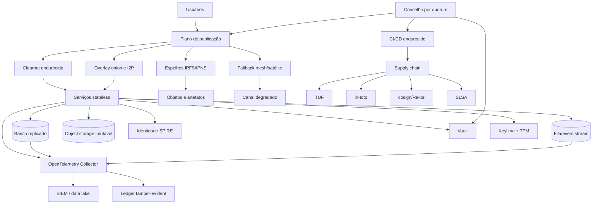
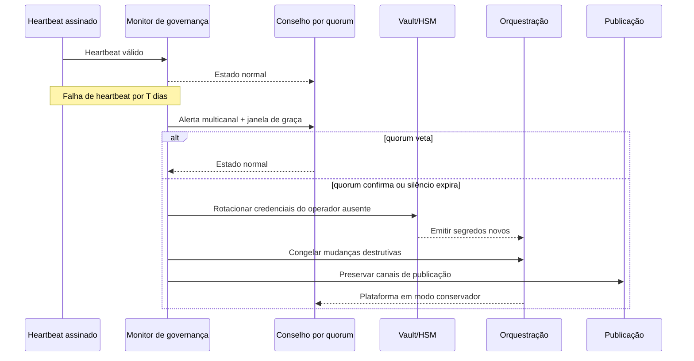
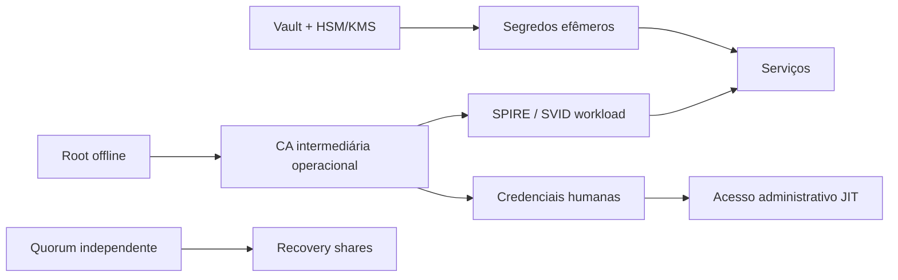

# Plataforma soberana autônoma resistente a bloqueios, comprometimento e dependência do operador

Arquivo Markdown: [plataforma_soberana_autonoma.md](sandbox:/mnt/data/plataforma_soberana_autonoma.md)

## Resumo executivo

Este relatório propõe uma arquitetura para uma plataforma **soberana, autônoma e operável sem dependência contínua do fundador**, desenhada para resistir a bloqueios por ISP, ordens de derrubada, DDoS, insiders, comprometimento de credenciais, adulteração de firmware, falhas de supply chain e erros comuns de usuários. A recomendação central é **não concentrar confiança em nenhuma pessoa, nuvem, registrador, domínio, ASN, região, KMS/HSM, pipeline de build ou superfície de publicação**. Em vez disso, a plataforma deve ser composta por planos independentes de **identidade**, **segredos**, **publicação**, **dados**, **supply chain** e **auditoria**, todos com redundância e verificabilidade. O princípio geral está alinhado com o Zero Trust do NIST — sem confiança implícita por localização de rede — e com práticas de integridade verificável para build, distribuição e auditoria. citeturn34view0turn34view2turn26view0turn25view3turn23view2

A arquitetura mais robusta, nas restrições informadas, é um **modelo híbrido**: plano de controle mínimo e muito endurecido; plano de dados replicado em **múltiplos provedores e domínios**; camada de publicação com **clearnet, onion service e I2P**, além de **espelhos IPFS/IPNS** para conteúdo estático, artefatos e manifests verificáveis; e camada de prova/auditoria em **transparency log** e **timestamping público**. IPFS é útil porque fornece conteúdo endereçável e verificável por hash, enquanto IPNS adiciona ponteiros mutáveis assinados para publicar versões novas sem trocar o identificador “humano” a cada alteração; mas IPFS **não é um provedor de armazenamento por si só**, e portanto precisa ser combinado com storage e pinning administrados pelo próprio operador. citeturn21view0turn21view2turn35view2turn35view3turn36view0

O **dead-man’s-switch** recomendado aqui **não** deve ser um “kill switch” cego. Ele deve funcionar como **mecanismo de transição de governança** para um “modo autônomo conservador”: na ausência do fundador ou operador principal, o sistema continua funcionando com privilégios reduzidos, mudanças estruturais congeladas, segredos rotacionados por quorum e poder distribuído a um conselho técnico-operacional com chaves independentes. O documento-base enviado por você já aponta corretamente para uma abordagem de controle assinado, sidecar de observabilidade, auditoria encadeada e automação minimamente confiável; este relatório generaliza essa ideia para uma plataforma inteira, não apenas para um plano de controle. fileciteturn0file0 citeturn27view3turn27view2turn25view3

**Jurisdições aplicáveis: não especificadas.** **Orçamento: não especificado.** Por isso, assumo apenas que exista viabilidade para operar em mais de um provedor e, idealmente, em mais de uma jurisdição. Se a plataforma estiver restrita a um único país hostil, a um único domínio ou a um único provedor de infraestrutura, a resistência real a censura e takedown cai materialmente. Para qualquer implementação real, recomenda-se consulta formal a advogados locais sobre telecomunicações, proteção de dados, retenção de logs, export controls, ordens de remoção e eventual uso de rádio ou satélite. citeturn37view2turn22view0

## Premissas, escopo e modelo de ameaça

### Premissas declaradas

Os requisitos informados pedem resistência simultânea a **censura de ISP**, **takedown governamental**, **DDoS**, **atores com recursos de Estado**, **insiders**, **técnicas comuns de invasão** e **erros de usuários**. Como a jurisdição não foi informada, este relatório trata a camada legal como **restrição variável** e recomenda evitar qualquer dependência singular de registrador, DNS, CA, hosting, CSP, ASN, KMS/HSM ou operador humano. Também assumo que a plataforma pode adotar **hardware com TPM 2.0**, identidade forte por workload, pipelines de build assinados e uma operação suficientemente madura para rodar testes de recuperação e exercícios de failover. Se qualquer uma dessas premissas falhar, o desenho ainda pode ser aplicado, mas com redução da segurança efetiva. citeturn33view1turn38view0turn38view3turn26view0

### Atores, objetivos e caminhos de ataque

| Ator | Objetivo provável | Caminhos de ataque mais prováveis | Controles prioritários |
|---|---|---|---|
| ISP / censor local | Bloquear acesso e degradar disponibilidade | DNS poisoning, IP blocking, throttling, filtragem de tráfego | Multi-homing, múltiplos domínios, publicação overlay, IPFS/IPNS, mensuração com OONI |
| Governo / regulador hostil | Takedown, apreensão, compelled assistance | Ordens sobre registrador, DNS, hosting, pagamentos, CA | Distribuição interjurisdicional, minimização de dados, governança por quorum, counsel |
| DDoS actor | Indisponibilidade e exaustão de recursos | Flooding L3/L4/L7, login storms, cache busting | Rate limit, filas, separação de planos, edge distribuído, failover multirregião |
| Nation-state / APT | Desanonimização, persistência, sabotagem | Supply chain, firmware, tráfego, infiltração em provedor | Secure/measured boot, attestation, build endurecido, compartimentalização |
| Insider | Exfiltração, fraude, sabotagem | Chaves, CI/CD, IAM, bancos, logs | Least privilege, 4-eyes, JIT access, logs imutáveis, segregação de funções |
| Hacker comum | Acesso indevido ou movimento lateral | Phishing, credential stuffing, BOLA/BOPLA, RCE, secrets em código | FIDO/passkeys, ZT, Vault, rotação curta, políticas de API, SBOM + assinatura |
| Usuário legítimo em erro | Exposição acidental ou perda de acesso | Compartilhamento de token, má configuração, upload indevido | UX segura, MFA resistente a phishing, automação corretiva, retenção mínima |

Essas ameaças são coerentes com o modelo do NIST SP 800-207, que desloca a defesa de perímetros estáticos para **usuários, recursos e ativos**, e com o OWASP API Security Top 10, que destaca falhas de autorização em nível de objeto e de propriedade como causas recorrentes de exposição e manipulação indevida. Do lado de supply chain, as superfícies mais perigosas são o pipeline de build, a assinatura/distribuição de artefatos e o comprometimento de chaves — exatamente os problemas endereçados por in-toto, TUF, SLSA e Sigstore. citeturn34view0turn18view3turn25view2turn7view1turn26view0turn25view3

Também é importante não superestimar overlays anônimos. Eles ajudam muito na resiliência a bloqueio e na dissociação entre serviço e infraestrutura pública, mas **não eliminam** risco de correlação e análise de tráfego quando o adversário tem visibilidade suficiente. A implicação prática é simples: **Tor/I2P devem entrar como uma camada entre várias**, não como garantia única de segurança operacional. citeturn13academia7turn36view2

### Checklist mínimo de threat model

- [ ] Jurisdições de operação, de usuários e de mantenedores foram identificadas ou marcadas como **não especificadas**.  
- [ ] Nenhum fundador ou operador detém chave única capaz de operar, desbloquear, atualizar ou desligar toda a plataforma.  
- [ ] Há pelo menos **três domínios independentes de confiança** para chaves Tier-0.  
- [ ] Cada serviço possui identidade de workload própria e política de acesso explícita.  
- [ ] O pipeline de build gera proveniência, assinaturas e artefatos verificáveis antes de qualquer deploy.  
- [ ] O plano de publicação possui ao menos **um caminho clearnet** e **um caminho overlay**.  
- [ ] O plano de observabilidade separa **telemetria operacional** de **evidência forense**.  
- [ ] Há procedimentos testados para revogação de segredos, rekey, restore e operação em modo conservador.  
- [ ] O plano de continuidade contempla falha de registrador, DNS, CA, CSP, KMS/HSM, líder e operadores humanos.  
- [ ] Existe decisão formal sobre retenção, pseudonimização e base legal para logs e dados pessoais.  

## Arquitetura soberana proposta

A topologia recomendada é de **múltiplos planos independentes**: plano de confiança, plano de controle, plano de dados, plano de publicação e plano de auditoria. O plano de confiança fica em torno de **SPIRE/SPIFFE** para identidade de workload, **Vault** para segredos, compartilhamento/quorum e leases efêmeros, e **Keylime + TPM** para measured boot e attestation. O plano de supply chain fica em **SLSA + in-toto + TUF + cosign/Rekor**. O plano de publicação expõe múltiplas superfícies: clearnet endurecida, overlays alternativos e espelhos por conteúdo endereçável. O plano de auditoria usa logs estruturados, encadeamento criptográfico e provas verificáveis de inclusão/consistência. citeturn38view3turn27view0turn38view0turn26view0turn25view2turn7view1turn25view3turn23view2turn24view2

O diagrama abaixo mostra os componentes recomendados e a separação de responsabilidades.



Esse desenho reflete práticas de **identidade descentralizada por workload**, segredos externos ao storage “não confiável”, build verificável e auditoria append-only. SPIRE expõe a Workload API, emite SPIFFE IDs/SVIDs e permite estabelecer confiança entre workloads por mTLS ou JWT; Vault divide a chave de unseal com Shamir por padrão, pode usar auto-unseal com HSM/KMS e revoga segredos automaticamente ao expirar o lease; Keylime fornece bootstrapping de confiança enraizada em hardware, monitoramento de integridade em execução e ações customizadas quando medições falham; e Rekor fornece um ledger imutável, consultável e auditável. citeturn38view3turn27view0turn27view2turn38view0turn25view3

### Comparação das opções de desenho

| Opção | Vantagem principal | Limitação principal | Papel recomendado |
|---|---|---|---|
| P2P com IPFS/IPNS | Conteúdo verificável por hash e fácil replicação | Não substitui storage/availability management | Distribuição de artefatos, mirrors, conteúdo estático |
| Multi-cloud ativo-ativo | Resiliência a falha, apreensão ou outage de um provedor | Mais complexidade operacional | Plano principal de dados e publicação |
| Transparency log | Integridade auditável e lógica append-only | Não substitui armazenamento operacional | Evidência e prova, não operação |
| Blockchain anchoring | Carimbo temporal público e difícil de reescrever | Latência, custo e metadados | Notarização periódica de hashes/raízes |
| Overlay alternativo | Aumenta resiliência a bloqueio | Desempenho e UX inferiores | Canal alternativo obrigatório |
| Mesh/off-grid | Sobrevive à falha local de internet | Baixa largura de banda | Coordenação e publicação mínima |

IPFS usa **CIDs** baseados em hash criptográfico; qualquer diferença no conteúdo produz CID distinto. IPNS cria **ponteiros mutáveis para CIDs**, assinados por uma chave privada, úteis para publicação contínua. Rekor, por sua vez, é construído sobre estrutura verificável baseada em Merkle; clientes podem checar inclusão e consistência do log para verificar que ele permanece append-only. OpenTimestamps permite ancorar hashes sem expor o conteúdo em claro, usando timestamping baseado em blockchain. citeturn21view2turn35view2turn25view3turn23view2turn28view0

### Governança e dead-man’s-switch

A governança recomendada é **5 de 8** ou **7 de 11** para Tier-0, distribuída entre pessoas, entidades e, se possível, jurisdições distintas. O fundador **não** deve possuir nenhuma combinação de chaves que, sozinha, permita reemitir identidades em massa, desbloquear o cofre, trocar política de updates ou apagar evidências. O “dead-man’s-switch” deve ser implementado em camadas: **heartbeat assinado**, **janela de graça**, **transição automática para modo conservador** e **medidas irreversíveis apenas por quorum**. Isso elimina o risco de “sumiço do operador = morte da plataforma” e, ao mesmo tempo, evita transições destrutivas por falso positivo. A mecânica de quorum e recovery keys do Vault é uma boa base para materializar esse processo. citeturn27view0turn27view3



### Gestão de chaves e quorum

A gestão de chaves deve separar pelo menos quatro camadas: **root offline**, **intermediárias operacionais**, **identidade de workload** e **credenciais efêmeras**. A root offline fica em HSM ou smartcards desconectados e só participa de cerimônias raras. As intermediárias assinam componentes internos e rodam com rotação programada. As identidades de workload nascem e expiram automaticamente. As credenciais humanas e de aplicação são emitidas **just-in-time**, com TTL curto e escopo mínimo. Isso reduz muito o impacto de vazamentos e limita movimento lateral. citeturn27view0turn27view2turn38view3



## Controles de segurança e acesso

A postura base deve ser **zero trust de recursos**: autenticação e autorização antes de cada sessão relevante, identidade forte de usuário e dispositivo, políticas explícitas e ausência de confiança implícita por rede, subnet ou “estar dentro do cluster”. Para tráfego east-west, use mTLS emitido por SPIRE/SPIFFE; para segredos, use Vault com leases curtas e renovação controlada; para hosts críticos, habilite secure/measured boot com TPM e validação remota; e para firmware/boot, siga a lógica do NIST SP 800-193 de **proteger, detectar e recuperar** contra mudanças não autorizadas. citeturn34view0turn34view1turn33view1turn38view3turn38view0

No acesso humano, a recomendação é dividir em três classes. **Usuários comuns**: passkeys/FIDO ou MFA forte. **Operadores padrão**: autenticação forte, autorização granular, sessões curtas, JIT e aprovação de segunda pessoa para ações sensíveis. **Tier-0**: hardware security keys ou mecanismos equivalentes com chaves não exportáveis, estações dedicadas, acesso por bastion controlado, gravação de comandos e obrigação de quorum para ações críticas. O NIST 800-63B exige opção de **autenticação resistente a phishing** em AAL2 e exige autenticador resistente a phishing com chave não exportável em AAL3; a própria FIDO Alliance destaca passkeys como resistentes a phishing, mas também observa que credenciais podem ser sincronizadas entre dispositivos, o que as torna inadequadas para cumprir AAL3 quando exportáveis. Em outras palavras: **para Tier-0, prefira credenciais FIDO device-bound ou chaves físicas dedicadas, não passkeys sincronizadas**. citeturn18view0turn18view1turn31view0turn31view2turn31view3

Para autorização, aplique **least privilege** por capacidade e não por cargo amplo. Evite papéis “admin global”; prefira papéis pequenos como `publish-manifest`, `approve-restore`, `rotate-workload-ca`, `read-forensic-ledger` ou `invoke-break-glass`. Sempre que possível, o privilégio deve ser **efêmero, aprovado, gravado e revogável**. Vault já modela isso com leases que revogam segredos ao expirar, e SPIRE permite autenticar workloads a stores, bancos ou serviços de nuvem sem distribuir credenciais estáticas de longa duração. citeturn27view2turn38view3

No supply chain, a linha recomendada é: **build endurecido**, **proveniência assinada**, **layout verificável**, **assinatura de artefatos**, **transparency log**, **SBOM** e **reprodutibilidade**, quando possível. SLSA estrutura níveis crescentes de hardening do build e da proveniência; in-toto registra quem fez cada etapa, em que ordem e com quais materiais/produtos; TUF protege distribuição e atualização mesmo com comprometimento parcial de repositório ou chaves; Rekor torna a assinatura publicamente auditável; SPDX e CycloneDX oferecem formatos padronizados de SBOM; e o ecossistema de Reproducible Builds reduz variância e facilita verificação independente. citeturn26view0turn25view2turn7view1turn25view3turn14view2turn14view3turn14view0

### Snippets de configuração

Exemplo de política de credenciais efêmeras para operadores, com TTL curto e capacidade mínima:

```hcl
path "kv/data/publication/*" {
  capabilities = ["read"]
}

path "sys/leases/revoke" {
  capabilities = ["update"]
}

path "transit/sign/releases" {
  capabilities = ["update"]
}
```

E emissão JIT com renovação curta:

```bash
vault token create \
  -policy=publisher-readonly \
  -ttl=15m \
  -period=0 \
  -explicit-max-ttl=30m \
  -display-name="jit-publisher"
```

O objetivo é que qualquer credencial humana ou de aplicação seja curta, específica e facilmente revogável; isso está alinhado ao modelo de leases e revogação automática do Vault. citeturn27view2turn27view0

Exemplo de verificação de artefato antes do deploy:

```bash
cosign verify \
  --certificate-identity-regexp='^https://github.com/sua-org/' \
  --certificate-oidc-issuer='https://token.actions.githubusercontent.com' \
  registry.example.org/app@sha256:SEU_DIGEST
```

A verificação acima só faz sentido se o pipeline publicar proveniência e attestation, e se o ambiente de deploy recusar artefatos não conformes. O papel do transparency log é tornar a assinatura **observável e auditável**, não apenas “confiável porque o repositório disse que era”. citeturn23view0turn25view3turn26view0

## Auditoria, logging e prontidão forense

A telemetria operacional deve ser **estruturada**, correlacionável e separada da evidência forense. OpenTelemetry define logs como registros temporais, preferencialmente estruturados, e o Collector fornece uma camada prática de recepção, transformação, enriquecimento e exportação para SIEMs e data lakes. O modelo de log record inclui campos como `Timestamp`, `TraceId`, `SpanId`, severidade, corpo, recurso e atributos — exatamente o tipo de estrutura que facilita correlação entre incidente, ator, recurso, decisão de política e impacto sistêmico. citeturn24view0turn24view1turn24view2

Para **tamper-evidence**, a recomendação é usar duas camadas. A primeira é um ledger interno com hash encadeado, retenção imutável e cópias WORM. A segunda é um log verificável externo ou semi-externo, como Rekor/Trillian, eventualmente com âncoras periódicas em OpenTimestamps. Rekor foi desenhado para metadados assinados de supply chain e os auditores podem checar consistência append-only porque o log usa estrutura verificável baseada em Merkle. OpenTimestamps permite provar que um hash existia antes de determinado ponto do tempo sem expor o documento original. citeturn25view3turn23view2turn28view0

A prontidão forense depende de quatro coisas: **sincronização temporal**, **captura suficiente de contexto**, **cadeia de custódia** e **privacidade proporcional**. O log deve preservar `trace_id`, `actor_type`, `subject`, `decision`, `policy_hash`, `artifact_digest`, `attestation_result`, `source_network`, `device_state` e `prev_hash`. Ao mesmo tempo, dados pessoais desnecessários não devem ser despejados em texto livre; prefira pseudônimos estáveis, classificação de sensibilidade e ACLs distintas para telemetria operacional versus evidência forense. citeturn24view2turn25view3turn23view2

### Exemplo de pipeline OpenTelemetry

```yaml
receivers:
  filelog:
    include: [/var/log/app/*.json]
processors:
  batch: {}
  attributes:
    actions:
      - key: environment
        value: production
        action: upsert
exporters:
  otlp:
    endpoint: siem.internal:4317
    tls:
      insecure: false
service:
  pipelines:
    logs:
      receivers: [filelog]
      processors: [attributes, batch]
      exporters: [otlp]
```

O Collector é especialmente útil como camada de padronização porque permite receber, transformar e exportar logs de várias fontes num modelo comum, e correlacioná-los com traces e spans ativos. citeturn24view1turn24view2

### Esquema sugerido de log de auditoria

```json
{
  "ts": "2026-06-17T20:15:43.192Z",
  "event_id": "01JY0T8G2Y6S7J7X3Z3A9J2W4Q",
  "trace_id": "5b7d2c4d1f7b40c7b56fdab64b4bbd1a",
  "span_id": "8d29a7d4d7d5142a",
  "tenant": "public-core",
  "actor_type": "human|workload|system",
  "actor_id": "spiffe://prod/ns/api/sa/publisher",
  "authn_method": "fido2|mTLS|oidc",
  "authz_policy_hash": "sha256:...",
  "action": "publish_manifest",
  "resource": "/publication/manifests/current",
  "decision": "allow|deny|auto-remediate",
  "reason_code": "policy_match",
  "device_state": "attested",
  "attestation_ref": "rekor://uuid/...",
  "artifact_digest": "sha256:...",
  "source_network": "overlay|clearnet|mesh",
  "prev_hash": "sha256:...",
  "entry_hash": "sha256:...",
  "retention_class": "forensic-high",
  "privacy_class": "pseudonymous"
}
```

Se houver acesso não autorizado ou violação de medição, a remediação deve ser automática e limitada: revogar sessão/lease, isolar workload, retirar da malha de publicação, elevar verbosidade forense, congelar updates e exigir quorum para retorno. Keylime suporta ações customizadas em falha de medições atestadas, e Vault já revoga segredos expirados automaticamente — dois bons gatilhos para automação corretiva. citeturn38view0turn27view2

## Resiliência a bloqueios e continuidade operacional

A estratégia contra bloqueios deve começar pela constatação operacional: **bloqueio precisa ser medido continuamente e com segurança**. OONI fornece software livre para medir bloqueio de sites, apps de mensagem e ferramentas de circumvention, e publica medições em tempo real como dados abertos; isso é útil tanto para observabilidade quanto para documentação probatória. A plataforma deve incorporar uma rotina de medição externa, idealmente por vantage points independentes, antes e depois de mudanças de edge, DNS ou rotas. citeturn37view0turn37view1

No plano de publicação, use **diversidade de nomes, rotas e superfícies**. Não concentre tudo em um único domínio, um único registrador ou um único front door. Publique ao menos: domínio principal, domínios-reserva, onion service, serviço/espelho I2P, manifests e conteúdo estático por IPFS/IPNS, além de um canal degradado de status mínimo. I2P é explicitamente uma camada anônima auto-organizada e resiliente, adequada a aplicações interativas; IPFS fornece endereçamento por conteúdo e IPNS adiciona ponteiros mutáveis verificáveis. citeturn36view0turn36view1turn21view2turn35view2

Para “alternativas ao domain fronting”, a recomendação prática é **não tratar domain fronting como controle-base**. Como o suporte depende de terceiros, a resiliência deve vir de **diversidade de protocolo e topologia**: overlays alternativos, múltiplos domínios e registradores, distribuição por CID/IPNS, múltiplos CSPs/ASNs, caches/mirrors independentes e fallback de **mesh/off-grid** para coordenação e publicação mínima. Meshtastic demonstra bem o papel de LoRa em comunicação off-grid de longo alcance, descentralizada e criptografada, mas **não** substitui o data plane principal; ele é mais adequado como canal de contingência, coordenação e sinalização. citeturn22view0turn37view2

A continuidade operacional exige separação entre **plano de controle** e **plano de publicação**. Mesmo que o controle administrativo seja congelado por suspeita de comprometimento, o plano de publicação precisa continuar servindo manifests estáticos, páginas de status, chaves públicas, checkpoints de auditoria e instruções de bootstrap. IPNS é particularmente útil aqui porque permite atualizar o CID subjacente mantendo um nome verificável. Para checkpoints críticos, notarize periodicamente hashes/raízes com OpenTimestamps. citeturn35view2turn28view0

### Procedimentos operacionais mínimos

| Procedimento | Frequência recomendada | Observações |
|---|---|---|
| Rotação de segredos de aplicação | diária ou sob demanda | TTL curto, emissão automática |
| Rotação de identidades de workload | horas ou poucos dias | sem credenciais estáticas em imagem |
| Rotação de chaves operacionais intermediárias | trimestral ou semestral | root offline rara |
| Restore testado de backup | mensal | restore em ambiente isolado |
| Exercício de failover multirregião | trimestral | com corte real controlado |
| Exercício do dead-man’s-switch | semestral | tabletop + teste parcial |
| Revisão de políticas IAM/autorização | mensal | atenção a drift e exceções |
| Auditoria de supply chain | contínua | commit, build, assinatura e deploy |

Há um cuidado especial no modelo de auto-unseal: o mecanismo externo de selo vira dependência crítica. A própria documentação do Vault alerta que recovery keys **não** descriptografam a root key e que a perda permanente do mecanismo de seal pode tornar o cluster irrecuperável, inclusive a partir de backups. Portanto, se auto-unseal for adotado, vale planejar **seal HA**, múltiplos mecanismos de selo e governança rígida sobre chaves KMS/HSM. citeturn27view3

## Roadmap, riscos e conformidade

### Ferramentas e protocolos abertos recomendados

| Função | Recomendação | Papel no desenho |
|---|---|---|
| Identidade de workload | SPIFFE/SPIRE | mTLS, JWT, identidade curta por workload |
| Segredos e quorum | Vault | leases, revogação, seal/unseal, recovery keys |
| Attestation | Keylime + TPM 2.0 | measured boot, PCR attestation, ações automáticas |
| Update framework | TUF | proteção da distribuição e atualização |
| Supply chain attestations | in-toto | rastreabilidade, auditoria e separação de etapas |
| Assinatura e transparency log | cosign + Rekor | assinatura verificável e observável |
| Proveniência de build | SLSA | níveis de hardening do build e da proveniência |
| SBOM | SPDX e/ou CycloneDX | inventário de componentes e dependências |
| Reproducibilidade | Reproducible Builds | verificação independente e redução de variação |
| Distribuição resiliente | IPFS + IPNS | mirrors e conteúdo endereçável/verificável |
| Overlay alternativo | I2P | alcance alternativo sob bloqueio |
| Medição de censura | OONI | detecção e evidência de bloqueios |
| Notarização temporal | OpenTimestamps | prova pública de existência/estado |
| Telemetria | OpenTelemetry Collector | normalização e exportação para SIEM |

A seleção acima foi priorizada por maturidade, documentação oficial e complementaridade arquitetural. Ela cobre identidade, segredos, attestation, builds, distribuição, auditoria e observabilidade sem depender estruturalmente de uma única empresa. citeturn38view3turn27view0turn38view0turn7view1turn25view2turn25view3turn26view0turn14view2turn14view3turn14view0turn35view2turn36view0turn37view0turn28view0turn24view1

### Roadmap priorizado

| Marco | Objetivo | Esforço estimado | Dependências | Resultado esperado |
|---|---|---:|---|---|
| Fundação de confiança | SPIRE, Vault, TPM/Keylime, hardware admin dedicado | 6–10 semanas | hardware, IAM, HSM/KMS | identidade forte e segredos efêmeros |
| Supply chain verificável | SLSA L2/L3 alvo, in-toto, cosign, Rekor, SBOM | 6–12 semanas | CI/CD e registry | deploy rejeita artefato não verificável |
| Publicação resiliente | multi-cloud, domínio-reserva, onion/I2P, IPFS/IPNS | 8–14 semanas | DNS, edge, observabilidade | múltiplos caminhos de publicação |
| Auditoria forense | OTel, lake/SIEM, ledger append-only, âncoras | 4–8 semanas | storage, retenção, IR | investigação e prova melhores |
| Dead-man’s-switch | quorum, playbooks, modo conservador, exercícios | 4–6 semanas | governança e chaves | operação sem fundador |
| DR e ensaios | restore, failover, tabletop, chaos drills | contínuo | todos os anteriores | resiliência validada |

**Orçamento:** não especificado. Em vez de estimativa financeira, usei esforço em semanas e complexidade relativa. A maior fonte de risco, aqui, não é tecnologia isolada, mas **coordenação entre governança, operação, chaves e publicação**. citeturn26view0turn27view3turn37view1

### Matriz de risco resumida

| Risco | Probabilidade | Impacto | Tratamento |
|---|---|---|---|
| Founder key person risk | Alta se não tratado | Crítico | Quorum, dead-man conservador, documentação e drills |
| Comprometimento de CI/CD | Média | Crítico | SLSA, in-toto, cosign, verificação no deploy |
| Comprometimento de firmware/boot | Média | Crítico | secure/measured boot, TPM, Keylime, NIST 800-193 |
| Bloqueio por ISP/registrador | Média/Alta | Alto | múltiplos domínios, overlays, IPFS/IPNS, OONI |
| Falha do mecanismo de auto-unseal | Média | Crítico | seal HA, governança forte do KMS/HSM, restore tests |
| Insider com privilégio excessivo | Média | Alto | least privilege, JIT, 4-eyes, ledger imutável |
| Erro humano em operação | Alta | Médio/Alto | automação segura, dry-run, break-glass protegido |
| Vazamento de logs/dados | Média | Alto | minimização, pseudonimização, cofres forenses, ACLs |

### Conformidade, ética e limitações

Como **jurisdição, categoria de dados, tipo de usuário e modelo societário não foram especificados**, qualquer recomendação regulatória precisa ser tratada como preliminar. Em muitos países, a combinação de criptografia forte, distribuição resistente a bloqueios, operação transfronteiriça, rádio LoRa, satélite, retenção de logs e minimização de identidade toca simultaneamente em normas de telecom, proteção de dados, investigação criminal, export controls e ordens de preservação ou remoção. A recomendação objetiva é: **consultar counsel antes de produção**, mapear bases legais por fluxo de dados, definir política de retenção mínima e separar claramente telemetria operacional, evidência forense e dados pessoais. citeturn22view0turn37view2

Eticamente, a meta legítima é proteger **disponibilidade, integridade, privacidade e continuidade** de uma plataforma contra abuso de poder, censura arbitrária, comprometimento técnico e falha humana. Isso não elimina a obrigação de cumprir a lei aplicável, minimizar dano a terceiros, preservar meios de auditoria e manter controles contra abuso. A plataforma deve ser soberana, mas não opaca a seus próprios mecanismos de verificação: toda autonomia precisa vir acompanhada de **provas auditáveis**, separação de funções e governança distribuída. citeturn25view3turn23view2turn24view2