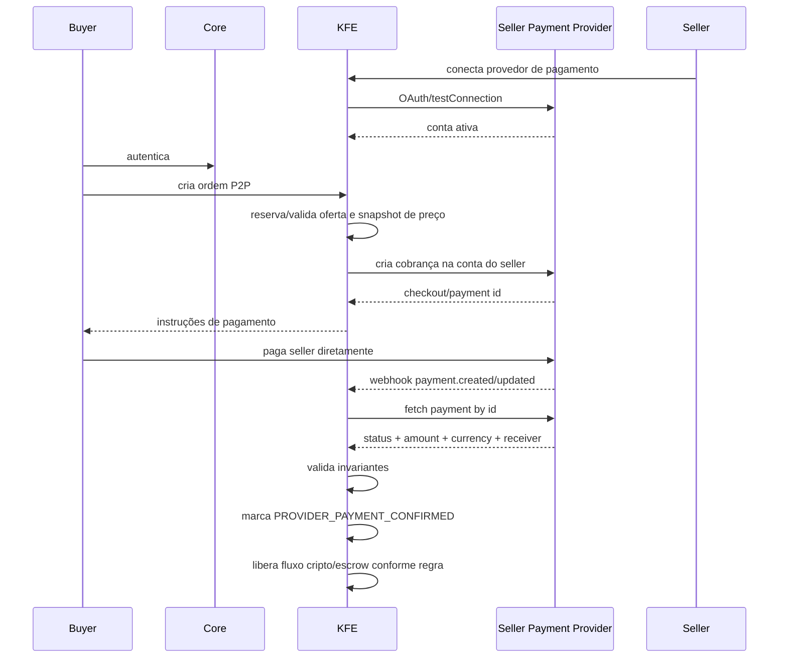

# KFE P2P: provedores de pagamento próprios do seller

## Objetivo

Criar um módulo P2P dentro do KFE onde sellers da plataforma possam receber pagamento fiat diretamente em uma conta própria de provedor externo, enquanto a Kerosene/KFE apenas cria a ordem, correlaciona o pagamento e verifica se o seller recebeu o valor combinado.

Exemplo de provedor alvo: Mercado Pago. O mesmo desenho deve aceitar outros provedores compatíveis que ofereçam autenticação de API, consulta de pagamentos, notificações/webhooks e identificadores de transação.

## Princípio central

O dinheiro fiat não passa pela Kerosene. O seller recebe no provedor dele. O KFE atua como orquestrador/verificador:

1. comprador abre ordem P2P;
2. seller tem uma conta de provedor conectada;
3. KFE cria ou registra uma cobrança vinculada à ordem;
4. provedor notifica ou KFE consulta status;
5. KFE valida valor, moeda, recebedor, status e referência;
6. se tudo bater, a ordem avança para pagamento confirmado;
7. liquidação cripto/entrega/escrow acontece dentro das regras KFE.

## Regra importante de segurança

O padrão recomendado é OAuth ou conta conectada. O seller deve autorizar a plataforma a consultar/criar cobranças na conta dele sem compartilhar credenciais privadas diretamente.

Aceitar Access Token/API key colada manualmente deve ser tratado como fallback controlado, com estes limites:

- credencial criptografada em repouso;
- nunca exibida de volta;
- escopo mínimo possível;
- teste de conexão obrigatório;
- rotação e revogação pelo seller;
- auditoria de todo uso;
- opção de desabilitar em produção quando OAuth estiver disponível.

## Encaixe na arquitetura KFE atual

Este módulo deve ficar no `:kfe-service`, não no Core.

Pacotes sugeridos:

```text
source.kfe.p2p
source.kfe.p2p.controller
source.kfe.p2p.dto
source.kfe.p2p.model
source.kfe.p2p.repository
source.kfe.p2p.service
source.kfe.p2p.provider
source.kfe.p2p.provider.mercadopago
```

O Core não deve conhecer Mercado Pago, sellers, provider credentials ou status externo. O Core apenas autentica o usuário e chama KFE, seguindo a fronteira Core -> KFE já iniciada.

## Modelo de domínio

### SellerProviderAccount

Representa uma conta externa conectada ao seller.

Campos principais:

- `id`
- `sellerUserId`
- `provider`: `MERCADO_PAGO`, `STRIPE`, `PIX_MANUAL`, etc.
- `connectionMode`: `OAUTH`, `API_KEY`, `MANUAL_REFERENCE`
- `externalAccountId`
- `displayName`
- `country`
- `currency`
- `status`: `PENDING`, `ACTIVE`, `REVOKED`, `ERROR`, `SUSPENDED`
- `credentialRef`: referência ao segredo criptografado/Vault, nunca o valor aberto
- `capabilitiesJson`: cria cobrança, consulta pagamento, webhook, refund, split, pix, cartão
- `lastVerifiedAt`
- `createdAt`, `updatedAt`

### P2pOrder

Representa a negociação entre buyer e seller.

Campos principais:

- `id`
- `publicId`
- `buyerUserId`
- `sellerUserId`
- `sellerProviderAccountId`
- `fiatAmountMinor`
- `fiatCurrency`
- `cryptoAsset`
- `cryptoAmountSats`
- `priceSnapshotJson`
- `status`
- `expiresAt`
- `createdAt`, `updatedAt`

Status sugeridos:

```text
DRAFT
AWAITING_BUYER_PAYMENT
PROVIDER_PAYMENT_PENDING
PROVIDER_PAYMENT_CONFIRMED
PROVIDER_PAYMENT_MISMATCH
PROVIDER_PAYMENT_REVERSED
CRYPTO_ESCROW_LOCKED
CRYPTO_RELEASED
CANCELLED
EXPIRED
DISPUTED
REQUIRES_RECONCILIATION
```

### P2pProviderPayment

Representa o pagamento externo observado no provedor.

Campos principais:

- `id`
- `p2pOrderId`
- `provider`
- `providerPaymentId`
- `providerOrderId`
- `providerPreferenceId`
- `providerStatusRaw`
- `normalizedStatus`: `PENDING`, `APPROVED`, `REJECTED`, `REFUNDED`, `CHARGED_BACK`, `UNKNOWN`
- `amountMinor`
- `currency`
- `payerExternalId`
- `sellerExternalAccountId`
- `paymentMethod`
- `paidAt`
- `rawPayloadHash`
- `rawPayloadEncryptedRef` ou storage redigido
- `createdAt`, `updatedAt`

### P2pProviderWebhookEvent

Evento bruto recebido do provedor.

Campos principais:

- `id`
- `provider`
- `eventId`
- `topic`
- `action`
- `providerPaymentId`
- `signatureValid`
- `receivedAt`
- `processedAt`
- `status`: `RECEIVED`, `PROCESSED`, `DUPLICATE`, `INVALID_SIGNATURE`, `FAILED`
- `payloadHash`
- `payloadRedactedJson`

### P2pProviderReconciliationJob

Controle de polling/reconciliação.

Campos principais:

- `id`
- `provider`
- `sellerProviderAccountId`
- `p2pOrderId`
- `nextRunAt`
- `attempts`
- `lastErrorCode`
- `lastErrorMessage`
- `status`: `SCHEDULED`, `RUNNING`, `DONE`, `FAILED`, `DEAD_LETTER`

## Abstração de provider

Criar uma interface interna do KFE:

```java
public interface SellerPaymentProviderAdapter {
    ProviderCode provider();

    ProviderAccountHealth testConnection(SellerProviderAccount account);

    ProviderCheckout createCheckout(P2pOrder order, SellerProviderAccount account);

    ProviderPaymentStatus fetchPayment(SellerProviderAccount account, String providerPaymentId);

    ProviderWebhookEvent parseWebhook(Map<String, String> headers, String rawBody, Map<String, String> query);

    boolean verifyWebhookSignature(SellerProviderAccount account, Map<String, String> headers, String rawBody, Map<String, String> query);
}
```

Resultado normalizado:

```java
public record ProviderPaymentStatus(
    String providerPaymentId,
    String rawStatus,
    NormalizedPaymentStatus normalizedStatus,
    long amountMinor,
    String currency,
    String sellerExternalAccountId,
    String payerExternalId,
    Instant paidAt,
    Map<String, Object> rawRedacted
) {}
```

## Mercado Pago como primeiro adapter

### Modo recomendado: OAuth

Fluxo:

1. seller clica em conectar Mercado Pago;
2. KFE cria `SellerProviderAccount` em `PENDING`;
3. seller é redirecionado para autorização Mercado Pago;
4. callback recebe code temporário;
5. KFE troca code por token e refresh token;
6. KFE salva credenciais criptografadas e marca conta como `ACTIVE` após `testConnection`;
7. webhooks do Mercado Pago alimentam `P2pProviderWebhookEvent`;
8. cada evento dispara busca ativa do pagamento pelo provider id antes de confirmar a ordem.

### Modo fallback: Access Token manual

Fluxo:

1. seller cola Access Token no painel;
2. KFE valida formato mínimo e faz chamada de teste;
3. KFE salva somente versão criptografada;
4. KFE marca como `ACTIVE` se a conta responder e pertencer ao seller esperado;
5. KFE recomenda migração para OAuth.

Esse modo deve poder ser bloqueado por configuração:

```properties
kfe.p2p.providers.mercado-pago.manual-token-enabled=false
```

## Fluxo de ordem P2P



## Invariantes obrigatórias antes de confirmar pagamento

KFE só pode considerar pagamento recebido se todos os campos baterem:

- `providerPaymentId` pertence à ordem esperada;
- status normalizado é `APPROVED` ou equivalente;
- moeda é a moeda da ordem;
- valor recebido é exatamente o esperado, ou dentro de tolerância configurada;
- recebedor externo é a conta conectada do seller;
- pagamento não está cancelado, estornado, em disputa ou chargeback;
- evento de webhook tem assinatura válida quando o provider suporta assinatura;
- consulta ativa ao provider confirma o mesmo status do webhook;
- idempotência garante que o mesmo provider payment não confirme duas ordens.

## Nunca confiar só no webhook

Webhook deve ser gatilho, não prova final. A prova final deve ser uma consulta autenticada ao provider usando a conexão do seller.

Motivo: webhook pode chegar duplicado, fora de ordem, atrasado, ou com payload reduzido. O KFE deve receber o evento, validar assinatura, enfileirar reconciliação, consultar o provider e só então mudar a ordem para `PROVIDER_PAYMENT_CONFIRMED`.

## API pública/seller proposta

### Seller conecta provider

```text
POST /kfe/p2p/seller/provider-accounts
GET  /kfe/p2p/seller/provider-accounts
POST /kfe/p2p/seller/provider-accounts/{id}/test
POST /kfe/p2p/seller/provider-accounts/{id}/revoke
```

### OAuth

```text
GET  /kfe/p2p/providers/mercado-pago/oauth/start
GET  /api/public/kfe/p2p/providers/mercado-pago/oauth/callback
```

### Ordem P2P

```text
POST /kfe/p2p/orders
GET  /kfe/p2p/orders/{orderId}
POST /kfe/p2p/orders/{orderId}/cancel
POST /kfe/p2p/orders/{orderId}/dispute
```

### Webhook do provider

```text
POST /api/public/kfe/p2p/providers/{provider}/webhooks
```

Esse endpoint é público em termos de JWT, mas protegido por assinatura do provider, allowlist opcional, rate limit, payload limit e idempotência de evento.

## Tabelas sugeridas

Migration sugerida: `V30__kfe_p2p_seller_payment_providers.sql`.

```sql
create table financial.p2p_seller_provider_accounts (...);
create table financial.p2p_orders (...);
create table financial.p2p_provider_payments (...);
create table financial.p2p_provider_webhook_events (...);
create table financial.p2p_provider_reconciliation_jobs (...);
```

Índices obrigatórios:

- unique `(provider, provider_payment_id)` em `p2p_provider_payments`;
- index `(seller_user_id, status, created_at)` em provider accounts;
- index `(buyer_user_id, status, created_at)` e `(seller_user_id, status, created_at)` em orders;
- unique `(provider, event_id)` em webhook events quando o provider fornece event id;
- index `(status, next_run_at)` em reconciliation jobs.

## Auditoria

Eventos KFE recomendados:

```text
KFE_P2P_PROVIDER_ACCOUNT_CONNECTED
KFE_P2P_PROVIDER_ACCOUNT_TESTED
KFE_P2P_PROVIDER_ACCOUNT_REVOKED
KFE_P2P_ORDER_CREATED
KFE_P2P_PROVIDER_CHECKOUT_CREATED
KFE_P2P_PROVIDER_WEBHOOK_RECEIVED
KFE_P2P_PROVIDER_WEBHOOK_REJECTED
KFE_P2P_PROVIDER_PAYMENT_CONFIRMED
KFE_P2P_PROVIDER_PAYMENT_MISMATCH
KFE_P2P_ORDER_DISPUTED
KFE_P2P_ORDER_RELEASED
```

Nunca gravar credential aberta em audit log. Sempre usar fingerprint/hash e provider account id.

## Estados de erro que precisam aparecer na UI

- provider não conectado;
- credencial expirada/revogada;
- webhook inválido;
- pagamento menor que o esperado;
- pagamento maior que o esperado;
- moeda divergente;
- pagamento recebido em conta diferente;
- pagamento aprovado depois da ordem expirar;
- pagamento estornado/chargeback após confirmação;
- provider indisponível;
- reconciliação pendente.

## Política de confirmação e disputa

Para P2P, confirmação de pagamento externo não deve liberar automaticamente cripto se a plataforma ainda não implementou escrow/lock de cripto seguro.

Recomendação:

1. fase inicial: confirmar pagamento externo e marcar ordem como `PROVIDER_PAYMENT_CONFIRMED`, mas exigir confirmação explícita de release conforme regra KFE;
2. fase com escrow: antes de expor instrução fiat, bloquear cripto do seller em escrow KFE;
3. após confirmação externa, liberar cripto para buyer;
4. em chargeback/disputa, bloquear novas operações do seller e abrir `DISPUTED`/`REQUIRES_RECONCILIATION`.

## Fases de implementação

### Fase 1 — Núcleo provider-agnostic

- criar models/repositories P2P;
- criar enums e DTOs;
- criar `SellerPaymentProviderAdapter`;
- criar APIs de provider account e order;
- criar estado de reconciliação sem Mercado Pago real;
- testes unitários de invariantes.

### Fase 2 — Mercado Pago OAuth adapter

- criar OAuth start/callback;
- armazenar credential criptografada;
- `testConnection`;
- criar checkout/cobrança;
- buscar pagamento por id;
- normalizar status.

### Fase 3 — Webhooks e reconciliação

- endpoint público de webhook;
- validação de assinatura;
- dedupe de evento;
- job de reconciliação;
- confirmação somente após fetch ativo;
- testes de duplicidade, fora de ordem e payload inválido.

### Fase 4 — P2P escrow e release

- travar cripto do seller antes de instruir buyer;
- release para buyer após confirmação provider;
- expiração e cancelamento seguros;
- disputa/chargeback.

### Fase 5 — Admin e risk

- painel admin de provider accounts;
- histórico de webhooks;
- reconciliação manual;
- limites por seller;
- score de confiabilidade;
- bloqueio automático por chargeback/fraude.

## Decisão recomendada

Implementar primeiro Mercado Pago via OAuth e webhooks, com polling de confirmação como fonte final. A Kerosene não deve depender de o seller colar uma chave privada no app como caminho principal. Isso reduz risco operacional, melhora revogação e prepara a plataforma para múltiplos providers sem reescrever o P2P.
