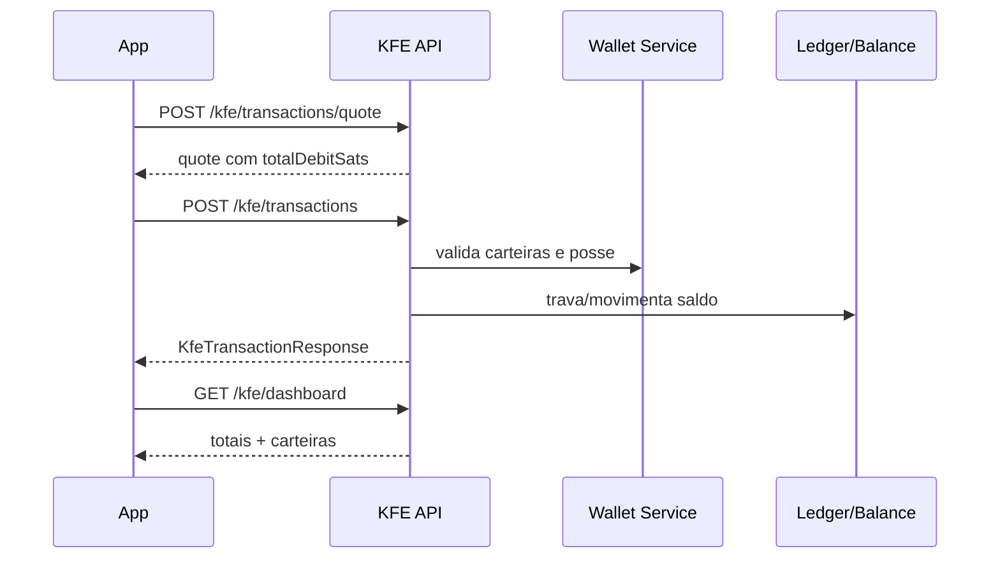

# KFE API

> Fonte de verdade desta página: controllers, DTOs, records, enums e `EndpointPolicyRegistry` do backend Spring Boot em `backend/kerosene/src/main/java`.
> Quando uma rota existe no controller mas não está declarada no `EndpointPolicyRegistry`, ela é documentada como `DENIED_BY_DEFAULT`, porque `Security.anyRequest().denyAll()` bloqueia a chamada antes do método executar.

## Convenções globais

### Envelope padrão `ApiResponse<T>`

A maior parte dos endpoints retorna o envelope abaixo. Endpoints explicitamente marcados como `raw` retornam o payload diretamente sem envelope. Campos `null` podem ser omitidos por `@JsonInclude`.

| Campo | Tipo | Nullable | Descrição | Exemplo |
|---|---:|:---:|---|---|
| `success` | boolean | não | Indica sucesso lógico da operação. | `true` |
| `message` | string | sim | Mensagem operacional retornada pelo controller/service. | `KFE wallet created.` |
| `data` | object/array/string | sim | Payload específico do endpoint. | `{...}` |
| `errorCode` | string | sim | Código de erro de negócio/validação quando `success=false`. | `AUTH_INVALID_CREDENTIALS` |
| `timestamp` | string date-time | não | Momento de montagem do envelope no servidor. | `2026-06-19T10:30:00` |

### Headers comuns

| Header | Tipo | Obrigatório | Quando usar | Exemplo |
|---|---:|:---:|---|---|
| `Content-Type` | string | sim em requests com body | Deve ser `application/json` para JSON. | `application/json` |
| `Authorization` | string | sim para `AUTHENTICATED`/`ADMIN` | Bearer token JWT emitido por login/TOTP/passkey/device-key. | `Bearer eyJhbGciOi...` |
| `X-Correlation-Id` | string | não | Correlação distribuída entre serviços/logs. Aceita caracteres seguros de 8 a 64 posições. | `req-20260619-0001` |
| `X-Request-Id` | string | não | Identificador idempotente/observável da requisição. | `mobile-01HD...` |
| `X-Device-Hash` | string | condicional | Usado por endpoints device-scoped de segurança/PIN. | `sha256:abc123...` |
| `X-Idempotency-Key` | string | recomendado | Recomendado em operações financeiras, embora KFE use `idempotencyKey` no body. | `txn-01J...` |

### Classes de autenticação

| Valor na documentação | Significado efetivo |
|---|---|
| `PUBLIC` | Permitido sem JWT. |
| `AUTHENTICATED` | Exige JWT válido. |
| `ADMIN` | Exige JWT com role `ADMIN`; alguns métodos também usam `@PreAuthorize`. |
| `DENIED_BY_DEFAULT` | Controller/DTO pode existir, mas a rota não tem policy e é bloqueada por `anyRequest().denyAll()`. |
| `STALE` | Documento legado sem controller ativo confirmado no código atual. |

### Estruturas de erro

Erro via envelope `ApiResponse`:

```json
{
  "success": false,
  "message": "Invalid token context",
  "data": null,
  "errorCode": "AUTH_SESSION_EXPIRED",
  "timestamp": "2026-06-19T10:30:00"
}
```

Erro MVC/validação ou fallback pode aparecer como `ResponseError`/erro Spring, dependendo do ponto da falha:

```json
{
  "timestamp": "2026-06-19T10:30:00",
  "status": "BAD_REQUEST",
  "error": "Bad Request",
  "message": "Validation failed",
  "path": "/auth/signup"
}
```

### Status codes comuns

| Status | Quando ocorre | Como resolver |
|---:|---|---|
| `200 OK` | Consulta ou operação concluída. | Consumir `data`. |
| `201 Created` | Recurso criado. | Persistir o `id` retornado. |
| `202 Accepted` | Fluxo assíncrono/pendente, comum em login com TOTP/aprovação. | Continuar no próximo passo indicado. |
| `204 No Content` | Operação concluída sem corpo. | Não tentar parsear JSON. |
| `400 Bad Request` | JSON inválido, campo faltante, enum inválido ou regra básica violada. | Corrigir request body/query/path. |
| `401 Unauthorized` | JWT ausente/inválido/expirado ou credencial incorreta. | Fazer login/renovar token ou reenviar credenciais. |
| `403 Forbidden` | Usuário autenticado sem permissão, admin token inválido ou policy nega acesso. | Verificar role/headers/policy. |
| `404 Not Found` | Recurso, sessão, dispositivo ou endpoint não encontrado. | Verificar identificadores. |
| `409 Conflict` | Duplicidade/idempotência/conflito de estado. | Consultar recurso existente ou trocar chave idempotente. |
| `410 Gone` | Sessão de recuperação expirada. | Reiniciar o fluxo. |
| `412 Precondition Failed` | Pré-condição criptográfica/security step-up falhou. | Refazer challenge/assinatura/fator. |
| `422 Unprocessable Entity` | Regra de negócio não satisfeita. | Ajustar estado da conta/recurso antes de repetir. |
| `429 Too Many Requests` | Rate limit. | Aplicar backoff exponencial. |
| `500 Internal Server Error` | Falha não tratada. | Registrar `X-Correlation-Id` e abrir incidente. |
| `503 Service Unavailable` | Dependência indisponível ou health `DOWN`. | Tentar novamente ou acionar operação. |

## Visão geral do serviço

API financeira principal do backend: carteiras, dashboard, capacidades de recebimento, quote, submissão de transações e auditoria administrativa. É o conjunto ativo para o app financeiro.


## Diagrama de fluxo KFE




## Endpoints

## Create KFE wallet

**Método e URL:** `POST /kfe/wallets`  
**Autenticação efetiva:** `AUTHENTICATED`  
**Tipo de resposta:** `ApiResponse envelope`

**O que faz:** Cria uma carteira financeira KFE para o usuário autenticado.

**Quando usar:** Use na criação de carteira interna, custodial on-chain ou cold/watch-only.

**Regras de negócio e limitações:** Existe limitação de uma carteira ativa/em criação para `INTERNAL` e `CUSTODIAL_ONCHAIN`; `WATCH_ONLY` aceita no máximo duas carteiras ativas/em criação por usuário e exige material público como xpub/descriptor quando usado como cold wallet. `issueInitialAddress=true` tenta emitir endereço inicial.

### Headers obrigatórios

| Nome | Tipo | Obrigatório | Descrição | Exemplo |
|---|---|---|---|---|
| Authorization | string | sim | Bearer JWT com permissão adequada. | Bearer <JWT> |
| Content-Type | string | sim | JSON request body. | application/json |

### Headers opcionais

| Nome | Tipo | Descrição | Exemplo |
|---|---|---|---|
| X-Correlation-Id | string | Rastreabilidade fim a fim. | req-20260619-0001 |
| X-Request-Id | string | Identificador do cliente para logs. | mobile-01J... |

### Path Parameters

| Nome | Tipo | Obrigatório | Descrição | Exemplo | Restrições |
|---|---|---|---|---|---|
| Nenhum | - | - | - | - | - |

### Query Parameters

| Nome | Tipo | Obrigatório | Default | Descrição | Exemplo |
|---|---|---|---|---|---|
| Nenhum | - | - | - | - | - |

### Request Body

| Campo | Tipo | Obrigatório | Nullable | Default | Validações | Descrição | Exemplo |
|---|---|---|---|---|---|---|---|
| kind | KfeWalletKind | sim | não | - | @NotNull; INTERNAL|CUSTODIAL_ONCHAIN|WATCH_ONLY | Método de custódia. | INTERNAL |
| name | KfeWalletName | não | sim | - | INVESTMENT|DAILY|VEHICLE|FUTURE_EXPENSES | Nome controlado da carteira. | DAILY |
| label | string | não | sim | - | max 96 | Rótulo livre. | Dia a dia |
| xpub | string | condicional | sim | - | requerido para watch-only sem descriptor | Extended public key. | xpub... |
| descriptor | string | não | sim | - | descriptor Bitcoin | Descriptor/script policy. | wpkh([abcd1234/84h/0h/0h]xpub...) |
| fingerprint | string | não | sim | - | hex fingerprint | Fingerprint da chave master. | abcd1234 |
| derivationPath | string | não | sim | - | BIP path | Caminho base. | m/84h/0h/0h |
| initialAddress | string | não | sim | - | endereço BTC | Endereço inicial fornecido pelo cliente. | bc1q... |
| initialAddressDerivationPath | string | não | sim | - | BIP path | Path do endereço inicial. | m/84h/0h/0h/0/0 |
| initialAddressDerivationIndex | integer | não | sim | - | >=0 quando usado | Índice do endereço. | 0 |
| initialAddressProviderReference | string | não | sim | - | livre | Referência do provedor. | btcpay-address-id |
| issueInitialAddress | boolean | não | sim | false | boolean | Pedir emissão inicial ao backend. | true |

Exemplo de body:

```json
{
  "kind": "WATCH_ONLY",
  "name": "INVESTMENT",
  "label": "Cold wallet principal",
  "xpub": "xpub6CUGRU...",
  "fingerprint": "abcd1234",
  "derivationPath": "m/84h/0h/0h",
  "issueInitialAddress": true
}
```

### Exemplo de requisição

```bash
curl -X POST 'http://localhost:8080/kfe/wallets' \
  -H 'Accept: application/json' \
  -H 'Authorization: Bearer <JWT>' \
  -H 'Content-Type: application/json' \
  --data '{
  "kind": "WATCH_ONLY",
  "name": "INVESTMENT",
  "label": "Cold wallet principal",
  "xpub": "xpub6CUGRU...",
  "fingerprint": "abcd1234",
  "derivationPath": "m/84h/0h/0h",
  "issueInitialAddress": true
}'
```

### Response de sucesso

**Status:** `201 Created`  
**Descrição:** Carteira criada.

Campos retornados:

| Campo | Tipo | Nullable | Descrição | Exemplo |
|---|---|---|---|---|
| data.id | uuid | não | Identificador da carteira. | 018f... |
| data.kind | enum | não | INTERNAL, CUSTODIAL_ONCHAIN ou WATCH_ONLY. | INTERNAL |
| data.status | enum | não | CREATING, ACTIVE, FROZEN, ROTATING_ADDRESS, KEYGEN_FAILED, QUORUM_BLOCKED, ARCHIVED. | ACTIVE |
| data.label | string | sim | Rótulo personalizado. | Carteira diária |
| data.walletName | string | sim | Nome controlado: INVESTMENT, DAILY, VEHICLE, FUTURE_EXPENSES. | DAILY |
| data.walletTypeDescription | string | sim | Descrição humana do tipo. | Carteira interna |
| data.asset | string | não | Ativo da carteira. | BTC |
| data.spendable | boolean | não | Indica se a carteira pode originar gasto. | true |
| data.xpubConfigured | boolean | não | Indica se há xpub/descriptor configurado. | false |
| data.mpcKeyConfigured | boolean | não | Indica se chave MPC foi configurada. | true |
| data.activeAddress | string | sim | Endereço de recebimento ativo. | bc1q... |
| data.createdAt | date-time | não | Criação. | 2026-06-19T10:30:00 |
| data.updatedAt | date-time | não | Última atualização. | 2026-06-19T10:31:00 |

Exemplo completo:

```json
{
  "success": true,
  "message": "KFE wallet created.",
  "data": {
    "id": "018f0000-0000-7000-8000-000000000001",
    "kind": "WATCH_ONLY",
    "status": "ACTIVE",
    "label": "Cold wallet principal",
    "walletName": "INVESTMENT",
    "walletTypeDescription": "Cold wallet observável",
    "asset": "BTC",
    "spendable": false,
    "xpubConfigured": true,
    "mpcKeyConfigured": false,
    "activeAddress": "bc1qexample",
    "createdAt": "2026-06-19T10:30:00",
    "updatedAt": "2026-06-19T10:30:00"
  },
  "timestamp": "2026-06-19T10:30:00"
}
```

### Status codes específicos

| Status | Nome | Quando ocorre | Como resolver |
|---|---|---|---|
| 201 | Created | Operação descrita acima. | Consumir response conforme schema. |
| 400 | Bad Request | Enum inválido, label > 96, xpub/descriptor inválido. | Corrigir payload. |
| 409 | Conflict | Já existe carteira ativa/em criação para o mesmo kind. | Usar carteira existente ou arquivar a anterior no backend quando suportado. |
| 422 | Unprocessable Entity | Regra financeira/custódia não satisfeita. | Ajustar configuração da carteira. |

### Exemplo de erro

```json
{
  "success": false,
  "message": "Request rejected or validation failed",
  "data": null,
  "errorCode": "VALIDATION_ERROR",
  "timestamp": "2026-06-19T10:30:00"
}
```

## List KFE wallets

**Método e URL:** `GET /kfe/wallets`  
**Autenticação efetiva:** `AUTHENTICATED`  
**Tipo de resposta:** `ApiResponse envelope`

**O que faz:** Lista as carteiras KFE do usuário autenticado.

**Quando usar:** Use para telas de carteiras e seleção de origem/destino.

**Regras de negócio e limitações:** Retorna somente carteiras pertencentes ao usuário do JWT.

### Headers obrigatórios

| Nome | Tipo | Obrigatório | Descrição | Exemplo |
|---|---|---|---|---|
| Authorization | string | sim | Bearer JWT com permissão adequada. | Bearer <JWT> |

### Headers opcionais

| Nome | Tipo | Descrição | Exemplo |
|---|---|---|---|
| X-Correlation-Id | string | Rastreabilidade fim a fim. | req-20260619-0001 |
| X-Request-Id | string | Identificador do cliente para logs. | mobile-01J... |

### Path Parameters

| Nome | Tipo | Obrigatório | Descrição | Exemplo | Restrições |
|---|---|---|---|---|---|
| Nenhum | - | - | - | - | - |

### Query Parameters

| Nome | Tipo | Obrigatório | Default | Descrição | Exemplo |
|---|---|---|---|---|---|
| Nenhum | - | - | - | - | - |

### Request Body

Este endpoint não recebe body.


### Exemplo de requisição

```bash
curl -X GET 'http://localhost:8080/kfe/wallets' \
  -H 'Accept: application/json' \
  -H 'Authorization: Bearer <JWT>'
```

### Response de sucesso

**Status:** `200 OK`  
**Descrição:** Operação concluída.

Campos retornados:

| Campo | Tipo | Nullable | Descrição | Exemplo |
|---|---|---|---|---|
| data[] | array<KfeWalletResponse> | não | Lista de carteiras; cada item contém todos os campos de `KfeWalletResponse`. | [{...}] |
| data.id | uuid | não | Identificador da carteira. | 018f... |
| data.kind | enum | não | INTERNAL, CUSTODIAL_ONCHAIN ou WATCH_ONLY. | INTERNAL |
| data.status | enum | não | CREATING, ACTIVE, FROZEN, ROTATING_ADDRESS, KEYGEN_FAILED, QUORUM_BLOCKED, ARCHIVED. | ACTIVE |
| data.label | string | sim | Rótulo personalizado. | Carteira diária |
| data.walletName | string | sim | Nome controlado: INVESTMENT, DAILY, VEHICLE, FUTURE_EXPENSES. | DAILY |
| data.walletTypeDescription | string | sim | Descrição humana do tipo. | Carteira interna |
| data.asset | string | não | Ativo da carteira. | BTC |
| data.spendable | boolean | não | Indica se a carteira pode originar gasto. | true |
| data.xpubConfigured | boolean | não | Indica se há xpub/descriptor configurado. | false |
| data.mpcKeyConfigured | boolean | não | Indica se chave MPC foi configurada. | true |
| data.activeAddress | string | sim | Endereço de recebimento ativo. | bc1q... |
| data.createdAt | date-time | não | Criação. | 2026-06-19T10:30:00 |
| data.updatedAt | date-time | não | Última atualização. | 2026-06-19T10:31:00 |

Exemplo completo:

```json
{
  "success": true,
  "message": "KFE wallets retrieved.",
  "data": [
    {
      "id": "018f0000-0000-7000-8000-000000000001",
      "kind": "INTERNAL",
      "status": "ACTIVE",
      "label": "Dia a dia",
      "walletName": "DAILY",
      "walletTypeDescription": "Carteira interna",
      "asset": "BTC",
      "spendable": true,
      "xpubConfigured": false,
      "mpcKeyConfigured": true,
      "activeAddress": null,
      "createdAt": "2026-06-19T10:30:00",
      "updatedAt": "2026-06-19T10:30:00"
    }
  ],
  "timestamp": "2026-06-19T10:30:00"
}
```

### Status codes específicos

| Status | Nome | Quando ocorre | Como resolver |
|---|---|---|---|
| 200 | OK | Operação descrita acima. | Consumir response conforme schema. |
| 401 | Unauthorized | JWT ausente, inválido ou expirado. | Refazer autenticação. |
| 403 | Forbidden | Token sem permissão ou policy nega acesso. | Validar role/policy. |

### Exemplo de erro

```json
{
  "success": false,
  "message": "Request rejected or validation failed",
  "data": null,
  "errorCode": "VALIDATION_ERROR",
  "timestamp": "2026-06-19T10:30:00"
}
```

## List wallet name options

**Método e URL:** `GET /kfe/wallets/names`  
**Autenticação efetiva:** `AUTHENTICATED`  
**Tipo de resposta:** `ApiResponse envelope`

**O que faz:** Lista nomes controlados aceitos para carteiras.

**Quando usar:** Use para preencher dropdowns de criação/edição.

**Regras de negócio e limitações:** Valores aceitos pelo enum `KfeWalletName`.

### Headers obrigatórios

| Nome | Tipo | Obrigatório | Descrição | Exemplo |
|---|---|---|---|---|
| Authorization | string | sim | Bearer JWT com permissão adequada. | Bearer <JWT> |

### Headers opcionais

| Nome | Tipo | Descrição | Exemplo |
|---|---|---|---|
| X-Correlation-Id | string | Rastreabilidade fim a fim. | req-20260619-0001 |
| X-Request-Id | string | Identificador do cliente para logs. | mobile-01J... |

### Path Parameters

| Nome | Tipo | Obrigatório | Descrição | Exemplo | Restrições |
|---|---|---|---|---|---|
| Nenhum | - | - | - | - | - |

### Query Parameters

| Nome | Tipo | Obrigatório | Default | Descrição | Exemplo |
|---|---|---|---|---|---|
| Nenhum | - | - | - | - | - |

### Request Body

Este endpoint não recebe body.


### Exemplo de requisição

```bash
curl -X GET 'http://localhost:8080/kfe/wallets/names' \
  -H 'Accept: application/json' \
  -H 'Authorization: Bearer <JWT>'
```

### Response de sucesso

**Status:** `200 OK`  
**Descrição:** Operação concluída.

Campos retornados:

| Campo | Tipo | Nullable | Descrição | Exemplo |
|---|---|---|---|---|
| data[].name | enum | não | INVESTMENT, DAILY, VEHICLE, FUTURE_EXPENSES. | DAILY |
| data[].label | string | não | Label humano em pt-BR. | Dia a dia |

Exemplo completo:

```json
{
  "success": true,
  "message": "KFE wallet names retrieved.",
  "data": [
    {
      "name": "INVESTMENT",
      "label": "Investimento"
    },
    {
      "name": "DAILY",
      "label": "Dia a dia"
    }
  ],
  "timestamp": "2026-06-19T10:30:00"
}
```

### Status codes específicos

| Status | Nome | Quando ocorre | Como resolver |
|---|---|---|---|
| 200 | OK | Operação descrita acima. | Consumir response conforme schema. |
| 401 | Unauthorized | JWT ausente, inválido ou expirado. | Refazer autenticação. |
| 403 | Forbidden | Token sem permissão ou policy nega acesso. | Validar role/policy. |

### Exemplo de erro

```json
{
  "success": false,
  "message": "Request rejected or validation failed",
  "data": null,
  "errorCode": "VALIDATION_ERROR",
  "timestamp": "2026-06-19T10:30:00"
}
```

## Rotate wallet address

**Método e URL:** `POST /kfe/wallets/{walletId}/addresses/rotate`  
**Autenticação efetiva:** `AUTHENTICATED`  
**Tipo de resposta:** `ApiResponse envelope`

**O que faz:** Emite/ativa um novo endereço de recebimento para uma carteira.

**Quando usar:** Use quando uma carteira interna/custodial precisa de endereço ativo para depósito/recebimento.

**Regras de negócio e limitações:** `WATCH_ONLY` pode ser bloqueada pelo serviço; cold wallet deve nascer com endereço inicial quando importada. Exige propriedade da carteira.

### Headers obrigatórios

| Nome | Tipo | Obrigatório | Descrição | Exemplo |
|---|---|---|---|---|
| Authorization | string | sim | Bearer JWT com permissão adequada. | Bearer <JWT> |

### Headers opcionais

| Nome | Tipo | Descrição | Exemplo |
|---|---|---|---|
| X-Correlation-Id | string | Rastreabilidade fim a fim. | req-20260619-0001 |
| X-Request-Id | string | Identificador do cliente para logs. | mobile-01J... |

### Path Parameters

| Nome | Tipo | Obrigatório | Descrição | Exemplo | Restrições |
|---|---|---|---|---|---|
| walletId | uuid | sim | Carteira que receberá novo endereço. | 018f0000-0000-7000-8000-000000000001 | UUID válido |

### Query Parameters

| Nome | Tipo | Obrigatório | Default | Descrição | Exemplo |
|---|---|---|---|---|---|
| Nenhum | - | - | - | - | - |

### Request Body

Este endpoint não recebe body.


### Exemplo de requisição

```bash
curl -X POST 'http://localhost:8080/kfe/wallets/{walletId}/addresses/rotate' \
  -H 'Accept: application/json' \
  -H 'Authorization: Bearer <JWT>'
```

### Response de sucesso

**Status:** `200 OK`  
**Descrição:** Operação concluída.

Campos retornados:

| Campo | Tipo | Nullable | Descrição | Exemplo |
|---|---|---|---|---|
| data.id | uuid | não | ID do endereço. | 018f... |
| data.walletId | uuid | não | ID da carteira. | 018f... |
| data.address | string | não | Endereço BTC. | bc1q... |
| data.role | enum | não | Papel do endereço. | RECEIVE |
| data.status | enum | não | Status do endereço. | ACTIVE |
| data.derivationPath | string | sim | Caminho derivado. | m/84h/0h/0h/0/1 |
| data.derivationIndex | integer | sim | Índice derivado. | 1 |
| data.providerReference | string | sim | Referência externa. | btcpay... |
| data.createdAt | date-time | não | Criação. | 2026-06-19T10:30:00 |
| data.retiredAt | date-time | sim | Retirada. | null |

Exemplo completo:

```json
{
  "success": true,
  "message": "KFE wallet address rotated.",
  "data": {
    "id": "018f0000-0000-7000-8000-000000000010",
    "walletId": "018f0000-0000-7000-8000-000000000001",
    "address": "bc1qexample",
    "role": "RECEIVE",
    "status": "ACTIVE",
    "derivationPath": "m/84h/0h/0h/0/1",
    "derivationIndex": 1,
    "providerReference": null,
    "createdAt": "2026-06-19T10:30:00",
    "retiredAt": null
  },
  "timestamp": "2026-06-19T10:30:00"
}
```

### Status codes específicos

| Status | Nome | Quando ocorre | Como resolver |
|---|---|---|---|
| 200 | OK | Operação descrita acima. | Consumir response conforme schema. |
| 401 | Unauthorized | JWT ausente, inválido ou expirado. | Refazer autenticação. |
| 403 | Forbidden | Token sem permissão ou policy nega acesso. | Validar role/policy. |

### Exemplo de erro

```json
{
  "success": false,
  "message": "Request rejected or validation failed",
  "data": null,
  "errorCode": "VALIDATION_ERROR",
  "timestamp": "2026-06-19T10:30:00"
}
```

## List cold wallet UTXOs

**Método e URL:** `GET /kfe/wallets/{walletId}/utxos`  
**Autenticação efetiva:** `AUTHENTICATED`  
**Tipo de resposta:** `ApiResponse envelope`

**O que faz:** Lista UTXOs observáveis da carteira cold/watch-only.

**Quando usar:** Use antes de montar PSBT para escolher inputs disponíveis.

**Regras de negócio e limitações:** Depende de backend/indexador/provedor que consiga observar UTXOs da carteira. Exige propriedade da carteira.

### Headers obrigatórios

| Nome | Tipo | Obrigatório | Descrição | Exemplo |
|---|---|---|---|---|
| Authorization | string | sim | Bearer JWT com permissão adequada. | Bearer <JWT> |

### Headers opcionais

| Nome | Tipo | Descrição | Exemplo |
|---|---|---|---|
| X-Correlation-Id | string | Rastreabilidade fim a fim. | req-20260619-0001 |
| X-Request-Id | string | Identificador do cliente para logs. | mobile-01J... |

### Path Parameters

| Nome | Tipo | Obrigatório | Descrição | Exemplo | Restrições |
|---|---|---|---|---|---|
| walletId | uuid | sim | Carteira watch-only/cold wallet. | 018f0000-0000-7000-8000-000000000001 | UUID válido |

### Query Parameters

| Nome | Tipo | Obrigatório | Default | Descrição | Exemplo |
|---|---|---|---|---|---|
| Nenhum | - | - | - | - | - |

### Request Body

Este endpoint não recebe body.


### Exemplo de requisição

```bash
curl -X GET 'http://localhost:8080/kfe/wallets/{walletId}/utxos' \
  -H 'Accept: application/json' \
  -H 'Authorization: Bearer <JWT>'
```

### Response de sucesso

**Status:** `200 OK`  
**Descrição:** Operação concluída.

Campos retornados:

| Campo | Tipo | Nullable | Descrição | Exemplo |
|---|---|---|---|---|
| data[].txid | string | não | Transaction id. | abc... |
| data[].vout | integer | não | Output index. | 0 |
| data[].valueSats | long | não | Valor em satoshis. | 100000 |
| data[].scriptPubKey | string | sim | Script pubkey. | 0014... |
| data[].address | string | sim | Endereço associado. | bc1q... |

Exemplo completo:

```json
{
  "success": true,
  "message": "KFE cold wallet UTXOs retrieved.",
  "data": [
    {
      "txid": "abc123",
      "vout": 0,
      "valueSats": 100000,
      "scriptPubKey": "0014abcd",
      "address": "bc1qexample"
    }
  ],
  "timestamp": "2026-06-19T10:30:00"
}
```

### Status codes específicos

| Status | Nome | Quando ocorre | Como resolver |
|---|---|---|---|
| 200 | OK | Operação descrita acima. | Consumir response conforme schema. |
| 401 | Unauthorized | JWT ausente, inválido ou expirado. | Refazer autenticação. |
| 403 | Forbidden | Token sem permissão ou policy nega acesso. | Validar role/policy. |

### Exemplo de erro

```json
{
  "success": false,
  "message": "Request rejected or validation failed",
  "data": null,
  "errorCode": "VALIDATION_ERROR",
  "timestamp": "2026-06-19T10:30:00"
}
```

## Create cold wallet PSBT

**Método e URL:** `POST /kfe/wallets/{walletId}/cold-wallet/psbt`  
**Autenticação efetiva:** `AUTHENTICATED`  
**Tipo de resposta:** `ApiResponse envelope`

**O que faz:** Monta uma PSBT para carteira cold/watch-only, sem assinar.

**Quando usar:** Use para fluxo de retirada offline: backend monta PSBT, usuário assina fora e outro endpoint futuro deverá transmitir.

**Regras de negócio e limitações:** Valida dust mínimo `amountSats >= 546`; `confirmationTarget` e `feeRateSatsPerVbyte` devem ser >=1 quando presentes; inputs são opcionais, mas se enviados cada input exige `txid` e `vout`.

### Headers obrigatórios

| Nome | Tipo | Obrigatório | Descrição | Exemplo |
|---|---|---|---|---|
| Authorization | string | sim | Bearer JWT com permissão adequada. | Bearer <JWT> |
| Content-Type | string | sim | JSON request body. | application/json |

### Headers opcionais

| Nome | Tipo | Descrição | Exemplo |
|---|---|---|---|
| X-Correlation-Id | string | Rastreabilidade fim a fim. | req-20260619-0001 |
| X-Request-Id | string | Identificador do cliente para logs. | mobile-01J... |

### Path Parameters

| Nome | Tipo | Obrigatório | Descrição | Exemplo | Restrições |
|---|---|---|---|---|---|
| walletId | uuid | sim | Carteira cold/watch-only. | 018f0000-0000-7000-8000-000000000001 | UUID válido |

### Query Parameters

| Nome | Tipo | Obrigatório | Default | Descrição | Exemplo |
|---|---|---|---|---|---|
| Nenhum | - | - | - | - | - |

### Request Body

| Campo | Tipo | Obrigatório | Nullable | Default | Validações | Descrição | Exemplo |
|---|---|---|---|---|---|---|---|
| destinationAddress | string | sim | não | - | @NotBlank; max 128 | Endereço de destino. | bc1qdest |
| amountSats | long | sim | não | - | min 546 | Valor a enviar. | 50000 |
| confirmationTarget | integer | não | sim | - | min 1 | Blocos alvo para estimativa. | 6 |
| feeRateSatsPerVbyte | long | não | sim | - | min 1 | Fee rate manual. | 5 |
| inputs | array<object> | não | sim | - | @Valid | Inputs específicos a usar. | [{"txid":"abc","vout":0}] |
| inputs[].txid | string | condicional | não | - | @NotBlank; max 128 | TXID do UTXO. | abc123 |
| inputs[].vout | integer | condicional | não | - | min 0 | Índice do output. | 0 |

Exemplo de body:

```json
{
  "destinationAddress": "bc1qdest",
  "amountSats": 50000,
  "confirmationTarget": 6,
  "feeRateSatsPerVbyte": 5,
  "inputs": [
    {
      "txid": "abc123",
      "vout": 0
    }
  ]
}
```

### Exemplo de requisição

```bash
curl -X POST 'http://localhost:8080/kfe/wallets/{walletId}/cold-wallet/psbt' \
  -H 'Accept: application/json' \
  -H 'Authorization: Bearer <JWT>' \
  -H 'Content-Type: application/json' \
  --data '{
  "destinationAddress": "bc1qdest",
  "amountSats": 50000,
  "confirmationTarget": 6,
  "feeRateSatsPerVbyte": 5,
  "inputs": [
    {
      "txid": "abc123",
      "vout": 0
    }
  ]
}'
```

### Response de sucesso

**Status:** `200 OK`  
**Descrição:** Operação concluída.

Campos retornados:

| Campo | Tipo | Nullable | Descrição | Exemplo |
|---|---|---|---|---|
| data.psbt | string | não | PSBT base64/serializada. | cHNidP8B... |
| data.psbtHash | string | não | Hash/fingerprint da PSBT. | sha256... |
| data.feeSats | long | não | Taxa estimada. | 600 |
| data.amountSats | long | não | Valor de envio. | 50000 |
| data.destinationAddress | string | não | Destino. | bc1qdest |
| data.inputs[] | array<Input> | não | Inputs usados. | [{...}] |

Exemplo completo:

```json
{
  "success": true,
  "message": "KFE cold wallet PSBT created.",
  "data": {
    "psbt": "cHNidP8BA...",
    "psbtHash": "sha256:abc",
    "feeSats": 600,
    "amountSats": 50000,
    "destinationAddress": "bc1qdest",
    "inputs": [
      {
        "txid": "abc123",
        "vout": 0
      }
    ]
  },
  "timestamp": "2026-06-19T10:30:00"
}
```

### Status codes específicos

| Status | Nome | Quando ocorre | Como resolver |
|---|---|---|---|
| 200 | OK | Operação descrita acima. | Consumir response conforme schema. |
| 401 | Unauthorized | JWT ausente, inválido ou expirado. | Refazer autenticação. |
| 403 | Forbidden | Token sem permissão ou policy nega acesso. | Validar role/policy. |
| 400 | Bad Request | Body inválido, enum inválido ou validação Bean Validation. | Corrigir payload. |

### Exemplo de erro

```json
{
  "success": false,
  "message": "Request rejected or validation failed",
  "data": null,
  "errorCode": "VALIDATION_ERROR",
  "timestamp": "2026-06-19T10:30:00"
}
```

## Get KFE dashboard

**Método e URL:** `GET /kfe/dashboard`  
**Autenticação efetiva:** `AUTHENTICATED`  
**Tipo de resposta:** `ApiResponse envelope`

**O que faz:** Retorna dashboard financeiro com carteiras, extrato recente e totais agregados.

**Quando usar:** Use na Home: primeiro exibir saldo total e depois saldos de cada carteira.

**Regras de negócio e limitações:** Totais são em satoshis. `totalSpendableSats` soma saldos gastáveis; `totalObservedSats` inclui saldos observados; `totalVisibleSats` é o valor para UI total.

### Headers obrigatórios

| Nome | Tipo | Obrigatório | Descrição | Exemplo |
|---|---|---|---|---|
| Authorization | string | sim | Bearer JWT com permissão adequada. | Bearer <JWT> |

### Headers opcionais

| Nome | Tipo | Descrição | Exemplo |
|---|---|---|---|
| X-Correlation-Id | string | Rastreabilidade fim a fim. | req-20260619-0001 |
| X-Request-Id | string | Identificador do cliente para logs. | mobile-01J... |

### Path Parameters

| Nome | Tipo | Obrigatório | Descrição | Exemplo | Restrições |
|---|---|---|---|---|---|
| Nenhum | - | - | - | - | - |

### Query Parameters

| Nome | Tipo | Obrigatório | Default | Descrição | Exemplo |
|---|---|---|---|---|---|
| Nenhum | - | - | - | - | - |

### Request Body

Este endpoint não recebe body.


### Exemplo de requisição

```bash
curl -X GET 'http://localhost:8080/kfe/dashboard' \
  -H 'Accept: application/json' \
  -H 'Authorization: Bearer <JWT>'
```

### Response de sucesso

**Status:** `200 OK`  
**Descrição:** Operação concluída.

Campos retornados:

| Campo | Tipo | Nullable | Descrição | Exemplo |
|---|---|---|---|---|
| data.wallets[] | array<KfeDashboardWallet> | não | Carteiras com saldos por carteira. | [{...}] |
| data.recentStatement[] | array<KfeStatementItem> | não | Itens recentes de extrato. | [{...}] |
| data.totalSpendableSats | long | não | Saldo total gastável. | 150000 |
| data.totalObservedSats | long | não | Saldo observado total. | 200000 |
| data.totalVisibleSats | long | não | Saldo total para exibição. | 200000 |

Exemplo completo:

```json
{
  "success": true,
  "message": "KFE dashboard retrieved.",
  "data": {
    "wallets": [
      {
        "walletId": "018f...",
        "kind": "INTERNAL",
        "status": "ACTIVE",
        "label": "Dia a dia",
        "walletName": "DAILY",
        "walletTypeDescription": "Carteira interna",
        "asset": "BTC",
        "spendable": true,
        "availableSats": 150000,
        "pendingSats": 0,
        "lockedSats": 0,
        "autoHoldSats": 0,
        "observedSats": 150000,
        "activeAddress": null,
        "createdAt": "2026-06-19T10:30:00",
        "updatedAt": "2026-06-19T10:30:00"
      }
    ],
    "recentStatement": [
      {
        "id": "018f...",
        "transactionId": "018f...",
        "walletId": "018f...",
        "displayPayloadJson": "{}",
        "createdAt": "2026-06-19T10:30:00",
        "expiresAt": null
      }
    ],
    "totalSpendableSats": 150000,
    "totalObservedSats": 150000,
    "totalVisibleSats": 150000
  },
  "timestamp": "2026-06-19T10:30:00"
}
```

### Status codes específicos

| Status | Nome | Quando ocorre | Como resolver |
|---|---|---|---|
| 200 | OK | Operação descrita acima. | Consumir response conforme schema. |
| 401 | Unauthorized | JWT ausente, inválido ou expirado. | Refazer autenticação. |
| 403 | Forbidden | Token sem permissão ou policy nega acesso. | Validar role/policy. |

### Exemplo de erro

```json
{
  "success": false,
  "message": "Request rejected or validation failed",
  "data": null,
  "errorCode": "VALIDATION_ERROR",
  "timestamp": "2026-06-19T10:30:00"
}
```

## Receiving capabilities

**Método e URL:** `GET /kfe/users/{receiverIdentifier}/receiving-capabilities`  
**Autenticação efetiva:** `AUTHENTICATED`  
**Tipo de resposta:** `ApiResponse envelope`

**O que faz:** Consulta como um usuário pode receber fundos.

**Quando usar:** Use antes de iniciar pagamento para escolher rail interno, lightning ou on-chain.

**Regras de negócio e limitações:** `receiverIdentifier` pode ser username/identificador suportado pelo serviço. Retorna requisitos ausentes quando o recebedor ainda não pode receber.

### Headers obrigatórios

| Nome | Tipo | Obrigatório | Descrição | Exemplo |
|---|---|---|---|---|
| Authorization | string | sim | Bearer JWT com permissão adequada. | Bearer <JWT> |

### Headers opcionais

| Nome | Tipo | Descrição | Exemplo |
|---|---|---|---|
| X-Correlation-Id | string | Rastreabilidade fim a fim. | req-20260619-0001 |
| X-Request-Id | string | Identificador do cliente para logs. | mobile-01J... |

### Path Parameters

| Nome | Tipo | Obrigatório | Descrição | Exemplo | Restrições |
|---|---|---|---|---|---|
| receiverIdentifier | string | sim | Identificador do recebedor. | alice | Não vazio |

### Query Parameters

| Nome | Tipo | Obrigatório | Default | Descrição | Exemplo |
|---|---|---|---|---|---|
| Nenhum | - | - | - | - | - |

### Request Body

Este endpoint não recebe body.


### Exemplo de requisição

```bash
curl -X GET 'http://localhost:8080/kfe/users/{receiverIdentifier}/receiving-capabilities' \
  -H 'Accept: application/json' \
  -H 'Authorization: Bearer <JWT>'
```

### Response de sucesso

**Status:** `200 OK`  
**Descrição:** Operação concluída.

Campos retornados:

| Campo | Tipo | Nullable | Descrição | Exemplo |
|---|---|---|---|---|
| data.canReceiveInternal | boolean | não | Recebe via rail interno. | true |
| data.canReceiveLightning | boolean | não | Recebe via Lightning. | false |
| data.canReceiveOnchain | boolean | não | Recebe on-chain. | true |
| data.preferredRail | string | sim | Rail recomendado. | INTERNAL |
| data.missingRequirements[] | array<string> | não | Requisitos faltantes. | [] |
| data.receiverDisplayName | string | sim | Nome de exibição. | Alice |
| data.internalWalletId | uuid | sim | Carteira interna do recebedor. | 018f... |
| data.availableRails[] | array<string> | não | Rails disponíveis. | ["INTERNAL"] |
| data.limits.asset | string | não | Ativo. | BTC |
| data.limits.fiatCurrencies[] | array<string> | não | Fiats suportadas. | ["BRL"] |
| data.limits.minInternalSats | long | não | Mínimo interno. | 1 |
| data.limits.minLightningSats | long | não | Mínimo LN. | 1 |
| data.limits.minOnchainSats | long | não | Mínimo on-chain. | 546 |

Exemplo completo:

```json
{
  "success": true,
  "message": "KFE receiving capabilities retrieved.",
  "data": {
    "canReceiveInternal": true,
    "canReceiveLightning": false,
    "canReceiveOnchain": true,
    "preferredRail": "INTERNAL",
    "missingRequirements": [],
    "receiverDisplayName": "Alice",
    "internalWalletId": "018f0000-0000-7000-8000-000000000002",
    "availableRails": [
      "INTERNAL",
      "ONCHAIN"
    ],
    "limits": {
      "asset": "BTC",
      "fiatCurrencies": [
        "BRL"
      ],
      "minInternalSats": 1,
      "minLightningSats": 1,
      "minOnchainSats": 546
    }
  },
  "timestamp": "2026-06-19T10:30:00"
}
```

### Status codes específicos

| Status | Nome | Quando ocorre | Como resolver |
|---|---|---|---|
| 200 | OK | Operação descrita acima. | Consumir response conforme schema. |
| 401 | Unauthorized | JWT ausente, inválido ou expirado. | Refazer autenticação. |
| 403 | Forbidden | Token sem permissão ou policy nega acesso. | Validar role/policy. |

### Exemplo de erro

```json
{
  "success": false,
  "message": "Request rejected or validation failed",
  "data": null,
  "errorCode": "VALIDATION_ERROR",
  "timestamp": "2026-06-19T10:30:00"
}
```

## Quote KFE transaction

**Método e URL:** `POST /kfe/transactions/quote`  
**Autenticação efetiva:** `AUTHENTICATED`  
**Tipo de resposta:** `ApiResponse envelope`

**O que faz:** Calcula quote de uma transação KFE sem executar movimentação.

**Quando usar:** Use antes de confirmar envio para mostrar valores, taxas e débito total.

**Regras de negócio e limitações:** `amountSats >= 1`; `networkFeeSats >= 0`; rail/direction usam enums KFE.

### Headers obrigatórios

| Nome | Tipo | Obrigatório | Descrição | Exemplo |
|---|---|---|---|---|
| Authorization | string | sim | Bearer JWT com permissão adequada. | Bearer <JWT> |
| Content-Type | string | sim | JSON request body. | application/json |

### Headers opcionais

| Nome | Tipo | Descrição | Exemplo |
|---|---|---|---|
| X-Correlation-Id | string | Rastreabilidade fim a fim. | req-20260619-0001 |
| X-Request-Id | string | Identificador do cliente para logs. | mobile-01J... |

### Path Parameters

| Nome | Tipo | Obrigatório | Descrição | Exemplo | Restrições |
|---|---|---|---|---|---|
| Nenhum | - | - | - | - | - |

### Query Parameters

| Nome | Tipo | Obrigatório | Default | Descrição | Exemplo |
|---|---|---|---|---|---|
| Nenhum | - | - | - | - | - |

### Request Body

| Campo | Tipo | Obrigatório | Nullable | Default | Validações | Descrição | Exemplo |
|---|---|---|---|---|---|---|---|
| rail | KfeRail | sim | não | - | INTERNAL|ONCHAIN|LIGHTNING | Rail de pagamento. | INTERNAL |
| direction | KfeDirection | sim | não | - | INBOUND|OUTBOUND|INTERNAL | Direção econômica. | INTERNAL |
| amountSats | long | sim | não | - | min 1 | Valor bruto. | 25000 |
| networkFeeSats | long | sim | não | 0 | min 0 | Taxa de rede estimada. | 0 |

Exemplo de body:

```json
{
  "rail": "INTERNAL",
  "direction": "INTERNAL",
  "amountSats": 25000,
  "networkFeeSats": 0
}
```

### Exemplo de requisição

```bash
curl -X POST 'http://localhost:8080/kfe/transactions/quote' \
  -H 'Accept: application/json' \
  -H 'Authorization: Bearer <JWT>' \
  -H 'Content-Type: application/json' \
  --data '{
  "rail": "INTERNAL",
  "direction": "INTERNAL",
  "amountSats": 25000,
  "networkFeeSats": 0
}'
```

### Response de sucesso

**Status:** `200 OK`  
**Descrição:** Operação concluída.

Campos retornados:

| Campo | Tipo | Nullable | Descrição | Exemplo |
|---|---|---|---|---|
| data.rail | enum | não | Rail usado. | INTERNAL |
| data.direction | enum | não | Direção. | INTERNAL |
| data.grossAmountSats | long | não | Valor bruto. | 25000 |
| data.receiverAmountSats | long | não | Valor do recebedor. | 25000 |
| data.networkFeeSats | long | não | Taxa de rede. | 0 |
| data.totalDebitSats | long | não | Débito total. | 25000 |
| data.keroseneFeeSats | long | não | Taxa Kerosene. | 0 |

Exemplo completo:

```json
{
  "success": true,
  "message": "KFE transaction quote generated.",
  "data": {
    "rail": "INTERNAL",
    "direction": "INTERNAL",
    "grossAmountSats": 25000,
    "receiverAmountSats": 25000,
    "networkFeeSats": 0,
    "totalDebitSats": 25000,
    "keroseneFeeSats": 0
  },
  "timestamp": "2026-06-19T10:30:00"
}
```

### Status codes específicos

| Status | Nome | Quando ocorre | Como resolver |
|---|---|---|---|
| 200 | OK | Operação descrita acima. | Consumir response conforme schema. |
| 401 | Unauthorized | JWT ausente, inválido ou expirado. | Refazer autenticação. |
| 403 | Forbidden | Token sem permissão ou policy nega acesso. | Validar role/policy. |
| 400 | Bad Request | Body inválido, enum inválido ou validação Bean Validation. | Corrigir payload. |

### Exemplo de erro

```json
{
  "success": false,
  "message": "Request rejected or validation failed",
  "data": null,
  "errorCode": "VALIDATION_ERROR",
  "timestamp": "2026-06-19T10:30:00"
}
```

## Submit KFE transaction

**Método e URL:** `POST /kfe/transactions`  
**Autenticação efetiva:** `AUTHENTICATED`  
**Tipo de resposta:** `ApiResponse envelope`

**O que faz:** Submete uma transação KFE para validação, bloqueio de saldo e execução conforme rail.

**Quando usar:** Use para transferência interna, depósito/saque on-chain ou Lightning quando suportado.

**Regras de negócio e limitações:** `idempotencyKey` é obrigatório no body. Operações sensíveis podem exigir `totpCode`, `passkeyAssertionJson` ou `confirmationPassphrase` conforme perfil de segurança.

### Headers obrigatórios

| Nome | Tipo | Obrigatório | Descrição | Exemplo |
|---|---|---|---|---|
| Authorization | string | sim | Bearer JWT com permissão adequada. | Bearer <JWT> |
| Content-Type | string | sim | JSON request body. | application/json |

### Headers opcionais

| Nome | Tipo | Descrição | Exemplo |
|---|---|---|---|
| X-Correlation-Id | string | Rastreabilidade fim a fim. | req-20260619-0001 |
| X-Request-Id | string | Identificador do cliente para logs. | mobile-01J... |

### Path Parameters

| Nome | Tipo | Obrigatório | Descrição | Exemplo | Restrições |
|---|---|---|---|---|---|
| Nenhum | - | - | - | - | - |

### Query Parameters

| Nome | Tipo | Obrigatório | Default | Descrição | Exemplo |
|---|---|---|---|---|---|
| Nenhum | - | - | - | - | - |

### Request Body

| Campo | Tipo | Obrigatório | Nullable | Default | Validações | Descrição | Exemplo |
|---|---|---|---|---|---|---|---|
| idempotencyKey | string | sim | não | - | @NotBlank | Chave idempotente de negócio. | pay-01J... |
| rail | KfeRail | sim | não | - | INTERNAL|ONCHAIN|LIGHTNING | Rail. | INTERNAL |
| direction | KfeDirection | sim | não | - | INBOUND|OUTBOUND|INTERNAL | Direção. | INTERNAL |
| sourceWalletId | uuid | condicional | sim | - | UUID | Carteira origem. | 018f... |
| destinationWalletId | uuid | condicional | sim | - | UUID | Carteira destino. | 018f... |
| amountSats | long | sim | não | - | min 1 | Valor bruto. | 25000 |
| networkFeeSats | long | sim | não | 0 | min 0 | Taxa de rede. | 0 |
| externalReference | string | não | sim | - | validação interna de tamanho/formato | Referência externa. | invoice-123 |
| memo | string | não | sim | - | livre | Memo para extrato. | Pagamento |
| totpCode | string | condicional | sim | - | 6 dígitos quando usado | Step-up TOTP. | 123456 |
| passkeyAssertionJson | string | condicional | sim | - | JSON WebAuthn | Assertion passkey. | {"id":"..."} |
| confirmationPassphrase | string | condicional | sim | - | write-only lógico | Confirmação por senha/passphrase. | ******** |

Exemplo de body:

```json
{
  "idempotencyKey": "pay-01JABC",
  "rail": "INTERNAL",
  "direction": "INTERNAL",
  "sourceWalletId": "018f0000-0000-7000-8000-000000000001",
  "destinationWalletId": "018f0000-0000-7000-8000-000000000002",
  "amountSats": 25000,
  "networkFeeSats": 0,
  "memo": "Transferência interna",
  "totpCode": "123456"
}
```

### Exemplo de requisição

```bash
curl -X POST 'http://localhost:8080/kfe/transactions' \
  -H 'Accept: application/json' \
  -H 'Authorization: Bearer <JWT>' \
  -H 'Content-Type: application/json' \
  --data '{
  "idempotencyKey": "pay-01JABC",
  "rail": "INTERNAL",
  "direction": "INTERNAL",
  "sourceWalletId": "018f0000-0000-7000-8000-000000000001",
  "destinationWalletId": "018f0000-0000-7000-8000-000000000002",
  "amountSats": 25000,
  "networkFeeSats": 0,
  "memo": "Transferência interna",
  "totpCode": "123456"
}'
```

### Response de sucesso

**Status:** `200 OK`  
**Descrição:** Operação concluída.

Campos retornados:

| Campo | Tipo | Nullable | Descrição | Exemplo |
|---|---|---|---|---|
| data.id | uuid | não | Identificador da transação. | 018f... |
| data.status | enum | não | INTENT, VALIDATING, QUORUM_SYNC, LOCKED, EXECUTING, SETTLED, FAILED, REQUIRES_RECONCILIATION. | SETTLED |
| data.rail | enum | não | INTERNAL, ONCHAIN, LIGHTNING. | INTERNAL |
| data.direction | enum | não | INBOUND, OUTBOUND, INTERNAL. | INTERNAL |
| data.sourceWalletId | uuid | sim | Carteira origem. | 018f... |
| data.destinationWalletId | uuid | sim | Carteira destino. | 018f... |
| data.grossAmountSats | long | não | Valor bruto. | 25000 |
| data.receiverAmountSats | long | não | Valor creditado ao recebedor. | 25000 |
| data.networkFeeSats | long | não | Taxa de rede. | 0 |
| data.keroseneFeeSats | long | não | Taxa da plataforma. | 0 |
| data.totalDebitSats | long | não | Débito total da origem. | 25000 |
| data.quorumProposalHash | string | sim | Hash de proposta no quorum. | a1b2... |
| data.quorumAckCount | int | não | Quantidade de ACKs. | 3 |
| data.providerReference | string | sim | Referência externa. | btcpay-invoice-id |
| data.blockchainTxid | string | sim | Txid on-chain. | txid... |
| data.failureCode | string | sim | Código de falha. | INSUFFICIENT_FUNDS |
| data.failureMessage | string | sim | Mensagem de falha. | Saldo insuficiente |
| data.createdAt | date-time | não | Criação. | 2026-06-19T10:30:00 |
| data.updatedAt | date-time | não | Atualização. | 2026-06-19T10:31:00 |

Exemplo completo:

```json
{
  "success": true,
  "message": "KFE transaction accepted.",
  "data": {
    "id": "018f0000-0000-7000-8000-000000000100",
    "status": "SETTLED",
    "rail": "INTERNAL",
    "direction": "INTERNAL",
    "sourceWalletId": "018f0000-0000-7000-8000-000000000001",
    "destinationWalletId": "018f0000-0000-7000-8000-000000000002",
    "grossAmountSats": 25000,
    "receiverAmountSats": 25000,
    "networkFeeSats": 0,
    "keroseneFeeSats": 0,
    "totalDebitSats": 25000,
    "quorumProposalHash": null,
    "quorumAckCount": 0,
    "providerReference": null,
    "blockchainTxid": null,
    "failureCode": null,
    "failureMessage": null,
    "createdAt": "2026-06-19T10:30:00",
    "updatedAt": "2026-06-19T10:30:00"
  },
  "timestamp": "2026-06-19T10:30:00"
}
```

### Status codes específicos

| Status | Nome | Quando ocorre | Como resolver |
|---|---|---|---|
| 200 | OK | Operação descrita acima. | Consumir response conforme schema. |
| 400 | Bad Request | Payload inválido ou validação Bean Validation. | Corrigir campos. |
| 409 | Conflict | Idempotency key já usada para payload incompatível ou estado conflitante. | Consultar transação por ID ou usar nova chave. |
| 422 | Unprocessable Entity | Saldo insuficiente, rail indisponível, conta bloqueada ou regra KFE. | Ajustar carteira/conta/rail. |

### Exemplo de erro

```json
{
  "success": false,
  "message": "Request rejected or validation failed",
  "data": null,
  "errorCode": "VALIDATION_ERROR",
  "timestamp": "2026-06-19T10:30:00"
}
```

## Get KFE transaction

**Método e URL:** `GET /kfe/transactions/{transactionId}`  
**Autenticação efetiva:** `AUTHENTICATED`  
**Tipo de resposta:** `ApiResponse envelope`

**O que faz:** Busca uma transação KFE por ID.

**Quando usar:** Use para polling de status e detalhe de extrato.

**Regras de negócio e limitações:** Exige que a transação pertença ao usuário autenticado.

### Headers obrigatórios

| Nome | Tipo | Obrigatório | Descrição | Exemplo |
|---|---|---|---|---|
| Authorization | string | sim | Bearer JWT com permissão adequada. | Bearer <JWT> |

### Headers opcionais

| Nome | Tipo | Descrição | Exemplo |
|---|---|---|---|
| X-Correlation-Id | string | Rastreabilidade fim a fim. | req-20260619-0001 |
| X-Request-Id | string | Identificador do cliente para logs. | mobile-01J... |

### Path Parameters

| Nome | Tipo | Obrigatório | Descrição | Exemplo | Restrições |
|---|---|---|---|---|---|
| transactionId | uuid | sim | ID da transação. | 018f0000-0000-7000-8000-000000000100 | UUID válido |

### Query Parameters

| Nome | Tipo | Obrigatório | Default | Descrição | Exemplo |
|---|---|---|---|---|---|
| Nenhum | - | - | - | - | - |

### Request Body

Este endpoint não recebe body.


### Exemplo de requisição

```bash
curl -X GET 'http://localhost:8080/kfe/transactions/{transactionId}' \
  -H 'Accept: application/json' \
  -H 'Authorization: Bearer <JWT>'
```

### Response de sucesso

**Status:** `200 OK`  
**Descrição:** Operação concluída.

Campos retornados:

| Campo | Tipo | Nullable | Descrição | Exemplo |
|---|---|---|---|---|
| data.id | uuid | não | Identificador da transação. | 018f... |
| data.status | enum | não | INTENT, VALIDATING, QUORUM_SYNC, LOCKED, EXECUTING, SETTLED, FAILED, REQUIRES_RECONCILIATION. | SETTLED |
| data.rail | enum | não | INTERNAL, ONCHAIN, LIGHTNING. | INTERNAL |
| data.direction | enum | não | INBOUND, OUTBOUND, INTERNAL. | INTERNAL |
| data.sourceWalletId | uuid | sim | Carteira origem. | 018f... |
| data.destinationWalletId | uuid | sim | Carteira destino. | 018f... |
| data.grossAmountSats | long | não | Valor bruto. | 25000 |
| data.receiverAmountSats | long | não | Valor creditado ao recebedor. | 25000 |
| data.networkFeeSats | long | não | Taxa de rede. | 0 |
| data.keroseneFeeSats | long | não | Taxa da plataforma. | 0 |
| data.totalDebitSats | long | não | Débito total da origem. | 25000 |
| data.quorumProposalHash | string | sim | Hash de proposta no quorum. | a1b2... |
| data.quorumAckCount | int | não | Quantidade de ACKs. | 3 |
| data.providerReference | string | sim | Referência externa. | btcpay-invoice-id |
| data.blockchainTxid | string | sim | Txid on-chain. | txid... |
| data.failureCode | string | sim | Código de falha. | INSUFFICIENT_FUNDS |
| data.failureMessage | string | sim | Mensagem de falha. | Saldo insuficiente |
| data.createdAt | date-time | não | Criação. | 2026-06-19T10:30:00 |
| data.updatedAt | date-time | não | Atualização. | 2026-06-19T10:31:00 |

Exemplo completo:

```json
{
  "success": true,
  "message": "KFE transaction retrieved.",
  "data": {
    "id": "018f0000-0000-7000-8000-000000000100",
    "status": "SETTLED",
    "rail": "INTERNAL",
    "direction": "INTERNAL",
    "sourceWalletId": "018f...",
    "destinationWalletId": "018f...",
    "grossAmountSats": 25000,
    "receiverAmountSats": 25000,
    "networkFeeSats": 0,
    "keroseneFeeSats": 0,
    "totalDebitSats": 25000,
    "quorumProposalHash": null,
    "quorumAckCount": 0,
    "providerReference": null,
    "blockchainTxid": null,
    "failureCode": null,
    "failureMessage": null,
    "createdAt": "2026-06-19T10:30:00",
    "updatedAt": "2026-06-19T10:30:00"
  },
  "timestamp": "2026-06-19T10:30:00"
}
```

### Status codes específicos

| Status | Nome | Quando ocorre | Como resolver |
|---|---|---|---|
| 200 | OK | Operação descrita acima. | Consumir response conforme schema. |
| 401 | Unauthorized | JWT ausente, inválido ou expirado. | Refazer autenticação. |
| 403 | Forbidden | Token sem permissão ou policy nega acesso. | Validar role/policy. |

### Exemplo de erro

```json
{
  "success": false,
  "message": "Request rejected or validation failed",
  "data": null,
  "errorCode": "VALIDATION_ERROR",
  "timestamp": "2026-06-19T10:30:00"
}
```

## Latest KFE audit root

**Método e URL:** `GET /api/admin/kfe/audit/latest`  
**Autenticação efetiva:** `ADMIN`  
**Tipo de resposta:** `ApiResponse envelope`

**O que faz:** Retorna último evento de auditoria e raiz Merkle atual.

**Quando usar:** Use em auditoria operacional e trilha de integridade KFE.

**Regras de negócio e limitações:** Exige role ADMIN e policy `/api/admin/**`.

### Headers obrigatórios

| Nome | Tipo | Obrigatório | Descrição | Exemplo |
|---|---|---|---|---|
| Authorization | string | sim | Bearer JWT com permissão adequada. | Bearer <JWT> |

### Headers opcionais

| Nome | Tipo | Descrição | Exemplo |
|---|---|---|---|
| X-Correlation-Id | string | Rastreabilidade fim a fim. | req-20260619-0001 |
| X-Request-Id | string | Identificador do cliente para logs. | mobile-01J... |

### Path Parameters

| Nome | Tipo | Obrigatório | Descrição | Exemplo | Restrições |
|---|---|---|---|---|---|
| Nenhum | - | - | - | - | - |

### Query Parameters

| Nome | Tipo | Obrigatório | Default | Descrição | Exemplo |
|---|---|---|---|---|---|
| Nenhum | - | - | - | - | - |

### Request Body

Este endpoint não recebe body.


### Exemplo de requisição

```bash
curl -X GET 'http://localhost:8080/api/admin/kfe/audit/latest' \
  -H 'Accept: application/json' \
  -H 'Authorization: Bearer <JWT>'
```

### Response de sucesso

**Status:** `200 OK`  
**Descrição:** Operação concluída.

Campos retornados:

| Campo | Tipo | Nullable | Descrição | Exemplo |
|---|---|---|---|---|
| data.latestEvent | KfeAuditEventResponse | sim | Último evento. | {...} |
| data.root | KfeAuditRootResponse | sim | Raiz agregada. | {...} |

Exemplo completo:

```json
{
  "success": true,
  "message": "KFE audit retrieved.",
  "data": {
    "latestEvent": null,
    "root": {
      "merkleRoot": "abc",
      "eventCount": 10,
      "fromSequence": 1,
      "toSequence": 10,
      "generatedAt": "2026-06-19T10:30:00"
    }
  },
  "timestamp": "2026-06-19T10:30:00"
}
```

### Status codes específicos

| Status | Nome | Quando ocorre | Como resolver |
|---|---|---|---|
| 200 | OK | Operação descrita acima. | Consumir response conforme schema. |
| 401 | Unauthorized | JWT ausente, inválido ou expirado. | Refazer autenticação. |
| 403 | Forbidden | Token sem permissão ou policy nega acesso. | Validar role/policy. |

### Exemplo de erro

```json
{
  "success": false,
  "message": "Request rejected or validation failed",
  "data": null,
  "errorCode": "VALIDATION_ERROR",
  "timestamp": "2026-06-19T10:30:00"
}
```

## Compute KFE audit root

**Método e URL:** `POST /api/admin/kfe/audit/root`  
**Autenticação efetiva:** `ADMIN`  
**Tipo de resposta:** `ApiResponse envelope`

**O que faz:** Computa raiz Merkle dos eventos auditáveis.

**Quando usar:** Use em auditoria operacional e trilha de integridade KFE.

**Regras de negócio e limitações:** Exige role ADMIN e policy `/api/admin/**`.

### Headers obrigatórios

| Nome | Tipo | Obrigatório | Descrição | Exemplo |
|---|---|---|---|---|
| Authorization | string | sim | Bearer JWT com permissão adequada. | Bearer <JWT> |

### Headers opcionais

| Nome | Tipo | Descrição | Exemplo |
|---|---|---|---|
| X-Correlation-Id | string | Rastreabilidade fim a fim. | req-20260619-0001 |
| X-Request-Id | string | Identificador do cliente para logs. | mobile-01J... |

### Path Parameters

| Nome | Tipo | Obrigatório | Descrição | Exemplo | Restrições |
|---|---|---|---|---|---|
| Nenhum | - | - | - | - | - |

### Query Parameters

| Nome | Tipo | Obrigatório | Default | Descrição | Exemplo |
|---|---|---|---|---|---|
| Nenhum | - | - | - | - | - |

### Request Body

Este endpoint não recebe body.


### Exemplo de requisição

```bash
curl -X POST 'http://localhost:8080/api/admin/kfe/audit/root' \
  -H 'Accept: application/json' \
  -H 'Authorization: Bearer <JWT>'
```

### Response de sucesso

**Status:** `200 OK`  
**Descrição:** Operação concluída.

Campos retornados:

| Campo | Tipo | Nullable | Descrição | Exemplo |
|---|---|---|---|---|
| data.merkleRoot | string | sim | Raiz Merkle. | abc |
| data.eventCount | long | não | Quantidade de eventos. | 10 |
| data.fromSequence | long | sim | Primeira sequência. | 1 |
| data.toSequence | long | sim | Última sequência. | 10 |
| data.generatedAt | date-time | não | Geração. | 2026-06-19T10:30:00 |

Exemplo completo:

```json
{
  "success": true,
  "message": "KFE audit retrieved.",
  "data": {
    "merkleRoot": "abc",
    "eventCount": 10,
    "fromSequence": 1,
    "toSequence": 10,
    "generatedAt": "2026-06-19T10:30:00"
  },
  "timestamp": "2026-06-19T10:30:00"
}
```

### Status codes específicos

| Status | Nome | Quando ocorre | Como resolver |
|---|---|---|---|
| 200 | OK | Operação descrita acima. | Consumir response conforme schema. |
| 401 | Unauthorized | JWT ausente, inválido ou expirado. | Refazer autenticação. |
| 403 | Forbidden | Token sem permissão ou policy nega acesso. | Validar role/policy. |

### Exemplo de erro

```json
{
  "success": false,
  "message": "Request rejected or validation failed",
  "data": null,
  "errorCode": "VALIDATION_ERROR",
  "timestamp": "2026-06-19T10:30:00"
}
```

## List KFE audit events

**Método e URL:** `GET /api/admin/kfe/audit/events?limit=50`  
**Autenticação efetiva:** `ADMIN`  
**Tipo de resposta:** `ApiResponse envelope`

**O que faz:** Lista eventos auditáveis KFE recentes.

**Quando usar:** Use para inspeção de trilha de alterações/transações.

**Regras de negócio e limitações:** `limit` default 50; service restringe entre 1 e 500.

### Headers obrigatórios

| Nome | Tipo | Obrigatório | Descrição | Exemplo |
|---|---|---|---|---|
| Authorization | string | sim | Bearer JWT com permissão adequada. | Bearer <JWT> |

### Headers opcionais

| Nome | Tipo | Descrição | Exemplo |
|---|---|---|---|
| X-Correlation-Id | string | Rastreabilidade fim a fim. | req-20260619-0001 |
| X-Request-Id | string | Identificador do cliente para logs. | mobile-01J... |

### Path Parameters

| Nome | Tipo | Obrigatório | Descrição | Exemplo | Restrições |
|---|---|---|---|---|---|
| Nenhum | - | - | - | - | - |

### Query Parameters

| Nome | Tipo | Obrigatório | Default | Descrição | Exemplo |
|---|---|---|---|---|---|
| limit | int | não | 50 | Quantidade de eventos. | 100 |

### Request Body

Este endpoint não recebe body.


### Exemplo de requisição

```bash
curl -X GET 'http://localhost:8080/api/admin/kfe/audit/events?limit=50' \
  -H 'Accept: application/json' \
  -H 'Authorization: Bearer <JWT>'
```

### Response de sucesso

**Status:** `200 OK`  
**Descrição:** Operação concluída.

Campos retornados:

| Campo | Tipo | Nullable | Descrição | Exemplo |
|---|---|---|---|---|
| data[].sequenceNumber | long | não | Sequência monotônica. | 1 |
| data[].id | uuid | não | ID do evento. | 018f... |
| data[].transactionId | uuid | sim | Transação relacionada. | 018f... |
| data[].walletId | uuid | sim | Carteira relacionada. | 018f... |
| data[].eventType | string | não | Tipo do evento. | TRANSACTION_SETTLED |
| data[].fromStatus | string | sim | Status anterior. | LOCKED |
| data[].toStatus | string | sim | Status novo. | SETTLED |
| data[].payloadHash | string | não | Hash do payload. | abc |
| data[].previousHash | string | sim | Hash anterior na cadeia. | def |
| data[].eventHash | string | não | Hash do evento. | ghi |
| data[].createdAt | date-time | não | Criação. | 2026-06-19T10:30:00 |

Exemplo completo:

```json
{
  "success": true,
  "message": "KFE audit events retrieved.",
  "data": [
    {
      "sequenceNumber": 1,
      "id": "018f...",
      "transactionId": "018f...",
      "walletId": "018f...",
      "eventType": "TRANSACTION_SETTLED",
      "fromStatus": "LOCKED",
      "toStatus": "SETTLED",
      "payloadHash": "abc",
      "previousHash": null,
      "eventHash": "ghi",
      "createdAt": "2026-06-19T10:30:00"
    }
  ],
  "timestamp": "2026-06-19T10:30:00"
}
```

### Status codes específicos

| Status | Nome | Quando ocorre | Como resolver |
|---|---|---|---|
| 200 | OK | Operação descrita acima. | Consumir response conforme schema. |
| 401 | Unauthorized | JWT ausente, inválido ou expirado. | Refazer autenticação. |
| 403 | Forbidden | Token sem permissão ou policy nega acesso. | Validar role/policy. |

### Exemplo de erro

```json
{
  "success": false,
  "message": "Request rejected or validation failed",
  "data": null,
  "errorCode": "VALIDATION_ERROR",
  "timestamp": "2026-06-19T10:30:00"
}
```

## List KFE transaction audit events

**Método e URL:** `GET /api/admin/kfe/audit/transactions/{transactionId}`  
**Autenticação efetiva:** `ADMIN`  
**Tipo de resposta:** `ApiResponse envelope`

**O que faz:** Lista eventos de auditoria de uma transação específica.

**Quando usar:** Use para investigação de uma transação.

**Regras de negócio e limitações:** Exige role ADMIN.

### Headers obrigatórios

| Nome | Tipo | Obrigatório | Descrição | Exemplo |
|---|---|---|---|---|
| Authorization | string | sim | Bearer JWT com permissão adequada. | Bearer <JWT> |

### Headers opcionais

| Nome | Tipo | Descrição | Exemplo |
|---|---|---|---|
| X-Correlation-Id | string | Rastreabilidade fim a fim. | req-20260619-0001 |
| X-Request-Id | string | Identificador do cliente para logs. | mobile-01J... |

### Path Parameters

| Nome | Tipo | Obrigatório | Descrição | Exemplo | Restrições |
|---|---|---|---|---|---|
| transactionId | uuid | sim | Transação investigada. | 018f... | UUID válido |

### Query Parameters

| Nome | Tipo | Obrigatório | Default | Descrição | Exemplo |
|---|---|---|---|---|---|
| Nenhum | - | - | - | - | - |

### Request Body

Este endpoint não recebe body.


### Exemplo de requisição

```bash
curl -X GET 'http://localhost:8080/api/admin/kfe/audit/transactions/{transactionId}' \
  -H 'Accept: application/json' \
  -H 'Authorization: Bearer <JWT>'
```

### Response de sucesso

**Status:** `200 OK`  
**Descrição:** Operação concluída.

Campos retornados:

| Campo | Tipo | Nullable | Descrição | Exemplo |
|---|---|---|---|---|
| data[] | array<KfeAuditEventResponse> | não | Eventos da transação. | [{...}] |

Exemplo completo:

```json
{
  "success": true,
  "message": "KFE transaction audit events retrieved.",
  "data": [],
  "timestamp": "2026-06-19T10:30:00"
}
```

### Status codes específicos

| Status | Nome | Quando ocorre | Como resolver |
|---|---|---|---|
| 200 | OK | Operação descrita acima. | Consumir response conforme schema. |
| 401 | Unauthorized | JWT ausente, inválido ou expirado. | Refazer autenticação. |
| 403 | Forbidden | Token sem permissão ou policy nega acesso. | Validar role/policy. |

### Exemplo de erro

```json
{
  "success": false,
  "message": "Request rejected or validation failed",
  "data": null,
  "errorCode": "VALIDATION_ERROR",
  "timestamp": "2026-06-19T10:30:00"
}
```

## Modelos de dados

### KfeWalletResponse

| Campo | Tipo | Restrições/regras |
|---|---:|---|
| `id` | uuid | Chave primária pública da carteira. |
| `kind` | enum | `INTERNAL`, `CUSTODIAL_ONCHAIN`, `WATCH_ONLY`; `INTERNAL` e `CUSTODIAL_ONCHAIN` são únicos por usuário entre carteiras ativas/em criação, e `WATCH_ONLY` permite até duas carteiras ativas/em criação. |
| `status` | enum | `CREATING`, `ACTIVE`, `FROZEN`, `ROTATING_ADDRESS`, `KEYGEN_FAILED`, `QUORUM_BLOCKED`, `ARCHIVED`. |
| `label` | string | Até 96 caracteres quando recebido no create. |
| `walletName` | enum/string | `INVESTMENT`, `DAILY`, `VEHICLE`, `FUTURE_EXPENSES`. |
| `asset` | string | Atualmente documentado como BTC nos fluxos de carteira Bitcoin. |
| `spendable` | boolean | `WATCH_ONLY` normalmente é observável, não gastável pelo backend. |
| `activeAddress` | string/null | Endereço ativo quando emitido. |

### KfeTransactionResponse

Todos os campos retornados foram listados nos endpoints de submit/get. Valores monetários são `long` em satoshis.


---

## Atualizar wallet KFE

**Método e URL:** `PATCH /kfe/wallets/{walletId}`  
**Autenticação:** Bearer JWT.

Atualiza metadados da wallet no KFE.

## Arquivar wallet KFE

**Método e URL:** `POST /kfe/wallets/{walletId}/archive`  
**Autenticação:** Bearer JWT.

Arquiva a wallet no KFE sem exclusão física de histórico financeiro.

## KFE Reserve Overview

**Método e URL:** `GET /api/admin/kfe/reserves/overview`  
**Autenticação:** Admin.

Retorna visão agregada de reservas a partir dos saldos do KFE.

---

## KFE payment requests

Endpoints oficiais para links/requests de recebimento. Substituem qualquer fluxo antigo de `REMOVED_LEGACY_FINANCIAL_ROUTE`, `REMOVED_LEGACY_FINANCIAL_ROUTE` ou receive-request fora do KFE.

| Método | URL | Auth | Uso |
|---|---|---|---|
| `POST` | `/kfe/payment-requests` | `AUTHENTICATED` | Cria request de recebimento on-chain para uma carteira KFE ativa. |
| `GET` | `/kfe/payment-requests` | `AUTHENTICATED` | Lista requests do usuário autenticado. |
| `GET` | `/kfe/payment-requests/{requestId}` | `AUTHENTICATED` | Consulta request próprio por UUID interno. |
| `GET` | `/api/public/kfe/payment-requests/{publicId}` | `PUBLIC` | Consulta pública segura para QR/link compartilhável. |
| `POST` | `/kfe/payment-requests/{requestId}/expire` | `AUTHENTICATED` | Expira request aberto. |
| `POST` | `/kfe/payment-requests/{requestId}/hide` | `AUTHENTICATED` | Oculta request da visão do usuário. |
| `POST` | `/kfe/payment-requests/{requestId}/cancel` | `AUTHENTICATED` | Cancela request aberto. |

### `POST /kfe/payment-requests`

Body:

```json
{
  "walletId": "018f0000-0000-7000-8000-000000000001",
  "rail": "ONCHAIN",
  "amountSats": 50000,
  "description": "Recebimento",
  "memo": "Pedido #123",
  "payerHint": "cliente",
  "expiresAt": "2026-06-19T11:30:00",
  "issueFreshAddress": true
}
```

Response `data`:

```json
{
  "id": "018f0000-0000-7000-8000-000000000101",
  "publicId": "h5k7...",
  "userId": 1,
  "walletId": "018f0000-0000-7000-8000-000000000001",
  "addressId": "018f0000-0000-7000-8000-000000000010",
  "address": "bc1q...",
  "rail": "ONCHAIN",
  "status": "OPEN",
  "amountSats": 50000,
  "description": "Recebimento",
  "memo": "Pedido #123",
  "payerHint": "cliente",
  "paidTransactionId": null,
  "expiresAt": "2026-06-19T11:30:00",
  "createdAt": "2026-06-19T10:30:00",
  "updatedAt": "2026-06-19T10:30:00"
}
```

Regras atuais: apenas `ONCHAIN` está habilitado; `INTERNAL` e `LIGHTNING` são rejeitados até existir invoice/settlement específico no KFE.

---

## KFE PSBT workflows

Workflow persistido para PSBT de cold/watch-only wallet. Substitui os endpoints antigos `REMOVED_LEGACY_FINANCIAL_ROUTE`.

| Método | URL | Auth | Uso |
|---|---|---|---|
| `POST` | `/kfe/wallets/{walletId}/cold-wallet/psbt` | `AUTHENTICATED` | Cria PSBT e abre workflow persistido. |
| `GET` | `/api/admin/kfe/reserves/psbts?walletId={walletId}` | `ADMIN` | Lista workflows PSBT. |
| `GET` | `/api/admin/kfe/reserves/psbts/{workflowId}` | `ADMIN` | Consulta workflow. |
| `POST` | `/api/admin/kfe/reserves/psbts/{workflowId}/signed` | `ADMIN` | Anexa PSBT assinada e tenta finalizar raw transaction. |
| `POST` | `/api/admin/kfe/reserves/psbts/{workflowId}/broadcast` | `ADMIN` | Transmite raw transaction finalizada. |

`POST /kfe/wallets/{walletId}/cold-wallet/psbt` agora retorna também `workflowId`:

```json
{
  "workflowId": "018f0000-0000-7000-8000-000000000201",
  "psbt": "cHNidP8BA...",
  "psbtHash": "abc...",
  "feeSats": 600,
  "amountSats": 50000,
  "destinationAddress": "bc1qdest",
  "inputs": [
    { "txid": "abc123", "vout": 0 }
  ]
}
```

Body para anexar assinatura:

```json
{
  "signedPsbt": "cHNidP8BA...signed..."
}
```

Estados do workflow: `CREATED`, `SIGNED`, `FINALIZED`, `BROADCAST`, `FAILED`.

---

## KFE tax events

Eventos fiscais agora são derivados de `financial.transactions_master` e classificados no próprio KFE. Substitui qualquer leitura de `financial.tax_events` legado.

| Método | URL | Auth | Uso |
|---|---|---|---|
| `GET` | `/kfe/tax-events` | `AUTHENTICATED` | Lista eventos derivados das transações KFE do usuário. |
| `GET` | `/kfe/tax-events/export?format=json|csv` | `AUTHENTICATED` | Exporta eventos em formato JSON ou CSV. |
| `POST` | `/kfe/tax-events/{eventId}/classify` | `AUTHENTICATED` | Persiste classificação do evento KFE. |

Body de classificação:

```json
{
  "classification": "SELF_TRANSFER"
}
```

Response `data`:

```json
{
  "id": "018f0000-0000-7000-8000-000000000100",
  "eventType": "WITHDRAWAL",
  "asset": "BTC",
  "quantitySats": 50000,
  "classification": "TRANSFER_OUT_OR_SPEND",
  "sourceRef": "txid-or-provider-reference",
  "createdAt": "2026-06-19T10:30:00",
  "walletId": "018f0000-0000-7000-8000-000000000001",
  "purgeAfter": "2027-06-19T10:30:00"
}
```

---

## KFE onramp directory

| Método | URL | Auth | Uso |
|---|---|---|---|
| `GET` | `/kfe/transactions/onramp-urls` | `AUTHENTICATED` | Retorna diretório configurado de URLs de compra/venda/ajuda. |

As chaves são configuradas por propriedades `kfe.onramp.url.buy`, `kfe.onramp.url.sell` e `kfe.onramp.url.help`. Quando nenhuma estiver configurada, retorna mapa vazio sem cair para legado.

---

## KFE authenticated PSBT workflows

Além da superfície admin de reservas, o fluxo de usuário autenticado usa:

| Método | URL | Auth | Uso |
|---|---|---|---|
| `GET` | `/kfe/cold-wallet/psbts?walletId={walletId}` | `AUTHENTICATED` | Lista workflows PSBT do usuário. |
| `GET` | `/kfe/cold-wallet/psbts/{workflowId}` | `AUTHENTICATED` | Consulta workflow PSBT próprio. |
| `POST` | `/kfe/cold-wallet/psbts/{workflowId}/signed` | `AUTHENTICATED` | Envia PSBT assinada. |
| `POST` | `/kfe/cold-wallet/psbts/{workflowId}/broadcast` | `AUTHENTICATED` | Transmite transação finalizada. |
