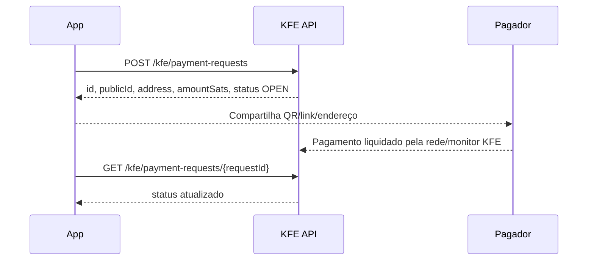
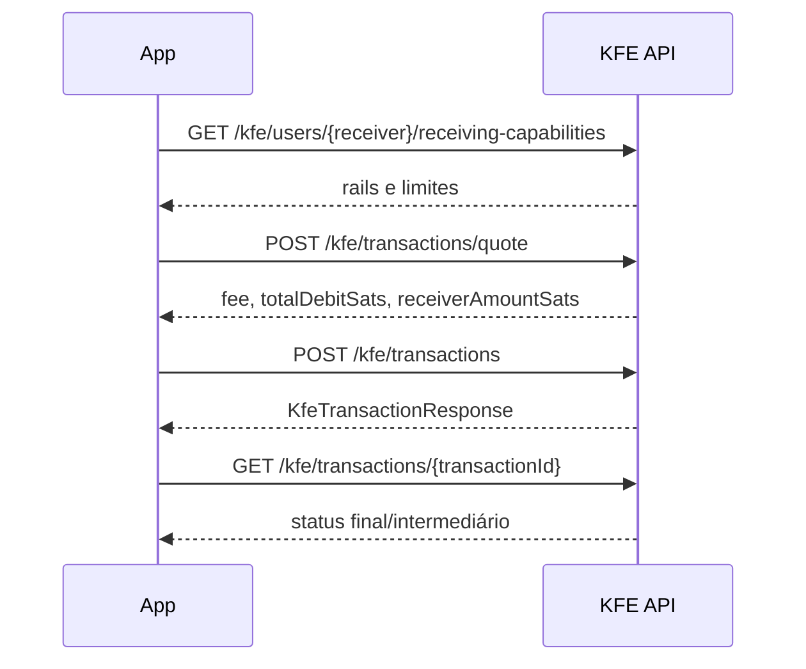

# Payments API

Documentação corporativa do fluxo de pagamentos e recebimentos no backend Kerosene.

Fonte real inspecionada:

- `backend/kerosene/src/main/java/source/kfe/controller/KfePaymentRequestController.java`
- `backend/kerosene/src/main/java/source/kfe/controller/KfePublicPaymentRequestController.java`
- `backend/kerosene/src/main/java/source/kfe/controller/KfeReceivingController.java`
- `backend/kerosene/src/main/java/source/kfe/controller/KfeTransactionController.java`
- `backend/kerosene/src/main/java/source/kfe/dto/KfeCreatePaymentRequest.java`
- `backend/kerosene/src/main/java/source/kfe/dto/KfePaymentRequestResponse.java`
- `backend/kerosene/src/main/java/source/kfe/dto/KfeReceivingCapabilitiesResponse.java`

## Estado real do serviço

A família legada `REMOVED_LEGACY_FINANCIAL_ROUTE` não possui controller ativo no código-fonte atual. O fluxo real de pagamentos está em KFE.

| Caso de uso | Endpoint ativo | Documento canônico |
| --- | --- | --- |
| Criar solicitação de recebimento | `POST /kfe/payment-requests` | Este arquivo e `KFE.md` |
| Listar solicitações próprias | `GET /kfe/payment-requests` | Este arquivo e `KFE.md` |
| Consultar solicitação própria | `GET /kfe/payment-requests/{requestId}` | Este arquivo e `KFE.md` |
| Resolver link público/QR | `GET /api/public/kfe/payment-requests/{publicId}` | Este arquivo e `KFE.md` |
| Expirar/ocultar/cancelar solicitação | `POST /kfe/payment-requests/{requestId}/expire|hide|cancel` | Este arquivo e `KFE.md` |
| Descobrir capacidade de recebimento | `GET /kfe/users/{receiverIdentifier}/receiving-capabilities` | Este arquivo e `KFE.md` |
| Simular pagamento | `POST /kfe/transactions/quote` | `KFE.md` |
| Submeter pagamento | `POST /kfe/transactions` | `KFE.md` |
| Consultar pagamento/transação | `GET /kfe/transactions/{transactionId}` | `KFE.md` |

## Headers comuns

| Nome | Tipo | Obrigatório | Descrição | Exemplo |
| --- | --- | --- | --- | --- |
| `Authorization` | string | Sim para endpoints privados | JWT Bearer do usuário autenticado. | `Bearer <JWT>` |
| `Content-Type` | string | Sim em `POST` com body | JSON. | `application/json` |
| `Accept` | string | Opcional | Preferencialmente JSON. | `application/json` |
| `X-Correlation-Id` | string | Recomendado | Rastreabilidade da operação. | `pay-20260619-0001` |

## Fluxo recomendado de recebimento



## Endpoint: Criar solicitação de recebimento

```http
POST /kfe/payment-requests
```

### O que faz

Cria uma solicitação de recebimento persistida em KFE, associada a uma carteira do usuário. Substitui fluxos sintéticos que apenas rotacionavam endereço sem criar um recurso rastreável.

### Quando usar

- Para gerar QR/link de cobrança.
- Para criar uma solicitação com valor, descrição, memo e expiração.
- Para permitir consulta posterior por `id` privado ou `publicId` público.

### Request body

| Campo | Tipo | Obrigatório | Nullable | Default | Validações | Descrição | Exemplo |
| --- | --- | --- | --- | --- | --- | --- | --- |
| `walletId` | UUID | Sim | Não | - | `@NotNull` | Carteira KFE que receberá o valor. | `8d4b0b7e-7e3f-4e9c-9a42-4e0b3f5b9b76` |
| `rail` | enum | Não | Sim | inferido pelo serviço | `KfeRail` | Rail desejado. | `ONCHAIN` |
| `amountSats` | long | Não | Sim | null | `@Min(1)` quando presente | Valor solicitado em satoshis. | `25000` |
| `description` | string | Não | Sim | null | max 180 | Descrição visível. | `Pedido 123` |
| `memo` | string | Não | Sim | null | max 255 | Memo adicional. | `Obrigado` |
| `payerHint` | string | Não | Sim | null | max 120 | Dica opcional do pagador. | `cliente@app` |
| `expiresAt` | datetime | Não | Sim | null | ISO local date-time | Expiração da solicitação. | `2026-06-20T15:00:00` |
| `issueFreshAddress` | boolean | Não | Sim | null | - | Solicita emissão de endereço novo quando suportado. | `true` |

### Exemplo curl

```bash
curl -X POST "$BASE_URL/kfe/payment-requests" \
  -H "Authorization: Bearer $ACCESS_TOKEN" \
  -H "Content-Type: application/json" \
  -d '{
    "walletId": "8d4b0b7e-7e3f-4e9c-9a42-4e0b3f5b9b76",
    "rail": "ONCHAIN",
    "amountSats": 25000,
    "description": "Pedido 123",
    "memo": "Obrigado",
    "payerHint": "cliente@app",
    "expiresAt": "2026-06-20T15:00:00",
    "issueFreshAddress": true
  }'
```

### Response de sucesso

Status esperado: `200 OK` ou `201 Created`, conforme semântica configurada no controller.

```json
{
  "success": true,
  "message": "KFE payment request created.",
  "data": {
    "id": "0a09dd2b-1e20-4b05-a69a-fbe96790d2b3",
    "publicId": "pr_8NqQj7",
    "userId": 1001,
    "walletId": "8d4b0b7e-7e3f-4e9c-9a42-4e0b3f5b9b76",
    "addressId": "0dbbd596-7e1b-48b6-9ef1-7f27449f2c1c",
    "address": "bc1qexample",
    "rail": "ONCHAIN",
    "status": "OPEN",
    "amountSats": 25000,
    "description": "Pedido 123",
    "memo": "Obrigado",
    "payerHint": "cliente@app",
    "paidTransactionId": null,
    "expiresAt": "2026-06-20T15:00:00",
    "createdAt": "2026-06-19T12:00:00",
    "updatedAt": "2026-06-19T12:00:00"
  },
  "timestamp": "2026-06-19T12:00:00"
}
```

### Campos retornados

| Campo | Tipo | Descrição |
| --- | --- | --- |
| `id` | UUID | ID interno da solicitação. |
| `publicId` | string | ID público para link/QR compartilhável. |
| `userId` | long | Dono da solicitação. |
| `walletId` | UUID | Carteira recebedora. |
| `addressId` | UUID/null | Entidade de endereço usada. |
| `address` | string/null | Endereço de rede exibível. |
| `rail` | enum | Rail usado. |
| `status` | enum | `OPEN`, `PAID`, `EXPIRED`, `HIDDEN`, `CANCELLED`. |
| `amountSats` | long/null | Valor solicitado em satoshis. |
| `description` | string/null | Descrição. |
| `memo` | string/null | Memo. |
| `payerHint` | string/null | Dica do pagador. |
| `paidTransactionId` | UUID/null | Transação KFE que liquidou a solicitação. |
| `expiresAt` | datetime/null | Expiração. |
| `createdAt` | datetime | Criação. |
| `updatedAt` | datetime | Última atualização. |

## Endpoints de leitura e lifecycle

| Endpoint | Para que serve | Body | Response |
| --- | --- | --- | --- |
| `GET /kfe/payment-requests` | Lista solicitações próprias. | none | `List<KfePaymentRequestResponse>` |
| `GET /kfe/payment-requests/{requestId}` | Consulta uma solicitação própria. | none | `KfePaymentRequestResponse` |
| `GET /api/public/kfe/payment-requests/{publicId}` | Consulta pública por link/QR. | none | `KfePaymentRequestResponse` |
| `POST /kfe/payment-requests/{requestId}/expire` | Marca como expirada. | none | `KfePaymentRequestResponse` |
| `POST /kfe/payment-requests/{requestId}/hide` | Oculta da listagem normal. | none | `KfePaymentRequestResponse` |
| `POST /kfe/payment-requests/{requestId}/cancel` | Cancela uma solicitação aberta. | none | `KfePaymentRequestResponse` |

## Endpoint: Consultar capacidades de recebimento

```http
GET /kfe/users/{receiverIdentifier}/receiving-capabilities
```

Retorna quais rails o recebedor consegue usar, o rail preferido, requisitos ausentes e limites mínimos por rail. Use antes de `POST /kfe/transactions/quote`.

### Path parameters

| Nome | Tipo | Obrigatório | Descrição | Exemplo | Restrições |
| --- | --- | --- | --- | --- | --- |
| `receiverIdentifier` | string | Sim | Identificador do recebedor entendido pelo domínio KFE. | `user@example.com` | Regra fica em `FinancialApi`. |

### Exemplo curl

```bash
curl -X GET "$BASE_URL/kfe/users/$RECEIVER/receiving-capabilities" \
  -H "Authorization: Bearer $ACCESS_TOKEN" \
  -H "Accept: application/json"
```

## Fluxo recomendado de pagamento



## Rotas legadas removidas

`REMOVED_LEGACY_FINANCIAL_ROUTE`, `REMOVED_LEGACY_FINANCIAL_ROUTE`, `REMOVED_LEGACY_FINANCIAL_ROUTE`, `REMOVED_LEGACY_FINANCIAL_ROUTE` e fluxos antigos de payment link não existem como controllers ativos. Use `/kfe/payment-requests/**`, `/kfe/transactions/quote` e `/kfe/transactions`.

## Status codes

| Status | Quando ocorre | Como resolver | Exemplo de resposta |
| --- | --- | --- | --- |
| `200 OK` | Leitura, lifecycle ou submissão concluída. | Consumir `data`. | `{ "success": true, "data": {} }` |
| `201 Created` | Recurso criado quando controller usar semântica Created. | Armazenar ID retornado. | `{ "success": true, "data": {} }` |
| `400 Bad Request` | Identificador/body inválido ou validação de DTO. | Corrigir path/body. | Varia. |
| `401 Unauthorized` | JWT ausente ou inválido em endpoint privado. | Reautenticar. | Varia. |
| `403 Forbidden` | Role/token sem permissão ou recurso de outro usuário. | Usar conta correta. | Varia. |
| `404 Not Found` | Recebedor, solicitação, transação ou rota legada inexistente. | Conferir ID/path. | Varia. |
| `409 Conflict` | Estado incompatível ou conflito de idempotência. | Atualizar estado antes de repetir. | Varia. |
| `422 Unprocessable Entity` | Rail indisponível, saldo insuficiente ou regra de negócio. | Ajustar estado antes de repetir. | Varia. |
| `429 Too Many Requests` | Rate limit global. | Backoff. | Varia. |
| `500 Internal Server Error` | Falha inesperada. | Investigar logs. | Varia. |
