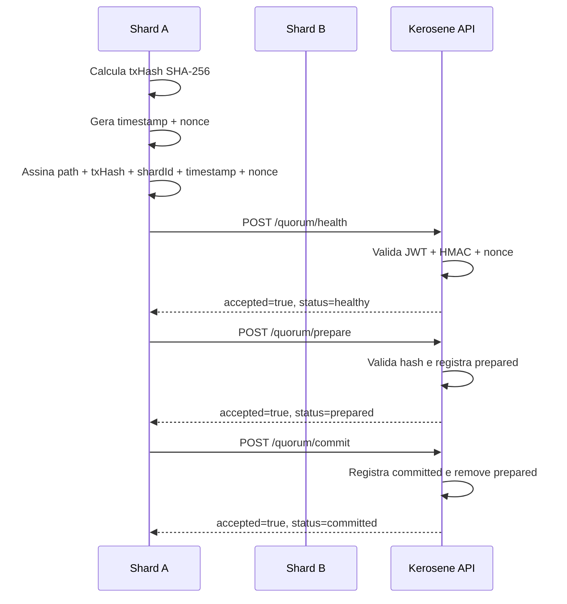

# Soberania e Quorum API

Documentação operacional da família de endpoints de soberania do nó, attestation, telemetria e quorum distribuído.

Fonte primária: código real em:

- `backend/kerosene/src/main/java/source/security/SovereigntyStatusController.java`
- `backend/kerosene/src/main/java/source/sovereign/quorum/QuorumShardController.java`
- `backend/kerosene/src/main/java/source/sovereign/quorum/QuorumShardService.java`
- `backend/kerosene/src/main/java/source/sovereign/quorum/QuorumAttestationService.java`
- `backend/kerosene/src/main/java/source/common/security/EndpointPolicyRegistry.java`

`docs/backend/API_REFERENCE.md` pode ser usado como índice consolidado, mas a política efetiva documentada aqui vem do `EndpointPolicyRegistry` e das validações implementadas nos controllers/services.

---

## Visão geral

A API de Soberania expõe o estado técnico do nó Kerosene e permite que nós autenticados participem do fluxo de quorum. Ela existe para quatro cenários principais:

1. **Status público de soberania**: permitir que app, painel ou operador consultem saúde de attestation, quorum, integridade do ledger e proteção de memória.
2. **Ping HTML público**: fornecer uma página simples de status do nó para verificação manual ou monitoramento leve.
3. **Operações administrativas de attestation**: permitir reatestar o baseline do nó após manutenção planejada, usando `X-Admin-Token`.
4. **Quorum shard-to-shard**: permitir health/prepare/commit entre shards usando assinatura HMAC por headers e hash de transação.

### Base path

```text
/sovereignty
/quorum
```

### Autenticação efetiva

| Família | Política no registry | Observação |
| --- | --- | --- |
| `GET /sovereignty/status` | `PUBLIC` | Sem JWT; retorna snapshot do nó. |
| `GET /sovereignty/ping` | `PUBLIC` | Sem JWT; retorna HTML. |
| `POST /sovereignty/reattest` | `AUTHENTICATED` | Além do JWT, exige `X-Admin-Token` válido. |
| `GET /sovereignty/telemetry` | `AUTHENTICATED` | Além do JWT, exige `X-Admin-Token` válido. |
| `POST /quorum/**` | `AUTHENTICATED` | Além do JWT, exige attestation HMAC shard-to-shard. |

### Convenções de envelope

Esta família **não usa o envelope padrão `ApiResponse`** em todos os endpoints. Os controllers retornam diretamente `Map`, `String` HTML ou `ResponseEntity<Map<...>>`.

---

## Headers comuns

### Headers HTTP padrão

| Nome | Tipo | Obrigatório | Quando usar | Exemplo |
| --- | --- | --- | --- | --- |
| `Authorization` | string | Sim para endpoints `AUTHENTICATED` | JWT Bearer emitido pelo fluxo de autenticação. | `Bearer eyJhbGciOi...` |
| `Content-Type` | string | Sim para `POST` com body | Deve ser `application/json`. | `application/json` |
| `Accept` | string | Opcional | Use `application/json`, exceto `/sovereignty/ping`, que retorna HTML. | `application/json` |

### Headers administrativos

| Nome | Tipo | Obrigatório | Descrição | Exemplo |
| --- | --- | --- | --- | --- |
| `X-Admin-Token` | string | Sim para `/sovereignty/reattest` e `/sovereignty/telemetry` | Token configurado em `security.admin.attestation-token`. A comparação é constant-time. | `attestation-admin-token` |

### Headers de quorum shard-to-shard

| Nome | Tipo | Obrigatório | Descrição | Exemplo |
| --- | --- | --- | --- | --- |
| `X-Tx-Hash` | string | Sim | Deve ser idêntico ao `txHash` enviado no body. | `b4f2...64hex` |
| `X-Shard-Id` | string | Sim | Identificador do shard remoto que assina a chamada. | `sa-east-1-a` |
| `X-Shard-Timestamp` | string numérica | Sim | Timestamp Unix em milissegundos. Deve estar dentro do skew permitido. | `1766100000000` |
| `X-Shard-Nonce` | string | Sim | Nonce único por shard dentro da janela de validade. Reuso é rejeitado. | `Urn0v7kXkN0mE` |
| `X-Shard-Signature` | string hexadecimal | Sim | HMAC-SHA256 do payload canônico. | `9f2c...` |

### Assinatura HMAC do quorum

O backend valida a assinatura usando `QuorumAttestationService`. A string canônica assinada é:

```text
{path}\n{txHash}\n{X-Shard-Id}\n{X-Shard-Timestamp}\n{X-Shard-Nonce}
```

O algoritmo é `HmacSHA256`, com secret carregado de `shard.attestation.secret`. O resultado esperado no header `X-Shard-Signature` é hexadecimal lowercase/uppercase aceito pela comparação textual gerada pelo service.

Restrições reais:

| Regra | Valor |
| --- | --- |
| Secret obrigatório | Sim. Se `shard.attestation.secret` não estiver configurado, a verificação lança erro interno. |
| Skew padrão | `30000ms`, configurável por `quorum.shard.attestation-max-skew-ms`. O mínimo efetivo é `1000ms`. |
| Replay protection | `X-Shard-Nonce` é memorizado por shard até expirar a janela de skew. |
| Validação de hash | `txHash` precisa ser SHA-256 hex de 64 caracteres nos endpoints `prepare` e `commit`. |

---

## Status codes comuns

| Status | Quando ocorre | Como resolver | Exemplo de resposta |
| --- | --- | --- | --- |
| `200 OK` | Snapshot, ping, telemetry ou quorum aceito. | Nenhuma ação. | `{ "accepted": true, "status": "prepared", "peer": "sa-east-1-a" }` |
| `400 Bad Request` | JSON inválido, body ausente/incompatível ou `txHash` inválido gerando erro de validação no service. | Enviar body conforme schema e `txHash` SHA-256 hex com 64 caracteres. | Varia conforme handler global de erro. |
| `401 Unauthorized` | Endpoint autenticado sem JWT válido. | Enviar `Authorization: Bearer <token>`. | Varia conforme Spring Security. |
| `403 Forbidden` | Token administrativo inválido ou attestation de quorum inválida. | Conferir `X-Admin-Token` ou headers HMAC de shard. | `{ "accepted": false, "status": "forbidden" }` |
| `429 Too Many Requests` | Rate limit global, se configurado, bloqueia a chamada. | Reduzir frequência e aplicar backoff. | Varia conforme filtro global. |
| `500 Internal Server Error` | Secret de attestation ausente em endpoints de quorum ou falha inesperada de serviço. | Configurar `shard.attestation.secret` e verificar logs. | Varia conforme handler global. |
| `503 Service Unavailable` | `/sovereignty/reattest` sem `security.admin.attestation-token` configurado. | Configurar o token administrativo fora do código. | `{ "error": "Re-attestation endpoint is not configured. Set security.admin.attestation-token." }` |

---

## Endpoint: Consultar status de soberania

```http
GET /sovereignty/status
```

### O que faz

Retorna um snapshot público do estado de soberania do nó: attestation TPM, quorum, integridade de ledger, proteção de memória, uptime e timestamp do servidor.

### Quando usar

- Tela pública ou interna de status do nó.
- Diagnóstico de saúde da infraestrutura.
- Verificação se o nó está em modo normal, degradado ou fail-stop.
- Auditoria operacional antes de executar ações sensíveis.

### Regras de negócio

- Endpoint público por policy.
- Não recebe body.
- Não exige token administrativo.
- Campos de hash são abreviados pelo método `abbreviate`, mantendo início e fim do hash.
- Se `KfeAuditAdminService.root()` falhar, `ledgerIntegrity.status` vira `ERROR`.

### Headers obrigatórios

Nenhum.

### Headers opcionais

| Nome | Tipo | Descrição | Exemplo |
| --- | --- | --- | --- |
| `Accept` | string | Formato esperado. | `application/json` |

### Path parameters

Nenhum.

### Query parameters

Nenhum.

### Request body

Não enviar body.

### Exemplo curl

```bash
curl -X GET "$BASE_URL/sovereignty/status" \
  -H "Accept: application/json"
```

### Response de sucesso

Status: `200 OK`

```json
{
  "hardwareAttestation": {
    "status": "VERIFIED",
    "chip": "TPM 2.0",
    "lastValidatedSecondsAgo": 12,
    "totalChecks": 42,
    "quoteHash": "a1b2c3d4…9a8b7c6d",
    "tmeEnabled": true,
    "coldBootRisk": "MITIGATED"
  },
  "networkConsensus": {
    "status": "ACTIVE",
    "activeNodes": 3,
    "failStopMode": false,
    "transactionsAccepted": 128,
    "requiredNodes": 2,
    "totalNodes": 3,
    "remotePeers": 2,
    "consensusAlgorithm": "Raft-2PC"
  },
  "ledgerIntegrity": {
    "status": "VALID",
    "lastRootHash": "4c5d6e7f…11121314",
    "computedAt": "2026-06-19T12:00:00Z",
    "eventCount": 981
  },
  "memoryProtection": {
    "status": "LOCKED",
    "mechanism": "mlock() via JVM native",
    "shardLocation": "tmpfs (volatile RAM)",
    "diskPersistence": false
  },
  "serverUptimeSeconds": 3600,
  "serverTimestamp": "2026-06-19T12:00:00Z"
}
```

### Campos retornados

| Campo | Tipo | Descrição |
| --- | --- | --- |
| `hardwareAttestation.status` | string | `VERIFIED` quando a integridade está OK; `COMPROMISED (STALL MODE)` quando `RemoteAttestationService.isIntegrityOk()` retorna false. |
| `hardwareAttestation.chip` | string | Valor fixo documentado pelo controller: `TPM 2.0`. |
| `hardwareAttestation.lastValidatedSecondsAgo` | number | Segundos desde a última validação de attestation. |
| `hardwareAttestation.totalChecks` | number | Total de checagens de attestation executadas pelo service. |
| `hardwareAttestation.quoteHash` | string/null | Hash abreviado da última quote. |
| `hardwareAttestation.tmeEnabled` | boolean | Indica se TME está habilitado segundo o service. |
| `hardwareAttestation.coldBootRisk` | string | `MITIGATED` quando TME está ativo; caso contrário mensagem de alerta. |
| `networkConsensus.status` | string | `FAIL-STOP`, `ACTIVE` ou `DEGRADED`. |
| `networkConsensus.activeNodes` | number | Quantidade de nós ativos no quorum. |
| `networkConsensus.failStopMode` | boolean | Se o quorum entrou em modo fail-stop. |
| `networkConsensus.transactionsAccepted` | number | Contador de transações aceitas pelo quorum sync. |
| `networkConsensus.requiredNodes` | number | Número mínimo de nós exigidos. |
| `networkConsensus.totalNodes` | number | Total configurado de nós. |
| `networkConsensus.remotePeers` | number | `totalNodes - 1`, limitado a mínimo zero. |
| `networkConsensus.consensusAlgorithm` | string | Valor fixo: `Raft-2PC`. |
| `ledgerIntegrity.status` | string | `VALID`, `PENDING` ou `ERROR`. |
| `ledgerIntegrity.lastRootHash` | string | Hash Merkle abreviado quando há eventos. |
| `ledgerIntegrity.computedAt` | string datetime | Momento de geração da raiz Merkle. |
| `ledgerIntegrity.eventCount` | number | Quantidade de eventos usados no cálculo da raiz. |
| `memoryProtection.status` | string | Valor fixo: `LOCKED`. |
| `memoryProtection.mechanism` | string | Valor fixo: `mlock() via JVM native`. |
| `memoryProtection.shardLocation` | string | Valor fixo: `tmpfs (volatile RAM)`. |
| `memoryProtection.diskPersistence` | boolean | Valor fixo: `false`. |
| `serverUptimeSeconds` | number | Uptime do processo desde carregamento da classe/controller. |
| `serverTimestamp` | string datetime | Timestamp ISO-8601 do servidor. |

### Status codes específicos

| Status | Significado |
| --- | --- |
| `200` | Snapshot retornado. Mesmo estados degradados são representados no body. |
| `500` | Falha inesperada fora dos blocos tratados pelo controller. |

---

## Endpoint: Ping HTML do nó

```http
GET /sovereignty/ping
```

### O que faz

Retorna uma página HTML simples com status visual, região, node id, uptime, horário do servidor e protocolo.

### Quando usar

- Verificação manual no navegador.
- Load balancer ou monitoramento que aceite HTML.
- Diagnóstico rápido de nó ativo sem autenticação.

### Regras de negócio

- Endpoint público.
- Produz `text/html`.
- A região vem da variável de ambiente `REGION`; se ausente, usa `DEV`.
- O node id vem de `InetAddress.getLocalHost().getHostName()`; em falha, retorna `unknown-node`.

### Headers obrigatórios

Nenhum.

### Headers opcionais

| Nome | Tipo | Descrição | Exemplo |
| --- | --- | --- | --- |
| `Accept` | string | Pode ser `text/html`. | `text/html` |

### Exemplo curl

```bash
curl -X GET "$BASE_URL/sovereignty/ping" \
  -H "Accept: text/html"
```

### Response de sucesso

Status: `200 OK`

Content-Type efetivo: `text/html`

O corpo é uma página HTML. Campos interpolados no HTML:

| Placeholder | Origem | Exemplo |
| --- | --- | --- |
| `REGION` | `System.getenv("REGION")` ou `DEV` | `DEV` |
| `NODE_ID` | hostname local ou `unknown-node` | `kerosene-node-1` |
| `UPTIME` | uptime em segundos | `3600` |
| `TIME` | `Instant.now()` | `2026-06-19T12:00:00Z` |
| `Protocol` | valor fixo no HTML | `v0.5-HYDRA` |

### Status codes específicos

| Status | Significado |
| --- | --- |
| `200` | HTML retornado. |
| `500` | Erro inesperado de renderização/servidor. |

---

## Endpoint: Reatestar baseline do nó

```http
POST /sovereignty/reattest
```

### O que faz

Executa `attestationService.reAttestBaseline()` para redefinir o baseline TPM/PCR após manutenção planejada, como atualização de kernel ou SO.

### Quando usar

- Após upgrade legítimo que alterou PCRs.
- Após manutenção operacional planejada.
- Para limpar STALL mode somente quando o operador confirmou que a alteração de baseline é esperada.

### Regras de negócio

- Exige JWT por policy `AUTHENTICATED`.
- Exige `X-Admin-Token` válido.
- Se `security.admin.attestation-token` não estiver configurado, o endpoint falha fechado com `503`.
- O token é comparado com `MessageDigest.isEqual`, reduzindo risco de timing oracle.
- Não recebe body.

### Headers obrigatórios

| Nome | Tipo | Obrigatório | Descrição | Exemplo |
| --- | --- | --- | --- | --- |
| `Authorization` | string | Sim | JWT Bearer. | `Bearer eyJhbGciOi...` |
| `X-Admin-Token` | string | Sim | Token de reattestation configurado em propriedade segura. | `attestation-admin-token` |

### Headers opcionais

| Nome | Tipo | Descrição | Exemplo |
| --- | --- | --- | --- |
| `Accept` | string | Formato esperado. | `application/json` |

### Request body

Não enviar body.

### Exemplo curl

```bash
curl -X POST "$BASE_URL/sovereignty/reattest" \
  -H "Authorization: Bearer $ACCESS_TOKEN" \
  -H "X-Admin-Token: $ATTESTATION_ADMIN_TOKEN" \
  -H "Accept: application/json"
```

### Response de sucesso

Status: `200 OK`

```json
{
  "message": "Node re-attested successfully. STALL mode will clear on next polling cycle."
}
```

### Campos retornados

| Campo | Tipo | Descrição |
| --- | --- | --- |
| `message` | string | Confirma que o baseline foi atualizado e que o STALL mode deve limpar no próximo ciclo de polling. |

### Responses de erro conhecidos

#### Token administrativo ausente ou inválido

Status: `403 Forbidden`

```json
{
  "error": "Invalid admin token. Re-attestation denied."
}
```

#### Token administrativo não configurado no servidor

Status: `503 Service Unavailable`

```json
{
  "error": "Re-attestation endpoint is not configured. Set security.admin.attestation-token."
}
```

---

## Endpoint: Consultar telemetria RAM-only

```http
GET /sovereignty/telemetry
```

### O que faz

Retorna snapshot de métricas em memória mantidas por `TelemetryService`. As métricas não são persistidas em disco e resetam no restart da JVM.

### Quando usar

- Monitoramento interno.
- Painel operacional protegido.
- Diagnóstico de quorum, attestation e eventos recentes.

### Regras de negócio

- Exige JWT por policy `AUTHENTICATED`.
- Exige `X-Admin-Token` válido.
- Se o token for inválido/ausente, retorna `403`.
- O schema exato vem de `telemetryService.snapshot()` e pode incluir novos contadores conforme o service evolui.

### Headers obrigatórios

| Nome | Tipo | Obrigatório | Descrição | Exemplo |
| --- | --- | --- | --- | --- |
| `Authorization` | string | Sim | JWT Bearer. | `Bearer eyJhbGciOi...` |
| `X-Admin-Token` | string | Sim | Mesmo token usado em `/sovereignty/reattest`. | `attestation-admin-token` |

### Request body

Não enviar body.

### Exemplo curl

```bash
curl -X GET "$BASE_URL/sovereignty/telemetry" \
  -H "Authorization: Bearer $ACCESS_TOKEN" \
  -H "X-Admin-Token: $ATTESTATION_ADMIN_TOKEN" \
  -H "Accept: application/json"
```

### Response de sucesso

Status: `200 OK`

Exemplo representativo; o corpo completo depende de `TelemetryService.snapshot()`:

```json
{
  "quorum": {
    "failures": 0,
    "transactionsAccepted": 128
  },
  "attestation": {
    "integrityFailures": 0
  },
  "events": []
}
```

### Campos retornados

Como o controller retorna diretamente o `Map` do service, a documentação não consegue inferir uma lista fechada de campos sem expandir o `TelemetryService`. Campos podem variar com a evolução dos contadores. O contrato estável inferível é:

| Campo | Tipo | Descrição |
| --- | --- | --- |
| `*` | object/map | Snapshot de métricas em memória. Não persistido. |

### Responses de erro conhecidos

Status: `403 Forbidden`

```json
{
  "error": "Invalid admin token."
}
```

---

## Endpoint: Health de quorum shard

```http
POST /quorum/health
```

### O que faz

Verifica se um shard remoto está aceitando mensagens autenticadas de quorum. Retorna `healthy` quando a assinatura e o hash conferem.

### Quando usar

- Health check autenticado entre shards.
- Verificar se o secret de attestation está alinhado.
- Validar caminho de comunicação antes de `prepare`/`commit`.

### Regras de negócio

- Exige JWT por policy `AUTHENTICATED`.
- Exige headers HMAC de quorum.
- `X-Tx-Hash` precisa ser igual ao `txHash` do body.
- Diferente de `prepare`/`commit`, o service de health não valida formato SHA-256; mas o controller ainda exige igualdade body/header e assinatura válida.

### Headers obrigatórios

| Nome | Tipo | Obrigatório | Descrição | Exemplo |
| --- | --- | --- | --- | --- |
| `Authorization` | string | Sim | JWT Bearer. | `Bearer eyJhbGciOi...` |
| `Content-Type` | string | Sim | JSON. | `application/json` |
| `X-Tx-Hash` | string | Sim | Mesmo valor de `body.txHash`. | `b4f2...` |
| `X-Shard-Id` | string | Sim | Shard emissor. | `sa-east-1-a` |
| `X-Shard-Timestamp` | string | Sim | Epoch millis dentro da janela permitida. | `1766100000000` |
| `X-Shard-Nonce` | string | Sim | Nonce único. | `Urn0v7kXkN0mE` |
| `X-Shard-Signature` | string | Sim | HMAC-SHA256 hexadecimal. | `9f2c...` |

### Request body

| Campo | Tipo | Obrigatório | Nullable | Default | Validações | Descrição | Exemplo |
| --- | --- | --- | --- | --- | --- | --- | --- |
| `txHash` | string | Sim | Não | nenhum | Deve ser igual a `X-Tx-Hash`. | Identificador lógico da transação/checagem. | `b4f2e7...` |

### Exemplo curl

```bash
curl -X POST "$BASE_URL/quorum/health" \
  -H "Authorization: Bearer $ACCESS_TOKEN" \
  -H "Content-Type: application/json" \
  -H "X-Tx-Hash: $TX_HASH" \
  -H "X-Shard-Id: sa-east-1-a" \
  -H "X-Shard-Timestamp: $EPOCH_MILLIS" \
  -H "X-Shard-Nonce: $NONCE" \
  -H "X-Shard-Signature: $SIGNATURE" \
  -d '{"txHash":"'$TX_HASH'"}'
```

### Response de sucesso

Status: `200 OK`

```json
{
  "accepted": true,
  "status": "healthy",
  "peer": "sa-east-1-a"
}
```

### Campos retornados

| Campo | Tipo | Descrição |
| --- | --- | --- |
| `accepted` | boolean | `true` quando a mensagem foi aceita. |
| `status` | string | `healthy`. |
| `peer` | string | Valor de `X-Shard-Id`; se ausente, `unknown`, mas ausência torna verificação inválida antes disso. |

### Erro de assinatura/hash

Status: `403 Forbidden`

```json
{
  "accepted": false,
  "status": "forbidden"
}
```

---

## Endpoint: Preparar transação no quorum

```http
POST /quorum/prepare
```

### O que faz

Registra um `txHash` como preparado no shard local. É a fase PREPARE do fluxo 2PC/Raft documentado pelo status de soberania.

### Quando usar

- Antes de consolidar/commit uma transação distribuída.
- Para coordenar consenso entre shards.
- Em chamadas internas de infraestrutura, não como API pública para clientes finais.

### Regras de negócio

- Exige JWT.
- Exige attestation HMAC.
- `txHash` precisa ser SHA-256 hexadecimal com 64 caracteres.
- Preparações são mantidas em memória e expiram por TTL.
- TTL padrão: `quorum.shard.entry-ttl-ms:300000`, mínimo efetivo `30000ms`.

### Headers obrigatórios

Mesmos headers de `/quorum/health`.

### Request body

| Campo | Tipo | Obrigatório | Nullable | Default | Validações | Descrição | Exemplo |
| --- | --- | --- | --- | --- | --- | --- | --- |
| `txHash` | string | Sim | Não | nenhum | Regex `^[0-9a-fA-F]{64}$`; igual ao `X-Tx-Hash`. | Hash SHA-256 da transação coordenada. | `aaaaaaaaaaaaaaaaaaaaaaaaaaaaaaaaaaaaaaaaaaaaaaaaaaaaaaaaaaaaaaaa` |

### Exemplo curl

```bash
curl -X POST "$BASE_URL/quorum/prepare" \
  -H "Authorization: Bearer $ACCESS_TOKEN" \
  -H "Content-Type: application/json" \
  -H "X-Tx-Hash: $TX_HASH" \
  -H "X-Shard-Id: sa-east-1-a" \
  -H "X-Shard-Timestamp: $EPOCH_MILLIS" \
  -H "X-Shard-Nonce: $NONCE" \
  -H "X-Shard-Signature: $SIGNATURE" \
  -d '{"txHash":"'$TX_HASH'"}'
```

### Response de sucesso

Status: `200 OK`

```json
{
  "accepted": true,
  "status": "prepared",
  "peer": "sa-east-1-a"
}
```

### Status codes específicos

| Status | Significado |
| --- | --- |
| `200` | Hash preparado ou chamada idempotente aceita. |
| `400` | `txHash` não é SHA-256 hex de 64 caracteres. |
| `403` | Headers HMAC inválidos, timestamp fora da janela, nonce repetido ou `X-Tx-Hash` diferente do body. |
| `500` | `shard.attestation.secret` ausente ou erro inesperado. |

---

## Endpoint: Commitar transação no quorum

```http
POST /quorum/commit
```

### O que faz

Registra um `txHash` como committed no shard local. Remove o hash do mapa de prepared e grava no mapa de committed em memória.

### Quando usar

- Após fase PREPARE bem-sucedida.
- Para concluir uma transação distribuída.
- Em recuperação idempotente após restart; o service aceita commit sem prepare local e registra warning.

### Regras de negócio

- Exige JWT.
- Exige attestation HMAC.
- `txHash` precisa ser SHA-256 hex de 64 caracteres.
- Commit é idempotente: se já estiver committed, retorna `accepted=true`, `status=committed`.
- Se não houver prepare local, o service aceita como recuperação idempotente e loga warning.

### Headers obrigatórios

Mesmos headers de `/quorum/health`.

### Request body

| Campo | Tipo | Obrigatório | Nullable | Default | Validações | Descrição | Exemplo |
| --- | --- | --- | --- | --- | --- | --- | --- |
| `txHash` | string | Sim | Não | nenhum | Regex `^[0-9a-fA-F]{64}$`; igual ao `X-Tx-Hash`. | Hash SHA-256 da transação coordenada. | `aaaaaaaaaaaaaaaaaaaaaaaaaaaaaaaaaaaaaaaaaaaaaaaaaaaaaaaaaaaaaaaa` |

### Exemplo curl

```bash
curl -X POST "$BASE_URL/quorum/commit" \
  -H "Authorization: Bearer $ACCESS_TOKEN" \
  -H "Content-Type: application/json" \
  -H "X-Tx-Hash: $TX_HASH" \
  -H "X-Shard-Id: sa-east-1-a" \
  -H "X-Shard-Timestamp: $EPOCH_MILLIS" \
  -H "X-Shard-Nonce: $NONCE" \
  -H "X-Shard-Signature: $SIGNATURE" \
  -d '{"txHash":"'$TX_HASH'"}'
```

### Response de sucesso

Status: `200 OK`

```json
{
  "accepted": true,
  "status": "committed",
  "peer": "sa-east-1-a"
}
```

### Status codes específicos

| Status | Significado |
| --- | --- |
| `200` | Commit aceito ou idempotente. |
| `400` | `txHash` inválido. |
| `403` | Attestation inválida. |
| `500` | Secret de attestation ausente ou erro inesperado. |

---

## Fluxo recomendado de quorum



---

## Ambiguidades e limites inferidos

- O endpoint `/sovereignty/telemetry` retorna o `Map` de `TelemetryService.snapshot()`. O controller não fixa um DTO; portanto, campos adicionais podem aparecer sem alteração de controller.
- `GET /sovereignty/status` é público e pode expor informações operacionais do nó. Isso é comportamento real do registry, não recomendação universal.
- Os endpoints de quorum exigem JWT por policy e também HMAC. A documentação não inferiu qual role específica o JWT precisa ter, porque a policy é `AUTHENTICATED`, não `ADMIN`.
- Os erros globais de Spring Security/validation podem usar estrutura definida fora destes controllers. Onde o controller monta o erro manualmente, o body foi documentado exatamente.
